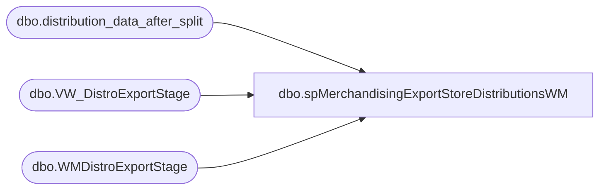

# dbo.spMerchandisingExportStoreDistributionsWM

**Database:** me_01  
**Server:** bedrockdb02  

## Architecture Diagram



## Table Dependencies

| Referenced Table |
|---|
| dbo.distribution_data_after_split |
| dbo.VW_DistroExportStage |
| dbo.WMDistroExportStage |

## Stored Procedure Code

```sql
CREATE proc [dbo].[spMerchandisingExportStoreDistributionsWM]

as

-- =====================================================================================================
-- Name: spMerchandisingExportStoreDistributionsWM
--
-- Description:	Exports Distros from distribution_data_after_split to staging table WMDistroExportStage.
--				Updates distribution_data_after_split to set records as released
--				Outputs Store Distro XML file for WM
--				 
-- Revision History
--		Name:			Date:			Comments:
--		Dan Tweedie		03/23/2015		Created proc.	
--		Dan Tweedie		2018-07-02		Updated for Dynamics distros
--		Tim CAllahan	2018-07-17		Updated VW_DistroExportStage to change Rec Type to 54 for any West Coast stores fulfilling from 0980
-- =====================================================================================================

set nocount on 

IF (Object_ID('me_01..WMDistroExportStage') IS NOT NULL) DROP TABLE WMDistroExportStage
select *
into WMDistroExportStage
from VW_DistroExportStage

if (select count(*) from WMDistroExportStage) > 0

BEGIN

	declare @xml xml

	select @xml = (select 
					'980' as [Warehouse],
					'1' as [DistroType],
					--(distribution_number + '|' + reasoncode) as [DistroNbr],
					case 
						when left(distribution_number, 1) in ('S', 'T') or distribution_number like '%t%'
						then distribution_number 
						else left((distribution_number + '|' + reasoncode), 12) 
					end as [DistroNbr],
					distribution_number as [PONbr],
					priority as [PriorityCode],
					destid as [StoreNbr],
					sequencenbr as [SequenceNumber],
					'001' as [SKUDefinition/Company],
					'001' as [SKUDefinition/Division],
					style_code as [SKUDefinition/Style],
					'F' as [SubSKUFields/InventoryType],
					'*' as [SubSKUFields/CountryOfOrigin],
					average_cost as [StoreDistroFields/Price],
					quantity as [StoreDistroFields/RequiredQty],
					'0' as [StoreDistroFields/StatusCode],
					NULL as [StoreDistroFields/DistroWithCtrlNo],
					'0' as [StoreDistroFields/WaveProcessingType],
					'STD' as [StoreDistroFields/InvAllocationType],
					rec_type as [StoreDistroFields/DistroBrkAttribute],
					cartonlabeltype as [StoreDistroFields/CartonLabelType],
					'51' as [StoreDistroFields/CartonCubingIndic],
					rec_type as [StoreDistroFields/TpeDesigSvcLvl],
					'0' as [StoreDistroFields/TpeFreightTerms],
					ref_field_1 as [StoreDistroFields/TpeRefField1]
				from WMDistroExportStage
				for xml path ('StoreDistro'), root ('StoreDistroBridge'))

	IF (Object_ID('tempdb..##distroxml') IS NOT null) DROP TABLE ##distroxml
	create table ##distroxml
	(XMLData xml)

	insert ##distroxml
	select @xml

	declare @query varchar(1000),
			@date varchar(52),
			@DistroFile varchar(1000),
			@XMLout varchar(1000),
			@file_location varchar(1000),
			@server varchar(20),
			@database varchar(20),
			@bcp varchar(1000),
			@type varchar(1000),
			@delete varchar(1000),
			@move varchar(1000)

			set @query = 'select * from ##distroxml'
			select @date = replace(replace(replace(replace(convert(varchar, getdate(), 121), ' ', ''), '-', ''), ':', ''), '.', '')
			set @file_location = '\\kermode\FileRepository\MERCHANDISING\WM\OUTBOUND\StoreDistro\'
			set @distroFile = 'ISDstoredistrobridge_' + @date + '.xml'
			set @XMLout = 'XML.out'
			set @server = 'bedrockdb02'
			set @database = 'me_01'
			set @bcp = 'bcp "' + @query + '" queryout "' + @file_location + @XMLout + '"  -T -w -S' + @server 

			exec master..xp_cmdshell @bcp --export xml file

			set @type = 'TYPE ' + @file_location + @XMLout + ' > ' + @file_location + @DistroFile 
			exec master..xp_cmdshell @type --this is needed because wm eis couldn't read the xml file due to encoding(?)
			
			set @delete = 'DEL ' + @file_location + @XMLout
			exec master..xp_cmdshell @delete

			set @move = 'MOVE ' + @file_location + @DistroFile + ' \\wminteg01\interfaces\storedistro\'
			exec master..xp_cmdshell @move

	--SET RELEASED FLAG TO PREVENT THE SAME DISTROS FROM EXPORTING AGAIN
	update distribution_data_after_split
	set released = 1
	where ID in (select id from WMDistroExportStage)
	OR 
	(
		ID is NULL 
		and distribution_number in  (select distribution_number from WMDistroExportStage) 
		and sourceid = '0980'
	)

END
```

