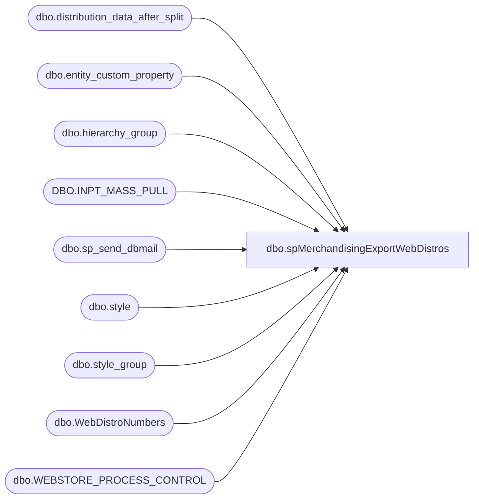

# dbo.spMerchandisingExportWebDistros

**Database:** me_01  
**Server:** bedrockdb02  

## Architecture Diagram



## Table Dependencies

| Referenced Table |
|---|
| dbo.distribution_data_after_split |
| dbo.entity_custom_property |
| dbo.hierarchy_group |
| DBO.INPT_MASS_PULL |
| dbo.sp_send_dbmail |
| dbo.style |
| dbo.style_group |
| dbo.WebDistroNumbers |
| dbo.WEBSTORE_PROCESS_CONTROL |

## Stored Procedure Code

```sql
CREATE proc [dbo].[spMerchandisingExportWebDistros]

as


-- =====================================================================================================
-- Name: spMerchandisingExportWebDistros
--
-- Description:	Exports distros from Merch to WM, specifically for sending inventory from 980 to the webstore
--				Replaces DTS package on WMETL01 called HOST_to_WEBSTORE_Distros_V1 (Merch 4.1 LIVE)
--
-- Revision History
--		Name:			Date:			Comments:
--		Dan Tweedie		07/19/2013		Created proc.	
--		Dan Tweedie		05/11/2015		removed implicit outer joins
--		Tim Callahan	10/23/2019		Added Logic to Exclude Multi Style Distribution Documents from Exporting
--										Due to the unique nature of the 980 to 0013 "Distro" process, WM will not allow multiple entries of the same distribution document number -> inpt_mass_pull_id
--										Sheri Reid (Distro Mgr) agreed to to an exception email being generate and the Allocator team to reduce the DQ for 0013 and key new individual documents 
--										In Conjunction, WMDB01 stored proc "dant_web_distros_not_in_wm" needed to be updated to not include these type of distros in the validation. 
--										Also backed up existing proc to "spMerchandisingExportWebDistros_bak_20191023"
--		Tim Callahan	11/15/2019		Updated Logic relating to webstore process control, only validating it's a web distro in the last 2 years as Aptos Distro Docs will recycle 
-- =====================================================================================================


set nocount on


--check to see if there are distros ready to export
IF (Object_ID('tempdb..#distros') IS NOT null) DROP TABLE #distros
select distinct distribution_number
into #distros
from distribution_data_after_split dd with (nolock)
join style s with (nolock) on dd.style_code = s.style_code
join style_group sg with (nolock) on s.style_id = sg.style_id
join hierarchy_group hg with (nolock) on hg.hierarchy_group_id = sg.hierarchy_group_id
where	dd.released is null 
and		dd.destid in ('0013', '1513')
and substring(hg.hierarchy_group_code,7,2) <> '60' --is not supplies

---if there are distros ready to export, proceed
if (select count(*) from #distros) > 0

BEGIN

-----------
	--make sure there aren't distros in WM waiting to bridge---can't send more distros until the queue is empty
	--if there are zero distros waitint in the wm queue, proceed
	IF (select count(*) from WMDB01.WMPROD.DBO.INPT_MASS_PULL where PROC_STAT_CODE = 0) = 0 
			BEGIN
				begin
					declare @document_number varchar(20)

					set @document_number = (select document_number from WebDistroNumbers) ---this number is incremented at the end of the procedure, so it is always one more than the last time the process ran

					--insert into	keith_web_distros
					IF (Object_ID('tempdb..#distroData') IS NOT null) DROP TABLE #distroData
					select	cast(ddas.distribution_number as int) as INPT_MASS_PULL_ID,
						right('000000' + convert(varchar(6),@document_number + 1),6)  as TRANS_NBR,
							'980' as WHSE,
							'001' as CO,
							'001' as DIV,
							right('000000' + convert(varchar(6),ddas.style_code),6) as STYLE,
							'F' AS INVN_TYPE, 
							'*' as CNTRY_OF_ORGN,		

							case when substring(hg.hierarchy_group_code,7,2)='60'
								then	ecp.custom_property_value * ddas.quantity
								else	ddas.quantity * s.distribution_multiple
							end as UNIT_REQD,

							'WB01011' as DEST_LOCN_BRCD,  -- Sathyan to specify later
							'R' as ALLOC_TYPE,
							0 as ERROR_SEQ_NBR,
							0 as PROC_STAT_CODE,
							' ' as PROCESS_TYPE,
							getdate() as CREATE_DATE_TIME,
							getdate() as MOD_DATE_TIME,
							'PKMS' as "USER_ID"
					into #distroData
					from	bedrockdb02.me_01.dbo.distribution_data_after_split ddas with (nolock)
							join bedrockdb02.me_01.dbo.style s with (nolock) on ddas.style_code = s.style_code
							join bedrockdb02.me_01.dbo.style_group sg with (nolock) on s.style_id = sg.style_id
							join bedrockdb02.me_01.dbo.hierarchy_group hg with (nolock) on sg.hierarchy_group_id = hg.hierarchy_group_id
							left join bedrockdb02.me_01.dbo.entity_custom_property ecp with (nolock) on s.style_id = ecp.parent_id
								and ecp.custom_property_id = 2
								and ecp.parent_type = 1
					where	ddas.sourceid = '0980'
					and		ddas.destid  in ('0013','1513')
					and		cast(convert(varchar, ddas.release_date,101)as datetime)  = cast(convert(varchar, getdate(),101)as datetime)	
					and		ddas.released is null
					and		ddas.distribution_number in (select distribution_number from #distros)
					--and		ddas.distribution_number not in (select distribution_number from WEBSTORE_PROCESS_CONTROL) --updated at the end of the procedure, to prevent us from sending the same distro twice -- Replaced on 11/15/2019
					and		ddas.distribution_number not in (select distribution_number from WEBSTORE_PROCESS_CONTROL where datediff(yy, loaded_date, getdate()) < 2) -- Added on 11/15/2019 Aptos Distro Docs will recycle but not in 2 years
					order by ddas.Id
				end

				--New Exception Code Added 10/23/2019
						if (select count (*) from #distroData group by INPT_MASS_PULL_ID having count (*) > 1) > 1
							Begin 

								IF (Object_ID('tempdb..##Multi') IS NOT null) DROP TABLE ##Multi 
								Select INPT_MASS_PULL_ID, count (distinct style) as Style_Count
								into ##Multi 
								from #distroData
								group by INPT_MASS_PULL_ID
								having count (distinct style) > 1

								-- Send Email 
								-- Build Table for Email 
									IF (Object_ID('tempdb..##Multi_email') IS NOT null) DROP TABLE ##Multi_email 
									select convert(varchar,INPT_MASS_PULL_ID) as Distro_Doc, Style, UNIT_REQD as Units
									into ##Multi_Email
									from #distroData
									where INPT_MASS_PULL_ID in (select INPT_MASS_PULL_ID from ##Multi)

										declare @text2 nvarchar(max)
	
										set @text2 = '
										<font face =arial size = 2> '  +
											'</b><H1>Multi Style Distribution Document(s) for 0013 - Excluded from Export to WM</H1>' +
											'<table border="1">' +
											'<tr><th>Distro_Doc</th><th>Style</th><th>Units</th></tr>' +
											CAST ( ( SELECT td = m.Distro_Doc, '',
															td = m.Style, '',
															td = m.Units, ''
													  from ##Multi_Email m 
													  FOR XML PATH('tr'), TYPE 
											) AS NVARCHAR(MAX) ) +
											'</font></table></font></p></p><br>'

											exec msdb.dbo.sp_send_dbmail
											@profile_name = 'merchadmin',
											@recipients = 'distrobears@buildabear.com;',
											@copy_recipients = 'TimC@buildabear.com;MerchAdmin@buildabear.com',
											@body = @text2,
											@subject = '*** Multi Style Distribution Document(s) for 0013 - Excluded from Export to WM ***',
											@body_format = 'HTML'

						

								-- Update Those Records in DDAS to Released = 2 
								update distribution_data_after_split 
								set released = 2 
								where distribution_number in (select Distro_Doc from ##Multi_Email)
								and destid in ('0013','1513')
								and sourceid = '0980'
								and released is null 
					

								-- Delete Those Records from #distrodata 
								delete 
								from #distroData 
								where INPT_MASS_PULL_ID in (select Distro_Doc from ##Multi_Email)

							end 
				-- End of new code added 10/23/2019
					


				---update merch table to show that distro has already been exported
				begin
					update distribution_data_after_split set released = 1 where released is null
					and destid in ('0013', '1513')
					and sourceid = '0980'
					and	distribution_number in (select distribution_number from #distros)
				end

				begin
				insert into wmdb01.wmprod.dbo.INPT_MASS_PULL
				select * from #distroData
				end

				-- Note, on 1/16/2018, I archived the Webstore_Process_Control table and purged rows with loaded dates OLDER than 12-31-2014
				-- On 1/15/2018, we had a distro that wouldn't export as the distro # already existed in this table but we had begun to recycle distribution numbers in Merchandising 

				begin
				insert into WEBSTORE_PROCESS_CONTROL
				select distinct INPT_MASS_PULL_ID as distribution_number, getdate() as loaded_date
				from #distroData
				end

				begin
				declare @doc varchar(20)
				set @doc = (select document_number from WebDistroNumbers)
				update WebDistroNumbers set document_number = right('000000' + convert(varchar(6),@doc + 1),6)
				end

			END


END
```

