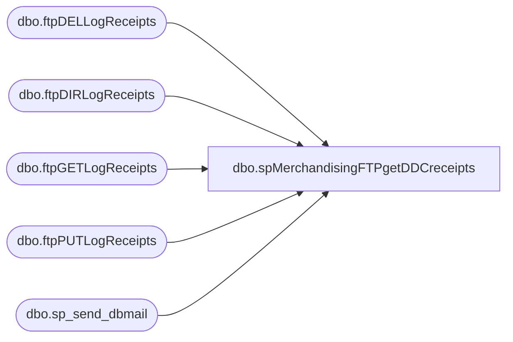

# dbo.spMerchandisingFTPgetDDCreceipts

**Database:** me_01  
**Server:** bedrockdb02  

## Architecture Diagram



## Table Dependencies

| Referenced Table |
|---|
| dbo.ftpDELLogReceipts |
| dbo.ftpDIRLogReceipts |
| dbo.ftpGETLogReceipts |
| dbo.ftpPUTLogReceipts |
| dbo.sp_send_dbmail |

## Stored Procedure Code

```sql
CREATE proc [dbo].[spMerchandisingFTPgetDDCreceipts]
as

-- =====================================================================================================
-- Name: spMerchandisingFTPgetDDCreceipts
--
-- Description:	FTP's to DDC server to retrieve Receipt files.
--				Captures log, sends email if failure occurs.
--
-- Input:	NA
--
-- Output: log file and emails only if failure occurs
--
-- Dependencies: NA
--				 
-- Revision History
--		Name:			Date:			Comments:
--		Dan Tweedie		10/08/2010		Created proc.	
--		Dan Tweedie		07/14/2015		Pointed to Kermode instead of oursmerchdb01
-- =====================================================================================================

set nocount on

--declare and set ftp variables 
declare @ftpDIR varchar(1000),
		@ftpGET varchar(1000),
		@ftpPUT varchar(1000),
		@ftpDEL varchar(1000),
		@Log_query varchar(1000),
		@Log_filename varchar(100),
		@Log_file_location varchar(100),
		@Log_bcp varchar(1000),
		@body varchar(4000)
		
set @ftpDIR = 'ftp -d -s:\\kermode\FileRepository\MERCHANDISING\WC_Distro\RECEIPTS\FTP\SCRIPTS\ftpDIR.txt' 
set @ftpGET = 'ftp -d -s:\\kermode\FileRepository\MERCHANDISING\WC_Distro\RECEIPTS\FTP\SCRIPTS\ftpGET.txt' 
set @ftpPUT = 'ftp -d -s:\\kermode\FileRepository\MERCHANDISING\WC_Distro\RECEIPTS\FTP\SCRIPTS\ftpPUT.txt' 
set @ftpDEL = 'ftp -d -s:\\kermode\FileRepository\MERCHANDISING\WC_Distro\RECEIPTS\FTP\SCRIPTS\ftpDEL.txt'

--create temp tables for ftp logs
IF (Object_ID('me_01..ftpDIRLogReceipts') IS NOT NULL) DROP TABLE ftpDIRLogReceipts
create table ftpDIRLogReceipts
(ftpLog varchar(4000))

IF (Object_ID('me_01..ftpGETLogReceipts') IS NOT NULL) DROP TABLE ftpGETLogReceipts
create table ftpGETLogReceipts
(ftpLog varchar(4000))

IF (Object_ID('me_01..ftpPUTLogReceipts') IS NOT NULL) DROP TABLE ftpPUTLogReceipts
create table ftpPUTLogReceipts
(ftpLog varchar(4000))

IF (Object_ID('me_01..ftpDELLogReceipts') IS NOT NULL) DROP TABLE ftpDELLogReceipts
create table ftpDELLogReceipts
(ftpLog varchar(4000))

--execute sql/ftp
----connect to ftp server, if connection unsuccessful, send email
insert ftpDIRLogReceipts exec master..xp_cmdshell @ftpDIR
if (select count(*) from ftpDIRLogReceipts where ftplog like '%Welcome%') < 1
	begin

		set @Log_query = 'select * from me_01.dbo.ftpDIRLogReceipts'
		set @Log_filename = 'ftpDIRLog.txt'
		set @Log_file_location = '\\kermode\FileRepository\MERCHANDISING\WC_Distro\RECEIPTS\FTP\LOGS\'
		set @Log_bcp = 'bcp "' + @Log_query + '" queryout "' + @Log_file_location + @Log_filename + '" -t, -T -c -Sbedrockdb02'

		exec master..xp_cmdshell @Log_bcp
			
		set @body =	'An attempt to connect to the DDC FTP server failed.' 
					+ char(10) + char(13) + 
					'See the attached log for details.'
					+ char(10) + char(13) + 
					+ char(10) + char(13) + 
					'This process is managed by me_01.dbo.spMerchandisingFTPgetDDCreceipts'

		EXEC msdb.dbo.sp_send_dbmail
		@profile_name = 'MerchAdmin',
		@recipients = 'merchadmin@buildabear.com',
		@subject = 'FTP Failure: Connection Failed',
		@body = @body,
		@file_attachments = '\\kermode\FileRepository\MERCHANDISING\WC_Distro\RECEIPTS\FTP\LOGS\ftpDIRLog.txt',
		@importance = 'HIGH'
	
	end
--if receipt file is present, continue
if (select count(*) from ftpDIRLogReceipts where ftplog like '%rc_babw%.dat%') > 0 

	BEGIN

		insert ftpGETLogReceipts exec master..xp_cmdshell @ftpGET
		if (select count(*) from ftpGETLogReceipts where ftplog like '%Transfer OK%') < 1
			begin
			
				set @Log_query = 'select * from me_01.dbo.ftpGETLogReceipts'
				set @Log_filename = 'ftpGETLog.txt'
				set @Log_file_location = '\\kermode\FileRepository\MERCHANDISING\WC_Distro\RECEIPTS\FTP\LOGS\'
				set @Log_bcp = 'bcp "' + @Log_query + '" queryout "' + @Log_file_location + @Log_filename + '" -t, -T -c -Sbedrockdb02'

				exec master..xp_cmdshell @Log_bcp
										
				set @body =	'An attempt to FTP a RECEIPT file from DDC to BAB failed.' 
							+ char(10) + char(13) + 
							'See the attached log for details.'
							+ char(10) + char(13) + 
							+ char(10) + char(13) + 
							'This process is managed by me_01.dbo.spMerchandisingFTPgetDDCreceipts'
		
				EXEC msdb.dbo.sp_send_dbmail
				@profile_name = 'MerchAdmin',
				@recipients = 'merchadmin@buildabear.com',
				@subject = 'FTP Failure: RECEIPT file from DDC to BAB',
				@body = @body,
				@file_attachments = '\\kermode\FileRepository\MERCHANDISING\WC_Distro\RECEIPTS\FTP\LOGS\ftpGETLog.txt',
				@importance = 'HIGH'
						
			end

		insert ftpPUTLogReceipts exec master..xp_cmdshell @ftpPUT
		if (select count(*) from ftpPUTLogReceipts where ftplog like '%Transfer OK%') < 1
			begin
				set @Log_query = 'select * from me_01.dbo.ftpPUTLogReceipts'
				set @Log_filename = 'ftpPUTLog.txt'
				set @Log_file_location = '\\kermode\FileRepository\MERCHANDISING\WC_Distro\RECEIPTS\FTP\LOGS\'
				set @Log_bcp = 'bcp "' + @Log_query + '" queryout "' + @Log_file_location + @Log_filename + '" -t, -T -c -Sbedrockdb02'

				exec master..xp_cmdshell @Log_bcp
										
				set @body =	'An attempt to FTP a RECEIPT file from BAB to DDC DONE folder failed.' 
							+ char(10) + char(13) + 
							'See the attached log for details.'
							+ char(10) + char(13) + 
							+ char(10) + char(13) + 
							'This process is managed by me_01.dbo.spMerchandisingFTPgetDDCreceipts'
		
				EXEC msdb.dbo.sp_send_dbmail
				@profile_name = 'MerchAdmin',
				@recipients = 'merchadmin@buildabear.com',
				@subject = 'FTP Failure: RECEIPT file from BAB to DDC DONE folder',
				@body = @body,
				@file_attachments = '\\kermode\FileRepository\MERCHANDISING\WC_Distro\RECEIPTS\FTP\LOGS\ftpPUTLog.txt',
				@importance = 'HIGH'
			end

		insert ftpDELLogReceipts exec master..xp_cmdshell @ftpDEL
		if (select count(*) from ftpDELLogReceipts where ftplog like '%File deleted successfully%') < 1
			begin
				set @Log_query = 'select * from me_01.dbo.ftpDELLogReceipts'
				set @Log_filename = 'ftpDELLog.txt'
				set @Log_file_location = '\\kermode\FileRepository\MERCHANDISING\WC_Distro\RECEIPTS\FTP\LOGS\'
				set @Log_bcp = 'bcp "' + @Log_query + '" queryout "' + @Log_file_location + @Log_filename + '" -t, -T -c -Sbedrockdb02'

				exec master..xp_cmdshell @Log_bcp
										
				set @body =	'An attempt to DELETE a RECEIPT file on the DDC server failed.' 
							+ char(10) + char(13) + 
							'See the attached log for details.'
							+ char(10) + char(13) + 
							+ char(10) + char(13) + 
							'This process is managed by me_01.dbo.spMerchandisingFTPgetDDCreceipts'
		
				EXEC msdb.dbo.sp_send_dbmail
				@profile_name = 'MerchAdmin',
				@recipients = 'merchadmin@buildabear.com',
				@subject = 'FTP Failure: Delete RECEIPT file DDC server',
				@body = @body,
				@file_attachments = '\\kermode\FileRepository\MERCHANDISING\WC_Distro\RECEIPTS\FTP\LOGS\ftpDELLog.txt',
				@importance = 'HIGH'
			end


END
```

