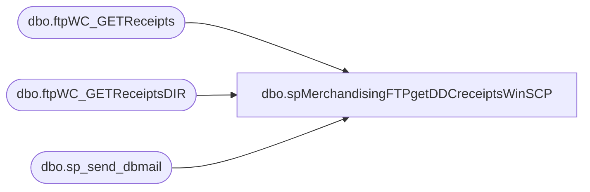

# dbo.spMerchandisingFTPgetDDCreceiptsWinSCP

**Database:** me_01  
**Server:** bedrockdb02  

## Architecture Diagram



## Table Dependencies

| Referenced Table |
|---|
| dbo.ftpWC_GETReceipts |
| dbo.ftpWC_GETReceiptsDIR |
| dbo.sp_send_dbmail |

## Stored Procedure Code

```sql
CREATE proc [dbo].[spMerchandisingFTPgetDDCreceiptsWinSCP]

as

-- =====================================================================================================
-- Name: spMerchandisingFTPgetDDCreceiptsWinSCP
--
-- Revision History
--		Name:			Date:			Comments:
--		Dan Tweedie		2020-06-23		Created proc
-- =====================================================================================================
	
set nocount on


--==================================================================================================================================================
--DELETE PREVIOUS LOG FILES
IF (Object_ID('tempdb..#DEL3') IS NOT NULL) DROP TABLE #DEL3
create table #DEL3(output varchar(1000))
	insert #DEL3 exec master..xp_cmdshell 'dir \\kermode\FileRepository\MERCHANDISING\WC_Distro\FTP\WinSCP\Logs\Inbound\WCReceiptsDownload.log /B'
	insert #DEL3 exec master..xp_cmdshell 'dir \\kermode\FileRepository\MERCHANDISING\WC_Distro\FTP\WinSCP\Logs\Inbound\ftpWC_GETReceiptsLog.txt /B'
	insert #DEL3 exec master..xp_cmdshell 'dir \\kermode\FileRepository\MERCHANDISING\WC_Distro\FTP\WinSCP\Logs\Inbound\WCReceiptsDIR.log /B'
	insert #DEL3 exec master..xp_cmdshell 'dir \\kermode\FileRepository\MERCHANDISING\WC_Distro\FTP\WinSCP\Logs\Inbound\ftpWC_GETReceiptsDIRLog.txt /B'
delete from #DEL3 where output is null or output = 'File Not Found'

IF (select count(*) from #DEL3 where output = 'WCReceiptsDownload.log') > 0
	begin
		exec master..xp_cmdshell 'del \\kermode\FileRepository\MERCHANDISING\WC_Distro\FTP\WinSCP\Logs\Inbound\WCReceiptsDownload.log'
	end
IF (select count(*) from #DEL3 where output = 'ftpWC_GETReceiptsLog.txt') > 0
	begin
		exec master..xp_cmdshell 'del \\kermode\FileRepository\MERCHANDISING\WC_Distro\FTP\WinSCP\Logs\Inbound\ftpWC_GETReceiptsLog.txt'
	end	
IF (select count(*) from #DEL3 where output = 'WCReceiptsDIR.log') > 0
	begin
		exec master..xp_cmdshell 'del \\kermode\FileRepository\MERCHANDISING\WC_Distro\FTP\WinSCP\Logs\Inbound\WCReceiptsDIR.log'
	end	
IF (select count(*) from #DEL3 where output = 'ftpWC_GETReceiptsDIRLog.txt') > 0
	begin
		exec master..xp_cmdshell 'del \\kermode\FileRepository\MERCHANDISING\WC_Distro\FTP\WinSCP\Logs\Inbound\ftpWC_GETReceiptsDIRLog.txt'
	end

--==================================================================================================================================================
------CHECK FOR EXISTENCE OF RECEIPT FILE
--==================================================================================================================================================
declare 
		@winSCP varchar(1000),
		@ini varchar(1000),
		@script varchar(1000),
		@log varchar(1000),
		@FTP varchar(4000),
		@Log_query varchar(1000),
		@Log_filename varchar(100),
		@Log_file_location varchar(100),
		@Log_bcp varchar(1000),
		@body varchar(4000)

select 
		@winSCP = '"\\stl-ssis-p-01\C$\Program Files (x86)\WinSCP\winscp.com"',
		--@ini = ' /ini=\\kermode\FileRepository\MERCHANDISING\WC_Distro\FTP\WinSCP\WINSCP.ini',
		@script = ' /script=\\kermode\FileRepository\MERCHANDISING\WC_Distro\FTP\WinSCP\Scripts\PoReceipts\PoReceiptsDIR.txt',
		@log = ' /log=\\kermode\FileRepository\MERCHANDISING\WC_Distro\FTP\WinSCP\Logs\Inbound\WCPoReceiptsDIR.log',
		@FTP = concat(@winSCP, /*@ini,*/ @script, @log)

IF (Object_ID('me_01..ftpWC_GETReceiptsDIR') IS NOT NULL) DROP TABLE ftpWC_GETReceiptsDIR
create table ftpWC_GETReceiptsDIR
(ftpLog varchar(4000))

insert ftpWC_GETReceiptsDIR exec master..xp_cmdshell @FTP

if (select count(*) from ftpWC_GETReceiptsDIR where ftpLog like '%.dat') > 0


--==================================================================================================================================================
------DOWNLOAD RECEIPTS FILE
--==================================================================================================================================================
		BEGIN
							
				select 
						@script = ' /script=\\kermode\FileRepository\MERCHANDISING\WC_Distro\FTP\WinSCP\Scripts\PoReceipts\PoReceipts.txt',
						@log = ' /log=\\kermode\FileRepository\MERCHANDISING\WC_Distro\FTP\WinSCP\Logs\Inbound\WCReceiptsDownload.log',
						@FTP = concat(@winSCP, @ini, @script, @log)

				--create temp tables for ftp logs
				IF (Object_ID('me_01..ftpWC_GETReceipts') IS NOT NULL) DROP TABLE ftpWC_GETReceipts
				create table ftpWC_GETReceipts
				(ftpLog varchar(4000))

				--execute sql/ftp
				----connect to ftp server, if connection unsuccessful, send email
						insert ftpWC_GETReceipts exec master..xp_cmdshell @FTP
						if (select count(*) from ftpWC_GETReceipts where ftplog like '%.dat%[100%]') < 1
							begin
								set @Log_query = 'select * from bedrockdb02.me_01.dbo.ftpWC_GETReceipts'
								set @Log_filename = 'ftpWC_GETReceiptsLog.txt'
								set @Log_file_location = '\\kermode\FileRepository\MERCHANDISING\WC_Distro\FTP\WinSCP\Logs\Inbound\'
								set @Log_bcp = 'bcp "' + @Log_query + '" queryout "' + @Log_file_location + @Log_filename + '" -t, -T -c -Sbedrockdb02'

								exec master..xp_cmdshell @Log_bcp
															
								set @body =	'An attempt to FTP download from DDC failed.' 
											+ char(10) + char(13) + 
											'See the attached logs for details.'
											+ char(10) + char(13) + 
											+ char(10) + char(13) + 
											'This process is managed by bedrockdb02.me_01.dbo.spMerchandisingFtpWC_GetPoReceiptFilesWinSCP'
							
								EXEC bedrockdb02.msdb.dbo.sp_send_dbmail
								@profile_name = 'MerchAdmin',
								@recipients = 'EntSysSupport@buildabear.com',
								@subject = 'FTP Failure: WC Receipts File Download from DDC',
								@body = @body,
								@file_attachments = '\\kermode\FileRepository\MERCHANDISING\WC_Distro\FTP\WinSCP\Logs\Inbound\ftpWC_GETReceiptsLog.txt;\\kermode\FileRepository\MERCHANDISING\WC_Distro\FTP\WinSCP\Logs\Inbound\WCReceiptsDownload.log',
								@importance = 'HIGH'
							end


		END
--==================================================================================================================================================
```

