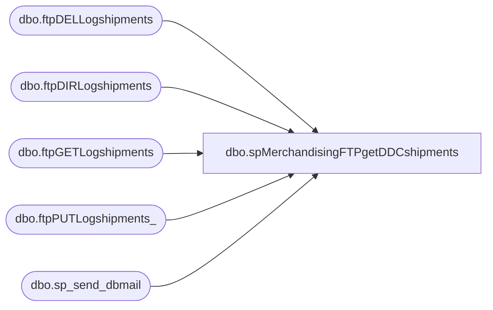

# dbo.spMerchandisingFTPgetDDCshipments

**Database:** me_01  
**Server:** bedrockdb02  

## Architecture Diagram



## Table Dependencies

| Referenced Table |
|---|
| dbo.ftpDELLogshipments |
| dbo.ftpDIRLogshipments |
| dbo.ftpGETLogshipments |
| dbo.ftpPUTLogshipments_ |
| dbo.sp_send_dbmail |

## Stored Procedure Code

```sql
CREATE proc [dbo].[spMerchandisingFTPgetDDCshipments]
as

-- =====================================================================================================
-- Name: spMerchandisingFTPgetDDCshipments
--
-- Description:	FTP's to DDC server to retrieve shipment files.
--				Captures log, sends email if failure occurs.
--
-- Input:	NA
--
-- Output: log file and emails only if failure occurs
--
-- Dependencies: NA
--				 
-- Revision History
--		Name:			Date:			Comments:
--		Dan Tweedie		10/08/2010		Created proc.	
--		Dan Tweedie		07/14/2015		Pointed to Kermode instead of oursmerchdb01
-- =====================================================================================================

set nocount on

--declare and set ftp variables 
declare @ftpDIR varchar(1000),
		@ftpGET varchar(1000),
		@ftpPUT varchar(1000),
		@ftpDEL varchar(1000),
		@Log_query varchar(1000),
		@Log_filename varchar(100),
		@Log_file_location varchar(100),
		@Log_bcp varchar(1000),
		@body varchar(4000)
		
set @ftpDIR = 'ftp -d -s:\\kermode\FileRepository\MERCHANDISING\WC_Distro\SHIPMENTS\FTP\SCRIPTS\ftpDIR.txt' 
set @ftpGET = 'ftp -d -s:\\kermode\FileRepository\MERCHANDISING\WC_Distro\SHIPMENTS\FTP\SCRIPTS\ftpGET.txt' 
set @ftpPUT = 'ftp -d -s:\\kermode\FileRepository\MERCHANDISING\WC_Distro\SHIPMENTS\FTP\SCRIPTS\ftpPUT.txt' 
set @ftpDEL = 'ftp -d -s:\\kermode\FileRepository\MERCHANDISING\WC_Distro\SHIPMENTS\FTP\SCRIPTS\ftpDEL.txt'

--create temp tables for ftp logs
IF (Object_ID('me_01..ftpDIRLogshipments') IS NOT NULL) DROP TABLE ftpDIRLogshipments
create table ftpDIRLogshipments
(ftpLog varchar(4000))

IF (Object_ID('me_01..ftpGETLogshipments') IS NOT NULL) DROP TABLE ftpGETLogshipments
create table ftpGETLogshipments
(ftpLog varchar(4000))

IF (Object_ID('me_01..ftpPUTLogshipments_') IS NOT NULL) DROP TABLE ftpPUTLogshipments_
create table ftpPUTLogshipments_
(ftpLog varchar(4000))

IF (Object_ID('me_01..ftpDELLogshipments') IS NOT NULL) DROP TABLE ftpDELLogshipments
create table ftpDELLogshipments
(ftpLog varchar(4000))

--execute sql/ftp
----connect to ftp server, if connection unsuccessful, send email
insert ftpDIRLogshipments exec master..xp_cmdshell @ftpDIR
if (select count(*) from ftpDIRLogshipments where ftplog like '%Welcome%') < 1
	begin

		set @Log_query = 'select * from me_01.dbo.ftpDIRLogshipments'
		set @Log_filename = 'ftpDIRLog.txt'
		set @Log_file_location = '\\kermode\FileRepository\MERCHANDISING\WC_Distro\SHIPMENTS\FTP\LOGS\'
		set @Log_bcp = 'bcp "' + @Log_query + '" queryout "' + @Log_file_location + @Log_filename + '" -t, -T -c -Sbedrockdb02'

		exec master..xp_cmdshell @Log_bcp
			
		set @body =	'An attempt to connect to the DDC FTP server failed.' 
					+ char(10) + char(13) + 
					'See the attached log for details.'
					+ char(10) + char(13) + 
					+ char(10) + char(13) + 
					'This process is managed by me_01.dbo.spMerchandisingFTPgetDDCshipments'

		EXEC msdb.dbo.sp_send_dbmail
		@profile_name = 'MerchAdmin',
		@recipients = 'merchadmin@buildabear.com',
		@subject = 'FTP Failure: Connection Failed',
		@body = @body,
		@file_attachments = '\\kermode\FileRepository\MERCHANDISING\WC_Distro\SHIPMENTS\FTP\LOGS\ftpDIRLog.txt',
		@importance = 'HIGH'
	
	end
--if shipment file is present, continue
if (select count(*) from ftpDIRLogshipments where ftplog like '%sc_babw%.dat%') > 0 

	BEGIN

		insert ftpGETLogshipments exec master..xp_cmdshell @ftpGET
		if (select count(*) from ftpGETLogshipments where ftplog like '%Transfer OK%') < 1
			begin
			
				set @Log_query = 'select * from me_01.dbo.ftpGETLogshipments'
				set @Log_filename = 'ftpGETLog.txt'
				set @Log_file_location = '\\kermode\FileRepository\MERCHANDISING\WC_Distro\SHIPMENTS\FTP\LOGS\'
				set @Log_bcp = 'bcp "' + @Log_query + '" queryout "' + @Log_file_location + @Log_filename + '" -t, -T -c -Sbedrockdb02'

				exec master..xp_cmdshell @Log_bcp
										
				set @body =	'An attempt to FTP a shipment file from DDC to BAB failed.' 
							+ char(10) + char(13) + 
							'See the attached log for details.'
							+ char(10) + char(13) + 
							+ char(10) + char(13) + 
							'This process is managed by me_01.dbo.spMerchandisingFTPgetDDCshipments'
		
				EXEC msdb.dbo.sp_send_dbmail
				@profile_name = 'MerchAdmin',
				@recipients = 'merchadmin@buildabear.com',
				@subject = 'FTP Failure: shipment file from DDC to BAB',
				@body = @body,
				@file_attachments = '\\kermode\FileRepository\MERCHANDISING\WC_Distro\SHIPMENTS\FTP\LOGS\ftpGETLog.txt',
				@importance = 'HIGH'
						
			end

		insert ftpPUTLogshipments_ exec master..xp_cmdshell @ftpPUT
		if (select count(*) from ftpPUTLogshipments_ where ftplog like '%Transfer OK%') < 1
			begin
				set @Log_query = 'select * from me_01.dbo.ftpPUTLogshipments_'
				set @Log_filename = 'ftpPUTLog.txt'
				set @Log_file_location = '\\kermode\FileRepository\MERCHANDISING\WC_Distro\SHIPMENTS\FTP\LOGS\'
				set @Log_bcp = 'bcp "' + @Log_query + '" queryout "' + @Log_file_location + @Log_filename + '" -t, -T -c -Sbedrockdb02'

				exec master..xp_cmdshell @Log_bcp
										
				set @body =	'An attempt to FTP a shipment file from BAB to DDC DONE folder failed.' 
							+ char(10) + char(13) + 
							'See the attached log for details.'
							+ char(10) + char(13) + 
							+ char(10) + char(13) + 
							'This process is managed by me_01.dbo.spMerchandisingFTPgetDDCshipments'
		
				EXEC msdb.dbo.sp_send_dbmail
				@profile_name = 'MerchAdmin',
				@recipients = 'merchadmin@buildabear.com',
				@subject = 'FTP Failure: shipment file from BAB to DDC DONE folder',
				@body = @body,
				@file_attachments = '\\kermode\FileRepository\MERCHANDISING\WC_Distro\SHIPMENTS\FTP\LOGS\ftpPUTLog.txt',
				@importance = 'HIGH'
			end

		insert ftpDELLogshipments exec master..xp_cmdshell @ftpDEL
		if (select count(*) from ftpDELLogshipments where ftplog like '%File deleted successfully%') < 1
			begin
				set @Log_query = 'select * from me_01.dbo.ftpDELLogshipments'
				set @Log_filename = 'ftpDELLog.txt'
				set @Log_file_location = '\\kermode\FileRepository\MERCHANDISING\WC_Distro\SHIPMENTS\FTP\LOGS\'
				set @Log_bcp = 'bcp "' + @Log_query + '" queryout "' + @Log_file_location + @Log_filename + '" -t, -T -c -Sbedrockdb02'

				exec master..xp_cmdshell @Log_bcp
										
				set @body =	'An attempt to DELETE a shipment file on the DDC server failed.' 
							+ char(10) + char(13) + 
							'See the attached log for details.'
							+ char(10) + char(13) + 
							+ char(10) + char(13) + 
							'This process is managed by me_01.dbo.spMerchandisingFTPgetDDCshipments'
		
				EXEC msdb.dbo.sp_send_dbmail
				@profile_name = 'MerchAdmin',
				@recipients = 'merchadmin@buildabear.com',
				@subject = 'FTP Failure: Delete shipment file DDC server',
				@body = @body,
				@file_attachments = '\\kermode\FileRepository\MERCHANDISING\WC_Distro\SHIPMENTS\FTP\LOGS\ftpDELLog.txt',
				@importance = 'HIGH'
			end


END
```

