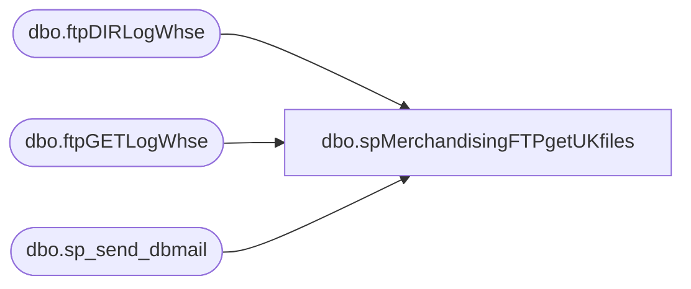

# dbo.spMerchandisingFTPgetUKfiles

**Database:** me_01  
**Server:** bedrockdb02  

## Architecture Diagram



## Table Dependencies

| Referenced Table |
|---|
| dbo.ftpDIRLogWhse |
| dbo.ftpGETLogWhse |
| dbo.sp_send_dbmail |

## Stored Procedure Code

```sql
CREATE proc [dbo].[spMerchandisingFTPgetUKfiles]
as

-- =====================================================================================================
-- Name: spMerchandisingFTPgetUKfiles
--
-- Description:	FTP's to UK Clipper server to retrieve Whse files.
--				Captures log, sends email if failure occurs.
--
-- Input:	NA
--
-- Output: log file and emails only if failure occurs
--
-- Dependencies: NA
--				 
-- Revision History
--		Name:			Date:			Comments:
--		Dan Tweedie		11/13/2012		Created proc.	
--		Dan Tweedie		04/08/2013		UPdated to connect to a new FTP server.
--		Dan Tweedie		07/08/2015		Altered to change the location for the files from oursmerchdb01 to kermode
-- =====================================================================================================

set nocount on

--declare and set ftp variables 
declare @ftpDIR varchar(1000),
		@ftpGET varchar(1000),
		@Log_query varchar(1000),
		@Log_filename varchar(100),
		@Log_file_location varchar(100),
		@Log_bcp varchar(1000),
		@body varchar(4000)
		
set @ftpDIR = 'ftp -d -s:\\kermode\FileRepository\MERCHANDISING\UK_Distro\FTP\SCRIPTS\ftpDIR.txt' 
set @ftpGET = 'ftp -d -s:\\kermode\FileRepository\MERCHANDISING\UK_Distro\FTP\SCRIPTS\ftpGET.txt' 

--create temp tables for ftp logs
IF (Object_ID('me_01..ftpDIRLogWhse') IS NOT NULL) DROP TABLE ftpDIRLogWhse
create table ftpDIRLogWhse
(ftpLog varchar(4000))

IF (Object_ID('me_01..ftpGETLogWhse') IS NOT NULL) DROP TABLE ftpGETLogWhse
create table ftpGETLogWhse
(ftpLog varchar(4000))

--execute sql/ftpHHH
----connect to ftp server, if connection unsuccessful, send email
insert ftpDIRLogWhse exec master..xp_cmdshell @ftpDIR
if (select count(*) from ftpDIRLogWhse where ftplog like '%Logon Accepted%') < 1
	begin

		set @Log_query = 'select * from BEDROCKDB02.me_01.dbo.ftpDIRLogWhse'
		set @Log_filename = 'ftpDIRLog.txt'
		set @Log_file_location = '\\kermode\FileRepository\MERCHANDISING\UK_Distro\FTP\LOGS\'
		set @Log_bcp = 'bcp "' + @Log_query + '" queryout "' + @Log_file_location + @Log_filename + '" -t, -T -c -SBEDROCKDB02'

		exec master..xp_cmdshell @Log_bcp
			
		set @body =	'An attempt to connect to the Clipper - UK FTP server to get a file list failed.' 
					+ char(10) + char(13) + 
					'See the attached log for details.'
					+ char(10) + char(13) + 
					+ char(10) + char(13) + 
					'This process is managed by spMerchandisingFTPgetUKfiles'

		EXEC BEDROCKDB02.msdb.dbo.sp_send_dbmail
		@profile_name = 'MerchAdmin',
		@recipients = 'merchadmin@buildabear.com',
		@subject = 'FTP Failure: Connection Failed',
		@body = @body,
		@file_attachments = '\\kermode\FileRepository\MERCHANDISING\UK_Distro\FTP\LOGS\ftpDIRLog.txt',
		@importance = 'HIGH'
	
	end
--if files are present, continue
declare @files int
select @files = count(*) from ftpDIRLogWhse where ftplog like '%%.txt%' or ftplog like '%%.dat%'

if (select count(*) from ftpDIRLogWhse where ftplog like '%%.txt%' or ftplog like '%%.dat%') > 0 

	BEGIN

		insert ftpGETLogWhse exec master..xp_cmdshell @ftpGET
		if (select count(*) from ftpGETLogWhse where ftplog like '%Retrieved%') < @files
			begin
			
				set @Log_query = 'select * from BEDROCKDB02.me_01.dbo.ftpGETLogWhse'
				set @Log_filename = 'ftpGETLog.txt'
				set @Log_file_location = '\\kermode\FileRepository\MERCHANDISING\UK_Distro\FTP\LOGS\'
				set @Log_bcp = 'bcp "' + @Log_query + '" queryout "' + @Log_file_location + @Log_filename + '" -t, -T -c -SBEDROCKDB02'

				exec master..xp_cmdshell @Log_bcp
										
				set @body =	'An attempt to FTP Whse files from Clipper - UK to BAB failed.' 
							+ char(10) + char(13) + 
							'See the attached log for details.'
							+ char(10) + char(13) + 
							+ char(10) + char(13) + 
							'This process is managed by spMerchandisingFTPgetUKfiles'
		
				EXEC BEDROCKDB02.msdb.dbo.sp_send_dbmail
				@profile_name = 'MerchAdmin',
				@recipients = 'merchadmin@buildabear.com',
				@subject = 'FTP Failure: Adjustments file from Clipper - UK to BAB',
				@body = @body,
				@file_attachments = '\\kermode\FileRepository\MERCHANDISING\UK_Distro\FTP\LOGS\ftpGETLog.txt',
				@importance = 'HIGH'
						
			end
			
------
	--move files to the interface directories
	declare @moveInventory varchar(1000),
		    @moveShipment varchar(1000),
			@moveReceipt varchar(1000),
			@moveStockAdj varchar(1000)

	select @moveInventory = 'move \\kermode\FileRepository\MERCHANDISING\UK_Distro\FTP\inventory*.txt \\kermode\FileRepository\MERCHANDISING\UK_Distro\INVENTORY'
	select @moveshipment = 'move \\kermode\FileRepository\MERCHANDISING\UK_Distro\FTP\distribution*.txt \\kermode\FileRepository\MERCHANDISING\UK_Distro\SHIPMENTS'
	select @movereceipt = 'move \\kermode\FileRepository\MERCHANDISING\UK_Distro\FTP\recv*.dat \\kermode\FileRepository\MERCHANDISING\UK_Distro\RECEIPTS'
	select @movestockadj = 'move \\kermode\FileRepository\MERCHANDISING\UK_Distro\FTP\stockadjustment*.txt \\kermode\FileRepository\MERCHANDISING\UK_Distro\STOCKADJ'

	exec master..xp_cmdshell @moveInventory
	exec master..xp_cmdshell @moveshipment
	exec master..xp_cmdshell @movereceipt
	exec master..xp_cmdshell @movestockadj
-------------------------------------------------------------------------------------------------------------------------------------
	---now do a final dir command and send email report to confirm that files were retrieved.
	IF (Object_ID('tempdb..##dirInventory') IS NOT NULL) DROP TABLE ##dirInventory
	create table ##dirInventory(files varchar(4000))
	
	IF (Object_ID('tempdb..##dirShipment') IS NOT NULL) DROP TABLE ##dirShipment
	create table ##dirShipment(files varchar(4000))

	IF (Object_ID('tempdb..##dirReceipt') IS NOT NULL) DROP TABLE ##dirReceipt
	create table ##dirReceipt(files varchar(4000))

	IF (Object_ID('tempdb..##dirStockAdj') IS NOT NULL) DROP TABLE ##dirStockAdj
	create table ##dirStockAdj(files varchar(4000))
	
	declare @dirInventory varchar(1000),
			@dirShipment varchar(1000),
			@dirReceipt varchar(1000),
			@dirStockAdj varchar(1000)

	select @dirInventory = 'dir \\kermode\FileRepository\MERCHANDISING\UK_Distro\INVENTORY /B'
	select @dirShipment = 'dir \\kermode\FileRepository\MERCHANDISING\UK_Distro\SHIPMENTS /B'
	select @dirReceipt = 'dir \\kermode\FileRepository\MERCHANDISING\UK_Distro\RECEIPTS /B'
	select @dirStockAdj = 'dir \\kermode\FileRepository\MERCHANDISING\UK_Distro\STOCKADJ /B'

	insert ##dirInventory
	exec master..xp_cmdshell @dirInventory

	insert ##dirShipment
	exec master..xp_cmdshell @dirshipment
	
	insert ##dirReceipt
	exec master..xp_cmdshell @dirreceipt
	
	insert ##dirStockAdj
	exec master..xp_cmdshell @dirstockadj

	declare @inv int,
			@shpmt int,
			@rcpt int,
			@adj int,
			@text nvarchar(max)

	select @inv = count(*) from ##dirInventory where files like '%.txt'
	select @shpmt = count(*) from ##dirShipment where files like '%.txt'
	select @rcpt = count(*) from ##dirReceipt where files like '%.dat'
	select @adj = count(*) from ##dirStockAdj where files like '%.txt'

	set @text = '<font face =arial size = 2>' + 
			'Clipper File Count Summary<br>' +
			'(files retrieved from the Clipper UK server and successfully located to our interface directories on \\kermode\FileRepository\MERCHANDISING\UK_Distro)' + 
			'<br><br>' +
			'<table border="1">' +
			'<tr><th>SHIPMENT</th><th>RECEIPT</th><th>ADJUSTMENT</th><th>INVENTORY</th></tr>' +
			CAST ( ( SELECT td = @shpmt,'',
							td = @rcpt, '',
							td = @adj, '',
							td = @inv, ''
					  FOR XML PATH('tr'), TYPE 
			) AS NVARCHAR(MAX) ) +
			'</font></table></font></p></p>
			<br>
			<font face =arial size = 1>This report was run from bedrockdb02.me_01.dbo.spMerchandisingFTPgetUKfiles.</font>
			<br>
			<br>'

	exec msdb.dbo.sp_send_dbmail
		@profile_name = 'merchadmin',
		@recipients = 'merchadmin@buildabear.com',
		@body = @text,
		@subject = 'Clipper UK File Summary',
		@body_format = 'HTML'

END
```

