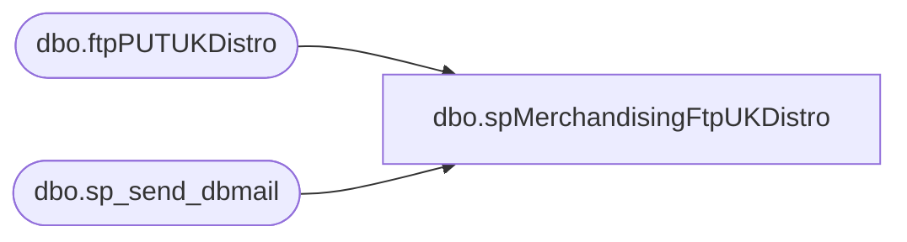

# dbo.spMerchandisingFtpUKDistro

**Database:** me_01  
**Server:** bedrockdb02  

## Architecture Diagram



## Table Dependencies

| Referenced Table |
|---|
| dbo.ftpPUTUKDistro |
| dbo.sp_send_dbmail |

## Stored Procedure Code

```sql
CREATE proc [dbo].[spMerchandisingFtpUKDistro]

as
-- =====================================================================================================
-- Name: spMerchandisingFtpUKDistro
--
-- Description:	Checks for existence of UK Distro file, uploads to UK FTP server, moves file to Done folder
--				 
-- Revision History
--		Name:			Date:			Comments:
--		Dan Tweedie		03/25/2015		Created proc.	
--		Tim Callahan	08/17/2016		Added Logic to e-mail FTP log on each run due to Clipper missing files twice within 1 week despite no error in FTP log. 
-- =====================================================================================================

set nocount on

--check the directory to see if there are distro CSV files ready to import
-------------do a DIR command and store the results in a temp table
IF (Object_ID('tempdb..#DIR') IS NOT NULL) DROP TABLE #DIR
create table #DIR (output varchar(1000))
insert #DIR exec master..xp_cmdshell 'dir \\kermode\FileRepository\MERCHANDISING\uk_distro\OUTBOUND\*.csv /B'
delete from #DIR where output is null or output = 'File Not Found'

------------query temp table to see if there are CSV files
if (select count(*) from #DIR) > 0

BEGIN
			-----ftp upload
					declare @ftpPUT varchar(1000),
							@Log_query varchar(1000),
							@Log_filename varchar(100),
							@Log_file_location varchar(100),
							@Log_bcp varchar(1000),
							@body varchar(4000)
							
					set @ftpPUT = 'ftp -d -s:\\kermode\FileRepository\MERCHANDISING\uk_distro\OUTBOUND\FTP\ftpPUT.txt' 

					--create temp tables for ftp logs
					IF (Object_ID('me_01..ftpPUTUKDistro') IS NOT NULL) DROP TABLE ftpPUTUKDistro
					create table ftpPUTUKDistro
					(ftpLog varchar(4000))

					--execute sql/ftp
					----connect to ftp server, if connection unsuccessful, send email
							insert ftpPUTUKDistro exec master..xp_cmdshell @ftpPUT

							-- Added 8/17/2016 - Send Log Each time export occurs, still send seperate alert if appears to fail 

							
										Declare
										@Log_query2 varchar(1000),
										@Log_filename2 varchar(100),
										@Log_file_location2 varchar(100),
										@Log_bcp2 varchar(1000),
										@body2 varchar(4000)
		

										set @Log_query2 = 'select * from bedrockdb02.me_01.dbo.ftpPUTUKDistro'
										set @Log_filename2 = 'ftpPUTMonitorLog.txt'
										set @Log_file_location2 = '\\kermode\FileRepository\MERCHANDISING\uk_distro\OUTBOUND\FTP\LOGS\Monitor\'
										set @Log_bcp2 = 'bcp "' + @Log_query2 + '" queryout "' + @Log_file_location2 + @Log_filename2 + '" -t, -T -c -Sbedrockdb02'

										

										exec master..xp_cmdshell @Log_bcp2


										set @body2 = 'Attached is the log from the most recent FTP transmission to Clipper Warehouse.'
											+ char(10) + char(13) +
											'This may be useful for troubleshooting missing files sent to Clipper.'
											+ char(10) + char(13) +
											'You may also find the latest log here \\kermode\FileRepository\MERCHANDISING\UK_Distro\OUTBOUND\FTP\LOGS\Monitor'
				
										EXEC bedrockdb02.msdb.dbo.sp_send_dbmail
										@profile_name = 'MerchAdmin',
										@recipients = 'MerchAdmin@buildabear.com',
										@subject = 'BAB to Clipper - Distro Upload FTP Log',
										@body= @body2, 
										@file_attachments = '\\kermode\FileRepository\MERCHANDISING\uk_distro\OUTBOUND\FTP\LOGS\Monitor\ftpPUTMonitorLog.txt'


							-- If connection unsuccesfull, send different e-mail as well 

							if (select count(*) from ftpPUTUKDistro where ftplog like '%Port command successful%') < 1
								begin
									set @Log_query = 'select * from bedrockdb02.me_01.dbo.ftpPUTUKDistro'
									set @Log_filename = 'ftpPUTLog.txt'
									set @Log_file_location = '\\kermode\FileRepository\MERCHANDISING\uk_distro\OUTBOUND\FTP\LOGS\'
									set @Log_bcp = 'bcp "' + @Log_query + '" queryout "' + @Log_file_location + @Log_filename + '" -t, -T -c -Sbedrockdb02'

									exec master..xp_cmdshell @Log_bcp
															
									set @body =	'An attempt to FTP a UK Distro file from Clipper failed.' 
												+ char(10) + char(13) + 
												'See the attached log for details.'
												+ char(10) + char(13) + 
												+ char(10) + char(13) + 
												'This process is managed by bedrockdb02.me_01.dbo.spMerchandisingFtpUKDistro'
							
									EXEC bedrockdb02.msdb.dbo.sp_send_dbmail
									@profile_name = 'MerchAdmin',
									@recipients = 'EntSysSupport@buildabear.com',
									@subject = 'FTP Failure: UK Distro Upload from BAB to Clipper',
									@body = @body,
									@file_attachments = '\\kermode\FileRepository\MERCHANDISING\uk_distro\OUTBOUND\FTP\LOGS\ftpPUTLog.txt',
									@importance = 'HIGH'
								end
							else
								begin
									EXEC master..xp_cmdshell 'move \\kermode\FileRepository\MERCHANDISING\uk_distro\OUTBOUND\* \\kermode\FileRepository\MERCHANDISING\uk_distro\OUTBOUND\done'
								end

END
```

