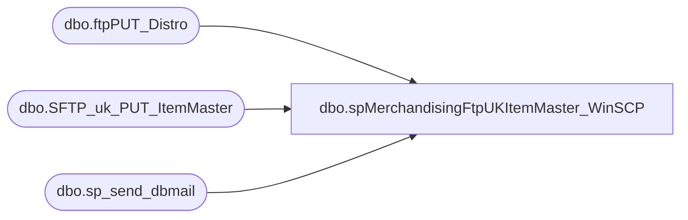

# dbo.spMerchandisingFtpUKItemMaster_WinSCP

**Database:** me_01  
**Server:** bedrockdb02  

## Architecture Diagram



## Table Dependencies

| Referenced Table |
|---|
| dbo.ftpPUT_Distro |
| dbo.SFTP_uk_PUT_ItemMaster |
| dbo.sp_send_dbmail |

## Stored Procedure Code

```sql
CREATE proc [dbo].[spMerchandisingFtpUKItemMaster_WinSCP]

as

-- =====================================================================================================
-- Name: spMerchandisingFtpUKItemMaster_WinSCP
--
-- Description:	FTPs CSV file for UK Item Master
--
-- Revision History
--		Name:			Date:			Comments:
--		Tim Callahan	01/24/2017		Created proc
--		Tim Callahan	02/02/2017		Implemented into Production
-- =====================================================================================================

set nocount on

--DELETE PREVIOUS LOG FILES
IF (Object_ID('tempdb..#DEL') IS NOT NULL) DROP TABLE #DEL
create table #DEL(output varchar(1000))
insert #DEL exec master..xp_cmdshell 'dir \\kermode\FileRepository\MERCHANDISING\UK_Distro\FTP\WinSCP\Logs\Outbound\ItemMasterUpload.log /B'
insert #DEL exec master..xp_cmdshell 'dir \\kermode\FileRepository\MERCHANDISING\UK_Distro\FTP\WinSCP\Logs\Outbound\SFTP_upload_Item_UK_MonitorLog.txt /B'
delete from #DEL where output is null or output = 'File Not Found'

IF (select count(*) from #DEL where output = 'ItemMasterUpload.log') > 0
	begin
		exec master..xp_cmdshell 'del \\kermode\FileRepository\MERCHANDISING\UK_Distro\FTP\WinSCP\Logs\Outbound\ItemMasterUpload.log'
	end
IF (select count(*) from #DEL where output = 'SFTP_upload_Item_UK_MonitorLog.txt') > 0
	begin
		exec master..xp_cmdshell 'del \\kermode\FileRepository\MERCHANDISING\UK_Distro\FTP\WinSCP\Logs\Outbound\SFTP_upload_Item_UK_MonitorLog.txt'
	end


--CHECK FOR FILES TO UPLOAD
-------------do a DIR command and store the results in a temp table
IF (Object_ID('tempdb..#DIR') IS NOT NULL) DROP TABLE #DIR
create table #DIR (output varchar(1000))
insert #DIR exec master..xp_cmdshell 'dir \\kermode\FileRepository\MERCHANDISING\UK_Distro\OUTBOUND\ItemMaster\*.csv /B'
delete from #DIR where output is null or output = 'File Not Found'

------------query temp table to see if there are CSV files
if (select count(*) from #DIR) > 0

BEGIN

			-----ftp upload
					declare 
							@winSCP varchar(1000),
							@ini varchar(1000),
							@script varchar(1000),
							@log varchar(1000),
							@SFTP varchar(4000),
							@Log_query varchar(1000),
							@Log_filename varchar(100),
							@Log_file_location varchar(100),
							@Log_bcp varchar(1000),
							@body varchar(4000)
							
					select 
							@winSCP = '"\\stl-ssis-p-01\C$\Program Files (x86)\WinSCP\winscp.com"',
							@ini = ' /ini=\\kermode\FileRepository\MERCHANDISING\UK_Distro\FTP\WinSCP\WINSCP.ini',
							@script = ' /script=\\kermode\FileRepository\MERCHANDISING\UK_Distro\FTP\WinSCP\Scripts\ItemMaster\ItemMasterUpload.txt',
							@log = ' /log=\\kermode\FileRepository\MERCHANDISING\UK_Distro\FTP\WinSCP\Logs\Outbound\ItemMasterUpload.Log',
							@SFTP = concat(@winSCP, @ini, @script, @log)

					--create temp tables for ftp logs
					IF (Object_ID('me_01..SFTP_uk_PUT_ItemMaster') IS NOT NULL) DROP TABLE SFTP_uk_PUT_ItemMaster
					create table SFTP_uk_PUT_ItemMaster
					(ftpLog varchar(4000))
					
					

					--execute sql/ftp
					----connect to ftp server, if connection unsuccessful, send email
							insert SFTP_uk_PUT_ItemMaster exec master..xp_cmdshell @SFTP
								
								-- select * from SFTP_uk_PUT_ItemMaster -- Just Here for testing 

							if (select count(*) from ftpPUT_Distro where ftplog like '%.csv%') < 1								
													
								begin
									set @Log_query = 'select * from bedrockdb02.me_01.dbo.SFTP_uk_PUT_ItemMaster'
									set @Log_filename = 'SFTP_upload_Item_UK_MonitorLog.txt'
									set @Log_file_location = '\\kermode\FileRepository\MERCHANDISING\UK_Distro\FTP\WinSCP\Logs\Outbound\'
									set @Log_bcp = 'bcp "' + @Log_query + '" queryout "' + @Log_file_location + @Log_filename + '" -t, -T -c -Sbedrockdb02'

									exec master..xp_cmdshell @Log_bcp
															
									set @body =	'An attempt to FTP a UK Item Master File to Clipper failed.' 
												+ char(10) + char(13) + 
												'See the attached logs for details.'
												+ char(10) + char(13) + 
												+ char(10) + char(13) + 
												'This process is managed by bedrockdb02.me_01.dbo.spMerchandisingFtpUKItemMaster_WinSCP'
							
									EXEC bedrockdb02.msdb.dbo.sp_send_dbmail
									@profile_name = 'MerchAdmin',
									@recipients = 'EntSysSupport@buildabear.com', -- Change to EntSysSupport@buildabear.com when ready to go live. 
									@subject = 'FTP Failure: UK Item Master File Upload from BAB to Clipper',
									@body = @body,
									@file_attachments = '\\kermode\FileRepository\MERCHANDISING\UK_Distro\FTP\WinSCP\Logs\Outbound\SFTP_upload_Item_UK_MonitorLog.txt;\\kermode\FileRepository\MERCHANDISING\UK_Distro\FTP\WinSCP\Logs\Outbound\ItemMasterUpload.log',
									@importance = 'HIGH'
								end
							else
								begin
									EXEC master..xp_cmdshell 'move \\kermode\FileRepository\MERCHANDISING\UK_Distro\OUTBOUND\ItemMaster\* \\kermode\FileRepository\MERCHANDISING\UK_Distro\OUTBOUND\ItemMaster\Done\'
								end


END
```

