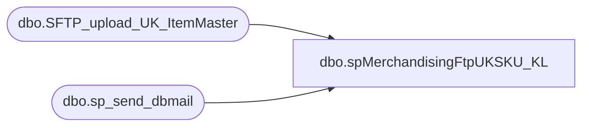

# dbo.spMerchandisingFtpUKSKU_KL

**Database:** me_01  
**Server:** bedrockdb02  

## Architecture Diagram



## Table Dependencies

| Referenced Table |
|---|
| dbo.SFTP_upload_UK_ItemMaster |
| dbo.sp_send_dbmail |

## Stored Procedure Code

```sql
CREATE proc [dbo].[spMerchandisingFtpUKSKU_KL]

as

-- =====================================================================================================
-- Name: spMerchandisingFtpUKSKU
--
-- Description:	Outputs CSV file for UK Item Master
--
-- Revision History
--		Name:			Date:			Comments:
--		Dan Tweedie		03/31/2015		Created proc
--		Keith Lee		9/7/2017		Updated proc to look and send .xml files for item master
--		Lizzy Timm		04/22/2020		Updated @winSCP = '"\\babwscore01\C$\Program Files (x86)\WinSCP\winscp.com"',to @winSCP = '"\\stl-ssis-p-01\C$\Program Files (x86)\WinSCP\winscp.com"',
-- =====================================================================================================
	

set nocount on

--DELETE PREVIOUS LOG FILES
IF (Object_ID('tempdb..#DEL') IS NOT NULL) DROP TABLE #DEL
create table #DEL(output varchar(1000))
insert #DEL exec master..xp_cmdshell 'dir \\kermode\FileRepository\MERCHANDISING\UK_Distro\FTP\WinSCP\Logs\Outbound\ItemMasterUpload.log /B'
insert #DEL exec master..xp_cmdshell 'dir \\kermode\FileRepository\MERCHANDISING\UK_Distro\FTP\WinSCP\Logs\Outbound\SFTP_ItemMaster_upload_UK_MonitorLog.txt /B'
delete from #DEL where output is null or output = 'File Not Found'


IF (select count(*) from #DEL where output = 'ItemMasterUpload.log') > 0
	begin
		exec master..xp_cmdshell 'del \\kermode\FileRepository\MERCHANDISING\UK_Distro\FTP\WinSCP\Logs\Outbound\ItemMasterUpload.log'
	end
IF (select count(*) from #DEL where output = 'SFTP_ItemMaster_upload_UK_MonitorLog.txt') > 0
	begin
		exec master..xp_cmdshell 'del \\kermode\FileRepository\MERCHANDISING\UK_Distro\FTP\WinSCP\Logs\Outbound\SFTP_ItemMaster_upload_UK_MonitorLog.txt'
	end


--CHECK FOR FILES TO UPLOAD
-------------do a DIR command and store the results in a temp table
IF (Object_ID('tempdb..#DIR') IS NOT NULL) DROP TABLE #DIR
create table #DIR (output varchar(1000))
insert #DIR exec master..xp_cmdshell 'dir \\kermode\FileRepository\MERCHANDISING\UK_Distro\OUTBOUND\ItemMaster\*.xml /B'
delete from #DIR where output is null or output = 'File Not Found'

------------query temp table to see if there are XML files
if (select count(*) from #DIR) > 0

BEGIN
			-----ftp upload
					declare 
							@winSCP varchar(1000),
							@ini varchar(1000),
							@script varchar(1000),
							@log varchar(1000),
							@SFTP varchar(4000),

							@Log_query varchar(1000),
							@Log_filename varchar(100),
							@Log_file_location varchar(100),
							@Log_bcp varchar(1000),
							@body varchar(4000),

							@Log_query2 varchar(1000),
							@Log_filename2 varchar(100),
							@Log_file_location2 varchar(100),
							@Log_bcp2 varchar(1000),
							@body2 varchar(4000)
							
					select 
							@winSCP = '"\\stl-ssis-p-01\C$\Program Files (x86)\WinSCP\winscp.com"',
							@ini = ' /ini=\\kermode\FileRepository\MERCHANDISING\UK_Distro\FTP\WinSCP\WINSCP.ini', 
							@script = ' /script=\\kermode\FileRepository\MERCHANDISING\UK_Distro\FTP\WinSCP\Scripts\ItemMaster\ItemMasterUpload.txt',
							@log = ' /log=\\kermode\FileRepository\MERCHANDISING\UK_Distro\FTP\WinSCP\Logs\Outbound\ItemMasterUpload.log',
							@SFTP = concat(@winSCP, @ini, @script, @log)

					--create temp tables for ftp logs
					IF (Object_ID('me_01..SFTP_upload_UK_ItemMaster') IS NOT NULL) DROP TABLE SFTP_upload_UK_ItemMaster
					create table SFTP_upload_UK_ItemMaster
					(ftpLog varchar(4000))

					--execute sql/ftp
					----connect to ftp server
							insert SFTP_upload_UK_ItemMaster exec master..xp_cmdshell @SFTP 
								-- This executes the SFTP as well as inserts the SQL log of what happpenend in the XP Command Shell, aka it's not injecting the WinSCP log into the table. 

								-- select * from SFTP_upload_UK_ItemMaster -- Just for SP troubleshooting 

					-- Send Log of XP_cmdshell Each time export occurs, still send seperate alert if appears to fail
					-- This step may ultimately be disabled once we are comfortbale with the new SFTP process, this was put in place when we had routine issues with uploading via FTP   						
				
									set @Log_query = 'select * from bedrockdb02.me_01.dbo.SFTP_upload_UK_ItemMaster'
									set @Log_filename = 'SFTP_ItemMaster_upload_UK_MonitorLog.txt'
									set @Log_file_location = '\\kermode\FileRepository\MERCHANDISING\UK_Distro\FTP\WinSCP\Logs\Outbound\'
									set @Log_bcp = 'bcp "' + @Log_query + '" queryout "' + @Log_file_location + @Log_filename + '" -t, -T -c -Sbedrockdb02'
																		
									exec master..xp_cmdshell @Log_bcp


									set @body = 'Attached is the SQL log from the most recent SFTP transmission to Clipper Warehouse.'
										+ char(10) + char(13) +
										'This may be useful for troubleshooting missing files sent to Clipper.'
										+ char(10) + char(13) +
										'You may also find the latest log here \\kermode\FileRepository\MERCHANDISING\UK_Distro\FTP\WinSCP\Logs\Outbound\'

									EXEC bedrockdb02.msdb.dbo.sp_send_dbmail
									@profile_name = 'MerchAdmin',
									@recipients = 'MerchAdmin@buildabear.com', -- Change to MerchAdmin when ready to go live
									@subject = 'BAB to Clipper - ItemMaster Upload SFTP Log',
									@body= @body, 
									@file_attachments = '\\kermode\FileRepository\MERCHANDISING\UK_Distro\FTP\WinSCP\Logs\Outbound\SFTP_ItemMaster_upload_UK_MonitorLog.txt'


					--if connection unsuccessful, send email
							if (select count(*) from SFTP_upload_UK_ItemMaster where ftplog like 'IIMitemmasterbridge%.xml%100[%]') < 1
								begin																	
									set @Log_query2 = 'select * from bedrockdb02.me_01.dbo.SFTP_upload_UK_ItemMaster'
									set @Log_filename2 = 'SFTP_upload_UK_ItemMasterLog.txt'
									set @Log_file_location2 = '\\kermode\FileRepository\MERCHANDISING\UK_Distro\FTP\WinSCP\Logs\Outbound\'
									set @Log_bcp2 = 'bcp "' + @Log_query2 + '" queryout "' + @Log_file_location2 + @Log_filename2 + '" -t, -T -c -Sbedrockdb02'

									exec master..xp_cmdshell @Log_bcp2
															
									set @body2 =	'An attempt to FTP a UK ItemMaster to Clipper failed.' 
												+ char(10) + char(13) + 
												'See the attached logs for details.'
												+ char(10) + char(13) + 
												+ char(10) + char(13) + 
												'This process is managed by bedrockdb02.me_01.dbo.spMerchandisingFtpUKSKU'
							
									EXEC bedrockdb02.msdb.dbo.sp_send_dbmail
									@profile_name = 'MerchAdmin',
									@recipients = 'MerchAdmin@buildabear.com', -- Change to MerchAdmin when ready to go live
									@subject = 'FTP Failure: UK ItemMaster File Upload from BAB to Clipper',
									@body = @body2,
									@file_attachments = '\\kermode\FileRepository\MERCHANDISING\UK_Distro\FTP\WinSCP\Logs\Outbound\SFTP_upload_UK_ItemMasterLog.txt;\\kermode\FileRepository\MERCHANDISING\UK_Distro\FTP\WinSCP\Logs\Outbound\ItemMasterUpload.log',
									@importance = 'HIGH'

								end
							else
								begin
									EXEC master..xp_cmdshell 'move \\kermode\FileRepository\MERCHANDISING\UK_Distro\OUTBOUND\ItemMaster\* \\kermode\FileRepository\MERCHANDISING\UK_Distro\OUTBOUND\ItemMaster\Done'
								end

END
```

