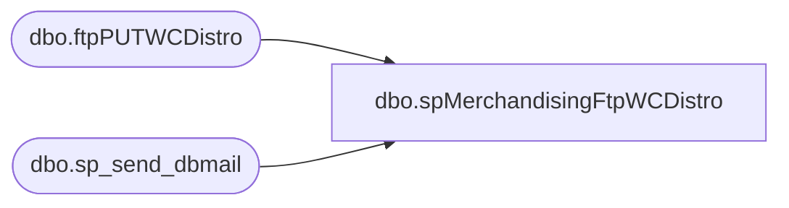

# dbo.spMerchandisingFtpWCDistro

**Database:** me_01  
**Server:** bedrockdb02  

## Architecture Diagram



## Table Dependencies

| Referenced Table |
|---|
| dbo.ftpPUTWCDistro |
| dbo.sp_send_dbmail |

## Stored Procedure Code

```sql
CREATE proc [dbo].[spMerchandisingFtpWCDistro]

as

-- =====================================================================================================
-- Name: spMerchandisingFtpWCDistro
--
-- Description:	Checks for existence of WC Distro file, uploads to WC FTP server, moves file to Done folder
--				 
-- Revision History
--		Name:			Date:			Comments:
--		Dan Tweedie		03/25/2015		Created proc.	
--		Tim Callahan	01/11/2017		Modified FTP validation string query from "Transfer Complete" to "Transfer Ok"
-- =====================================================================================================

set nocount on

--check the directory to see if there are distro files ready to import
-------------do a DIR command and store the results in a temp table
IF (Object_ID('tempdb..#DIR') IS NOT NULL) DROP TABLE #DIR
create table #DIR (output varchar(1000))
insert #DIR exec master..xp_cmdshell 'dir \\kermode\FileRepository\MERCHANDISING\WC_distro\OUTBOUND\*.txt /B'
delete from #DIR where output is null or output = 'File Not Found'

------------query temp table to see if there are CSV files
if (select count(*) from #DIR) > 0

BEGIN
			-----ftp upload
					declare @ftpPUT varchar(1000),
							@Log_query varchar(1000),
							@Log_filename varchar(100),
							@Log_file_location varchar(100),
							@Log_bcp varchar(1000),
							@body varchar(4000)
							
					set @ftpPUT = 'ftp -d -s:\\kermode\FileRepository\MERCHANDISING\WC_distro\OUTBOUND\FTP\ftpPUT.txt' 

					--create temp tables for ftp logs
					IF (Object_ID('me_01..ftpPUTWCDistro') IS NOT NULL) DROP TABLE ftpPUTWCDistro
					create table ftpPUTWCDistro
					(ftpLog varchar(4000))

					--execute sql/ftp
					----connect to ftp server, if connection unsuccessful, send email
							insert ftpPUTWCDistro exec master..xp_cmdshell @ftpPUT
							if (select count(*) from ftpPUTWCDistro where ftplog like '%Transfer OK%') < 1
								begin
									set @Log_query = 'select * from bedrockdb02.me_01.dbo.ftpPUTWCDistro'
									set @Log_filename = 'ftpPUTLog.txt'
									set @Log_file_location = '\\kermode\FileRepository\MERCHANDISING\WC_distro\OUTBOUND\FTP\LOGS\'
									set @Log_bcp = 'bcp "' + @Log_query + '" queryout "' + @Log_file_location + @Log_filename + '" -t, -T -c -Sbedrockdb02'

									exec master..xp_cmdshell @Log_bcp
															
									set @body =	'An attempt to FTP a WC Distro file from DDC failed.' 
												+ char(10) + char(13) + 
												'See the attached log for details.'
												+ char(10) + char(13) + 
												+ char(10) + char(13) + 
												'This process is managed by bedrockdb02.me_01.dbo.spMerchandisingFtpWCDistro'
							
									EXEC bedrockdb02.msdb.dbo.sp_send_dbmail
									@profile_name = 'MerchAdmin',
									@recipients = 'EntSysSupport@buildabear.com',
									@subject = 'FTP Failure: WC Distro Upload from BAB to DDC',
									@body = @body,
									@file_attachments = '\\kermode\FileRepository\MERCHANDISING\WC_distro\OUTBOUND\FTP\LOGS\ftpPUTLog.txt',
									@importance = 'HIGH'
								end
							else
								begin
									EXEC master..xp_cmdshell 'move \\kermode\FileRepository\MERCHANDISING\WC_distro\OUTBOUND\* \\kermode\FileRepository\MERCHANDISING\WC_distro\OUTBOUND\done'
								end

END
```

