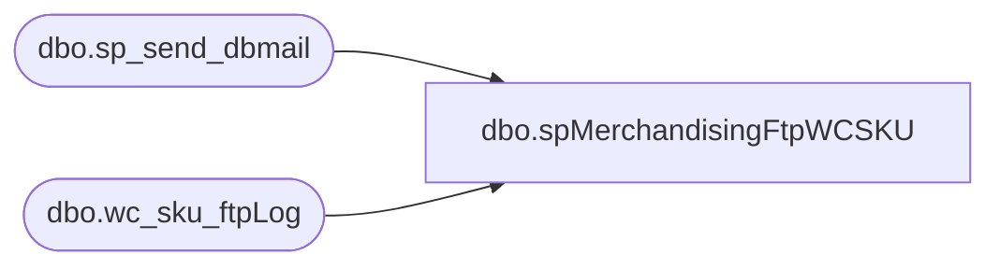

# dbo.spMerchandisingFtpWCSKU

**Database:** me_01  
**Server:** bedrockdb02  

## Architecture Diagram



## Table Dependencies

| Referenced Table |
|---|
| dbo.sp_send_dbmail |
| dbo.wc_sku_ftpLog |

## Stored Procedure Code

```sql
CREATE proc [dbo].[spMerchandisingFtpWCSKU]

as

-- =====================================================================================================
-- Name: spMerchandisingFtpWCSKU
--
-- Description:	Outputs CSV file for UK Item Master
--
-- Revision History
--		Name:			Date:			Comments:
--		Dan Tweedie		03/31/2015		Created proc
-- =====================================================================================================
	
set nocount on

---FTP file to west coast warehouse, capture log 
	IF (Object_ID('me_01..wc_sku_ftpLog') IS NOT NULL) DROP TABLE wc_sku_ftpLog
	create table wc_sku_ftpLog
	(ftpLog varchar(4000))

	declare @ftp varchar(1000)
	set @ftp = 'ftp -d -s:\\kermode\FileRepository\MERCHANDISING\wc_distro\OUTBOUND\FTP\ftpPUT_SKU.txt' 
	insert wc_sku_ftpLog exec master..xp_cmdshell @ftp

	if (select count (*) from wc_sku_ftpLog where ftpLog like '%Transfer complete%') > 0 
		begin
		---Move file to DONE folder
			declare @done varchar(1000)
			set @done = 'move \\kermode\FileRepository\MERCHANDISING\WC_Distro\OUTBOUND\ItemMaster\*.csv \\kermode\FileRepository\MERCHANDISING\WC_Distro\OUTBOUND\ItemMaster\DONE'	
			exec master..xp_cmdshell @done
		end
	
	if (select count (*) from wc_sku_ftpLog where ftpLog like '%Transfer complete%') < 1
		begin
			
		--output from ftpLog to text file
			declare @Log_query varchar(1000),
					@Log_filename varchar(100),
					@Log_file_location varchar(100),
					@Log_bcp varchar(1000)

			set @Log_query = 'select * from bedrockdb02.me_01.dbo.wc_sku_ftpLog'
			set @Log_filename = 'ftpPut_SKU_Log.txt'
			set @Log_file_location = '\\kermode\FileRepository\MERCHANDISING\WC_Distro\OUTBOUND\FTP\LOGS\'
			set @Log_bcp = 'bcp "' + @Log_query + '" queryout "' + @Log_file_location + @Log_filename + '" -t, -T -c'

			exec master..xp_cmdshell @Log_bcp
		--send email with log file attached
			declare @body varchar(4000)
			set @body =	'An attempt to FTP an Item Load file from Merchandising to West Coast DC (Dependable) failed.' 
						+ char(10) + char(13) + 
						'See the attached log for details.'
						+ char(10) + char(13) + 
						+ char(10) + char(13) + 
						'This process is managed by bedrockdb02.me_01.dbo.spMerchandising_Report_wcItemLoad'
	
			EXEC bedrockdb02.msdb.dbo.sp_send_dbmail
			@profile_name = 'MerchAdmin',
			@recipients = 'EntSysSupport@buildabear.com',
			@subject = 'FTP Failure: Item Load File From Merchandising To West Coast DC (Dependable)',
			@body = @body,
			@file_attachments = '\\kermode\FileRepository\MERCHANDISING\WC_Distro\OUTBOUND\FTP\LOGS\ftpPut_SKU_Log.txt',
			@importance = 'HIGH'
		end
```

