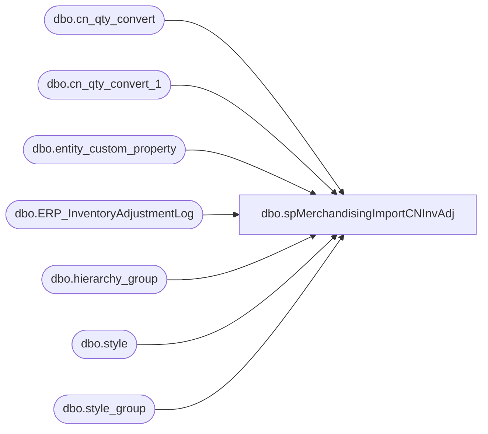

# dbo.spMerchandisingImportCNInvAdj

**Database:** me_01  
**Server:** bedrockdb02  

## Architecture Diagram



## Table Dependencies

| Referenced Table |
|---|
| dbo.cn_qty_convert |
| dbo.cn_qty_convert_1 |
| dbo.entity_custom_property |
| dbo.ERP_InventoryAdjustmentLog |
| dbo.hierarchy_group |
| dbo.style |
| dbo.style_group |

## Stored Procedure Code

```sql
CREATE proc [dbo].[spMerchandisingImportCNInvAdj]

as

-- =====================================================================================================
-- Name: spMerchandisingImportCNInvAdj
--
-- Description:	Bulk insert inventory adjustment file from CN warehouse, outputs file to pipeline
--
-- Revision History
--		Name:			Date:			Comments:
--		Dan Tweedie		01/25/2016		Created proc.	
--		Keith Lee		03/25/2016		Fixed source file path.
--		Dan Tweedie		2018-07-03		Added Stage Data for Dynamics
--		Tim Callahan	2021-06-14		Added loop for handling multiple files 
-- =====================================================================================================


set nocount on

/*****************************************************************************************
 ****PROCESS ONE: IMPORT DATA FROM FILE, MASSAGE DATA, STORE HISTORICAL RECORD OF FILE****
 *****************************************************************************************/
--------------------------
----BEGIN PROCESS ONE-----
--------------------------

-----see if there's a file waiting


IF (Object_ID('tempdb..#cn_files') IS NOT NULL) DROP TABLE #cn_files
create table #cn_files (output varchar(1000))
insert #cn_files exec master..xp_cmdshell 'dir \\kermode\FileRepository\MERCHANDISING\CN_Distro\INBOUND\STOCKADJ\*.csv /b'
delete from #cn_files where output is null or output = 'File Not Found'
OR output not like '%.csv%'

IF (Object_ID('tempdb..#tmp_cn') IS NOT NULL) DROP TABLE #tmp_cn
create table #tmp_cn (location_code varchar(4), style varchar(6), qty int, description varchar(52))

if (select count(*) from #tmp_cn) > 0

BEGIN
	declare 
		@cn_bulk varchar(1000),
		@cn_file varchar(1000),
		@cn_move varchar(1000),
		@Files int


	select @Files = count(*) from #cn_files

	while @Files > 0 
		Begin 
			select @cn_file = max(output) from #cn_files 
			set @cn_bulk = 'bulk insert #tmp_CN from ''\\kermode\FileRepository\MERCHANDISING\CN_Distro\INBOUND\STOCKADJ\' + @cn_file + ''' with (FIELDTERMINATOR = '','', ROWTERMINATOR = ''\n'')'
			exec (@cn_bulk)

			select @cn_move = 'move \\kermode\FileRepository\MERCHANDISING\CN_Distro\INBOUND\STOCKADJ\' +@cn_file +' \\kermode\FileRepository\MERCHANDISING\CN_Distro\INBOUND\STOCKADJ\Done'

			
			exec master..xp_cmdshell @cn_move
			delete from #cn_files where output = @cn_file

			
			select @Files = count (*) from #cn_files
			if @Files < 1 
				break
			else
				continue
		end 

		---convert value to +/- and convert supply qty's to cases
		IF (Object_ID('me_01..cn_qty_convert_1') IS NOT NULL) DROP TABLE cn_qty_convert_1
		create table cn_qty_convert_1 (location_code varchar(4), style varchar(6), description varchar(52), orig_qty int, converted_qty int)

		insert cn_qty_convert_1
		select location_code, right(('000000' + i.style), 6) style, left(i.description, 20) description, i.qty orig_qty, 
			case when substring(hg.hierarchy_group_code,7,2)='60' 
				then (i.qty * -1) / ecp.custom_property_value
				else (i.qty * -1)
			end as converted_qty
		from #tmp_cn i
			inner join style s (nolock) on right(('000000' + i.style), 6) = s.style_code
			inner join style_group sg (nolock) on s.style_id = sg.style_id
			inner join hierarchy_group hg (nolock) on sg.hierarchy_group_id = hg.hierarchy_group_id
			left outer join	entity_custom_property ecp on s.style_id = ecp.parent_id and ecp.custom_property_id = 2 and	ecp.parent_type = 1


			------------------------------------------------
	--ARCHIVE DATA FOR DYNAMICS
	--------------------------------------
	if (select count(*) from #tmp_cn) > 0
	begin
		insert ERP_InventoryAdjustmentLog 
		select 	
			location_code as LocationCode, 
			right(('000000' + style), 6) as Style, 
			qty as Qty,
			left(description, 20) as Description, 
			getdate()
		from #tmp_cn
	end
-----------------------------------------------------------
--------------------------------------------------------------


		----remove rows that have value of '0' for qty
		IF (Object_ID('me_01..cn_qty_convert') IS NOT NULL) DROP TABLE cn_qty_convert
		create table cn_qty_convert (location_code varchar(4), style varchar(6), description varchar(52), orig_qty int, converted_qty int)

		insert cn_qty_convert
		select location_code, style, description, sum(orig_qty) orig_qty, sum(converted_qty) converted_qty
		from cn_qty_convert_1 
		group by location_code, style, description
		having sum(orig_qty) <> 0

			


		--<><><><><><><><><><><><><><><><><><><><><><><><><><><><><><><><><><><><><><><><><>--
		--------------------------
		-----END PROCESS ONE------
		--------------------------
		--<><><><><><><><><><><><><><><><><><><><><><><><><><><><><><><><><><><><><><><><><>--

		/**********************************************************************************************************
		 ***PROCESS TWO: TAKE DATA FROM PROCESS ONE, GENERATE SHRINK ADJUSTMENT FILE, DROP ON PIPELINE DIRECTORY***
		 **********************************************************************************************************/
		--------------------------
		----BEGIN PROCESS TWO-----
		--------------------------
		---executes stored proc spUKStockAdjustment_FileExport:

		if (select count(*) from cn_qty_convert) > 0
			begin

				declare @file varchar(1000) 
				select @file = 'sqlcmd -E -Sbedrockdb02 -dme_01 -Q"exec spMerchandisingSelectCNStockAdj" -o"\\pipeapp01\Company01\Text File to IM Import Tables- Import Shrink Adj\STSIMSA.CN.%date:~10%%date:~4,2%%date:~7,2%%time:~0,2%%time:~3,2%%time:~6,2%.GO" -w1000'
				exec master..xp_cmdshell @file
	
			end


	--	EXEC pipeapp01.master..xp_cmdshell 'PipelineScheduleClient Start 16506 0'

END
```

