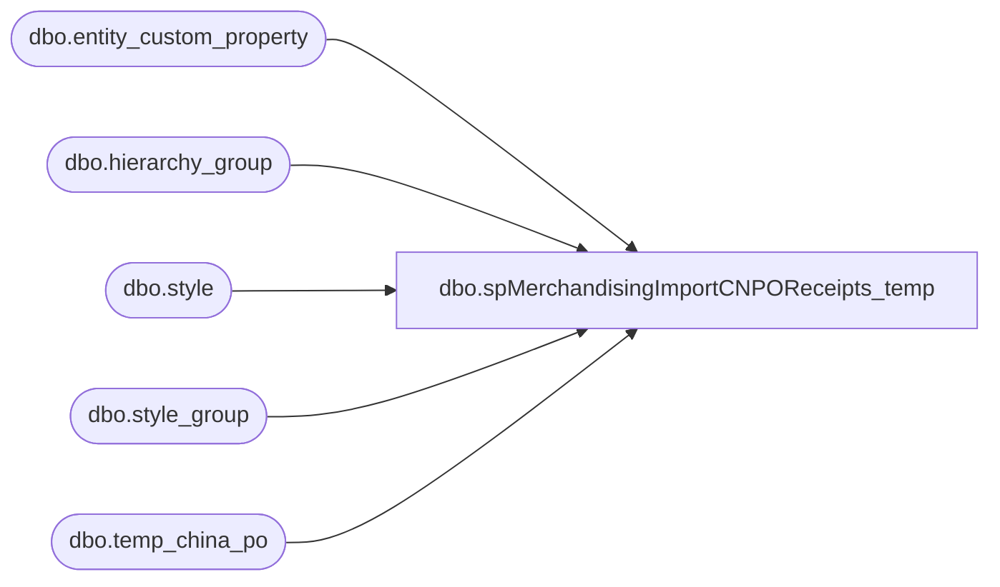

# dbo.spMerchandisingImportCNPOReceipts_temp

**Database:** me_01  
**Server:** bedrockdb02  

## Architecture Diagram



## Table Dependencies

| Referenced Table |
|---|
| dbo.entity_custom_property |
| dbo.hierarchy_group |
| dbo.style |
| dbo.style_group |
| dbo.temp_china_po |

## Stored Procedure Code

```sql
CREATE proc [dbo].[spMerchandisingImportCNPOReceipts_temp]

as 

-- =====================================================================================================
-- Name: spMerchandisingImportCNPOReceipts
--
-- Description:	Bulk insert PO receipt file from CN warehouse, stages data, calls another proc to output the pipeline file
--
-- Revision History
--		Name:			Date:			Comments:
--		Dan Tweedie		01/21/2016		Created proc.
--		Keith Lee		03/24/2016		Fixed file path on kermode.
-- =====================================================================================================

set nocount on

--check the directory to see if there are distro CSV files ready to import
-------------do a DIR command and store the results in a temp table
IF (Object_ID('tempdb..#DIR') IS NOT NULL) DROP TABLE #DIR
create table #DIR (output varchar(1000))
insert #DIR exec master..xp_cmdshell 'dir \\kermode\FileRepository\MERCHANDISING\CN_Distro\INBOUND\RECEIPTS\*.csv /B'
delete from #DIR where output is null or output = 'File Not Found'

------------query temp table to see if there are CSV files
if (select count(*) from #DIR) > 0
---find files with spaces in the name, rename to remove the spaces

BEGIN

		if (object_id('tempdb..#CNPOR') is not null) drop table #CNPOR
		create table #CNPOR
		(location_code varchar(4),
		 receipt_date varchar(10),
		 po_no varchar(7),
		 style_code varchar(6),
		 qty int)

			
		declare @files int,
				@filename varchar(100),
				@filepath varchar(100),
				@bulkinsert varchar(4000),
				@bulkinsertArchive varchar(4000),
				@del varchar(100),
				@move varchar(1000),
				@query varchar(1000),
				@file_name varchar(100),
				@file_location varchar(100),
				@server varchar(20),
				@database varchar(20),
				@bcp varchar(1000),
				@timestamp varchar(52),
				@rename varchar(1000),
				@nameage varchar(104),
				@documentNumber varchar(9)

		select @filepath = '\\kermode\FileRepository\MERCHANDISING\CN_Distro\INBOUND\RECEIPTS\'
		select @files = count(*) from #dir
		
		
---------Bulk Insert Loop
		while @files > 0
			begin
			    select @timestamp = replace( ( convert(varchar, getdate(), 112) + convert(varchar, getdate(), 114) ), ':', '')
				select @filename = max(output) from #dir
								
				select @bulkinsert = 'bulk insert #CNPOR from ''' + @filepath + @filename + ''' with (FIELDTERMINATOR = '','', ROWTERMINATOR = ''\n'')'
				exec (@bulkinsert)
				
				select @rename = 'ren ' + @filepath + @filename + ' ' + @filename + '.' + @timestamp + '.csv'
				exec master..xp_cmdshell @rename
				
				select @move = 'move ' + @filepath + @filename + '.' + @timestamp + '.csv' + ' \\kermode\FileRepository\MERCHANDISING\CN_Distro\INBOUND\RECEIPTS\Done\'
		        exec master..xp_cmdshell @move
				
				delete from #dir where output = @filename
				select @files = count(*) from #dir
								
				if @files < 1
					break
				else
					continue
			end


---convert qty for supplies - stage into holding table
if (object_id('me_01..tmpCNPOReceiptImport') is not null) drop table tmpCNPOReceiptImport;
WITH 
Receipts (location_code, receipt_date, po_no, style_code, qty, dam)
	as (
		select u.location_code, u.receipt_date, isnull(tcp.new_po,u.po_no), right(('000000000000' + u.style_code),12) style_code, 
		case when ecp.custom_property_value is not null and substring(hg.hierarchy_group_code,7,2)='60'
				then (u.qty / ecp.custom_property_value)
				else u.qty
			end as qty,
			'0' as dam
		from #CNPOR u
		join style s (nolock) on u.style_code = s.style_code
		join style_group sg (nolock) on s.style_id = sg.style_id
		join hierarchy_group hg (nolock) on hg.hierarchy_group_id = sg.hierarchy_group_id
		left join temp_china_po tcp (nolock) on u.po_no = tcp.old_po
		left join entity_custom_property ecp (nolock) on ecp.parent_id = s.style_id
			and ecp.custom_property_id = 2 -- FRCSTM
			and	parent_type = 1
	   )
select location_code, convert(date,receipt_date) as receipt_date, po_no, style_code, sum(qty) qty, dam
into tmpCNPOReceiptImport
from Receipts
group by location_code,receipt_date, po_no, style_code, dam

---generate po receipt file for pipeline
declare @query1 varchar(1000),
		@file_location1 varchar(100),
		@file_name1 varchar(100),
		@server1 varchar(52),
		@database1 varchar(52),
		@username1 varchar(52),
		@password1 varchar(52),
		@sqlcmd varchar(1000)

	
set @query1 = 'set nocount on exec spMerchandisingOutputCNPOReceipts'
set @file_location1 = '\\pipetestapp01\Company01\Text File to IM - Import PO Receipts\'
set @file_name1 = 'STSIMPORECEIPT.CN.' + @timestamp + '.GO'
set @server1 = 'bedrockdb02'
set @database1 = 'me_01'
set @sqlcmd = 'sqlcmd -S' + @server1 + ' -d' + @database1 + ' -Q' + '"' + @query1 + '"' + ' -o' + '"' + @file_location1 + @file_name1 + '"' + ' -s"," -w100 -W'
exec master..xp_cmdshell @sqlcmd


END
```

