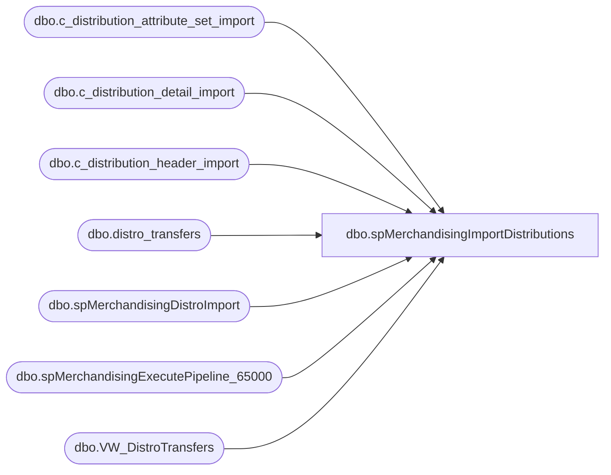

# dbo.spMerchandisingImportDistributions

**Database:** me_01  
**Server:** bedrockdb02  

## Architecture Diagram



## Table Dependencies

| Referenced Table |
|---|
| dbo.c_distribution_attribute_set_import |
| dbo.c_distribution_detail_import |
| dbo.c_distribution_header_import |
| dbo.distro_transfers |
| dbo.spMerchandisingDistroImport |
| dbo.spMerchandisingExecutePipeline_65000 |
| dbo.VW_DistroTransfers |

## Stored Procedure Code

```sql
CREATE proc [dbo].[spMerchandisingImportDistributions]

as 

-- =====================================================================================================
-- Name: spMerchandisingImportDistributions
--
-- Description:	Imports distros from CSV file, stages to distro_transfers table,
--				Stages distros from distro_transfers to import into Merchandising, runs Pipeline to complete the import
--				Runs validations to confirms distros imported successfully
--
-- Revision History
--		Name:			Date:			Comments:
--		Dan Tweedie		03/13/2015		Created proc.	
--		Dan Tweedie		07/23/2015		Added ranking to the original 'distribution_id' values to ensure they are grouped such that 1 sku with multiple destinations and 1 attribute_set_id equals one distribution_id
--										this is needed because apps such as paperclip, matchstick, etc that export from Access to distro_transfers are not grouping properly for Merch
--		Tim Callahan	10/10/2016		Added "distribution_description" to the order by clause of the  Group\Dense rank step as it can cause the duplicate entries and the SQL will terminate the job. 
-- =====================================================================================================

set nocount on 

--IMPORT DISTROS FROM CSV FILE TO DISTRO_TRANSFERS TABLE (CSV FILE CREATED BY DISTRO TEAM AS ALTERNATIVE WAY TO IMPORT DISTROS INTO MERCHANDISING)
exec spMerchandisingDistroImport

--IMPORT FROM DISTRO_TRANSFERS TO PIPELINE IMPORT TABLES 
IF (Object_ID('tempdb..#distrostage') IS NOT NULL) DROP TABLE #distrostage
select *
into #distrostage
from VW_DistroTransfers

--Group / dense_rank the distros so one style per multiple locations with a single rec type are all on one document
-- Added distribution_description after sku_id before attribute_set_id in the order by sub statement -- TimC on 10-10-2016
IF (Object_ID('tempdb..#distrostage2') IS NOT NULL) DROP TABLE #distrostage2
select 
		cast(((convert(varchar, getdate(), 112) + cast(datepart(hh, getdate()) as varchar) + cast(datepart(mi, getdate()) as varchar)) + dense_rank() over (order by warehouse, sku_id, distribution_description, attribute_set_id)) as varchar) as distribution_id,
		distro_transfers_id,
		distribution_description,
		sku_id,
		quantity,
		warehouse,
		store,
		attribute_set_id
into #distrostage2
from #distrostage

if (select count(*) from #distrostage2) > 0

BEGIN

---SET EXPORTED DATE ON DISTRO_TRANSFERS TO PREVENT THE SAME DISTROS FROM EXPORTING
	update distro_transfers
	set exported_date = getdate()
	--where replace(documentnumber, 'DMT', '') in (select distribution_id from #distrostage)
	where id in (select distro_transfers_id from #distrostage2)

	--STAGE DISTROS FOR PIPELINE
	insert c_distribution_header_import
	select distinct distribution_id, distribution_description, warehouse
	from #distrostage2

	insert c_distribution_detail_import
	select distribution_id, sku_id, sum(quantity), store
	from #distrostage2
	group by distribution_id, sku_id, store
	
	insert c_distribution_attribute_set_import
	select distribution_id, attribute_set_id
	from #distrostage2
	group by distribution_id, attribute_set_id

	--RUN PIPELINE SEGMENT 65000 TO IMPORT DISTROS INTO MERCH
	EXEC spMerchandisingExecutePipeline_65000
	--EXEC pipeapp01.master..xp_cmdshell 'PipelineScheduleClient Start 65000 0'

	
END
```

