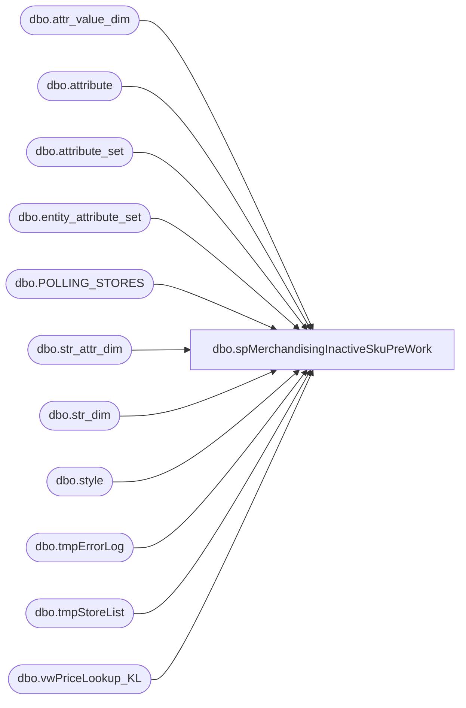

# dbo.spMerchandisingInactiveSkuPreWork

**Database:** me_01  
**Server:** bedrockdb02  

## Architecture Diagram



## Table Dependencies

| Referenced Table |
|---|
| dbo.attr_value_dim |
| dbo.attribute |
| dbo.attribute_set |
| dbo.entity_attribute_set |
| dbo.POLLING_STORES |
| dbo.str_attr_dim |
| dbo.str_dim |
| dbo.style |
| dbo.tmpErrorLog |
| dbo.tmpStoreList |
| dbo.vwPriceLookup_KL |

## Stored Procedure Code

```sql
CREATE proc [dbo].[spMerchandisingInactiveSkuPreWork]

as 

-- =====================================================================================================
-- Name: spMerchandisingInactiveSkuPreWork
-- Description: An SSIS package runs to compare Merch Inactive SKUs to every store's Active SKUs. This proc is executed from that SSIS package.
--				These steps are performed before the SSIS package connects to the stores. 
--				 
-- Revision History
--		Name:			Date:			Comments: 
--		Dan Tweedie	    09/11/2015		Created proc.	
--		Dan Tweedie		10/14/2015		Added store price query to stage price data, added table to store price data from stores
--		Dan Tweedie		10/30/2015		Added OWNRSP attribute
--		Dan Tweedie		2020-01-06		Updated query fo tmpStoreList
-- =====================================================================================================

set nocount on

--Get Inactive Styles from Merch
IF (Object_ID('me_01..tmpInactiveSkus') IS NOT NULL) DROP TABLE tmpInactiveSkus
select style_code 
into tmpInactiveSkus
from style with (nolock) 
where active_flag = 0


--Get Store List from Kodiak --exclude web, closed, or not yet open
--IF (Object_ID('me_01..tmpStoreList') IS NOT NULL) DROP TABLE tmpStoreList
--SELECT s.str_num,
--	   '10.' +
--	cast(
--	case when s.str_num between 1 and 99 then '0' 
--		else cast(s.str_num/100 as varchar) 
--	end as varchar) + '.' + 
--	cast(s.str_num - s.str_num/100*100 as varchar) + 
--	'.101' store_ip,
--	NTILE(10) OVER(ORDER BY (SELECT RAND()) ASC) StoreGroup
--into tmpStoreList
--FROM kodiak.BABWMstrData.dbo.STR_DIM s 
--join location l (nolock) on right('0000' + cast(s.STR_NUM as varchar(4)), 4) = l.location_code
--       and l.active_flag = 1
--where cast(s.str_open_dt as date) <= cast(getdate() as date)
--and (cast(s.str_close_dt as date) > cast(getdate() as date) or s.str_close_dt is null)
--and not exists (				
--				select distinct sne.str_num
--				from kodiak.BABWMstrData.dbo.str_dim sne
--				join kodiak.BABWMstrData.dbo.str_attr_dim sadne on sne.str_id = sadne.str_id
--				join kodiak.BABWMstrData.dbo.attr_value_dim avdne on sadne.attr_value_id = avdne.attr_value_id
--				where avdne.title = 'web'
--				and s.str_num = sne.str_num
--			   )
IF (Object_ID('me_01..tmpStoreList') IS NOT NULL) DROP TABLE tmpStoreList
SELECT 
	s.STORE_NUM as str_num,
	   '10.' +
	cast(
	case when s.STORE_NUM between 1 and 99 then '0' 
		else cast(s.STORE_NUM/100 as varchar) 
	end as varchar) + '.' + 
	cast(s.STORE_NUM - s.STORE_NUM/100*100 as varchar) + 
	'.101' store_ip,
	NTILE(10) OVER(ORDER BY (SELECT RAND()) ASC) StoreGroup
into tmpStoreList
FROM bedrockdb01.auditworks.dbo.POLLING_STORES s
WHERE POLLING_VLDTN = 1
AND POLLING_VLDTN_DATE <= GETDATE()
AND CLOSED_DATE IS NULL
and not exists (				
				select distinct sne.str_num
				from kodiak.BABWMstrData.dbo.str_dim sne
				join kodiak.BABWMstrData.dbo.str_attr_dim sadne on sne.str_id = sadne.str_id
				join kodiak.BABWMstrData.dbo.attr_value_dim avdne on sadne.attr_value_id = avdne.attr_value_id
				where avdne.title = 'web'
				and s.STORE_NUM = sne.str_num
			   )

--Get Price Data From Merch - By Store
IF (Object_ID('tempdb..#tmpMerchPrice') IS NOT NULL) DROP TABLE #tmpMerchPrice
select distinct bv.location_code, bv.style_id, bv.style_code, bv.short_desc,
	case when isnull(bv.promo_local_price, bv.current_local_price) > bv.current_local_price
		then bv.current_local_price
		else isnull(bv.promo_local_price, bv.current_local_price) 
	end as CurrentSellingRetail
into #tmpMerchPrice
from vwPriceLookup_KL bv with (nolock)
--where bv.style_id in (4440, 42869, 45154, 46205)

IF (Object_ID('me_01..tmpMerchPrice') IS NOT NULL) DROP TABLE tmpMerchPrice
select p.location_code, p.style_code, p.short_desc, p.CurrentSellingRetail, att.attribute_set_code OWNRSP
into tmpMerchPrice
from #tmpMerchPrice p
join entity_attribute_set eas (nolock) on p.style_id = eas.parent_id
join attribute_set att (nolock) on eas.attribute_set_id = att.attribute_set_id
join attribute a (nolock) on att.attribute_id = a.attribute_id and a.parent_type = 1
where a.attribute_code = 'OWNRSP'


--Stage each store group into individual tables, to be pulled from during SSIS execution. I have them in different tables, so there are no locks as they run in parallel
	IF (Object_ID('me_01..tmpStoreList1') IS NOT null) DROP TABLE tmpStoreList1
	select str_num, store_ip 
	into tmpStoreList1
	from tmpStoreList
	where StoreGroup = 1

	IF (Object_ID('me_01..tmpStoreList2') IS NOT null) DROP TABLE tmpStoreList2
	select str_num, store_ip 
	into tmpStoreList2
	from tmpStoreList
	where StoreGroup = 2

	IF (Object_ID('me_01..tmpStoreList3') IS NOT null) DROP TABLE tmpStoreList3
	select str_num, store_ip 
	into tmpStoreList3
	from tmpStoreList
	where StoreGroup = 3

	IF (Object_ID('me_01..tmpStoreList4') IS NOT null) DROP TABLE tmpStoreList4
	select str_num, store_ip 
	into tmpStoreList4
	from tmpStoreList
	where StoreGroup = 4

	IF (Object_ID('me_01..tmpStoreList5') IS NOT null) DROP TABLE tmpStoreList5
	select str_num, store_ip 
	into tmpStoreList5
	from tmpStoreList
	where StoreGroup = 5

	IF (Object_ID('me_01..tmpStoreList6') IS NOT null) DROP TABLE tmpStoreList6
	select str_num, store_ip 
	into tmpStoreList6
	from tmpStoreList
	where StoreGroup = 6

	IF (Object_ID('me_01..tmpStoreList7') IS NOT null) DROP TABLE tmpStoreList7
	select str_num, store_ip 
	into tmpStoreList7
	from tmpStoreList
	where StoreGroup = 7

	IF (Object_ID('me_01..tmpStoreList8') IS NOT null) DROP TABLE tmpStoreList8
	select str_num, store_ip 
	into tmpStoreList8
	from tmpStoreList
	where StoreGroup = 8

	IF (Object_ID('me_01..tmpStoreList9') IS NOT null) DROP TABLE tmpStoreList9
	select str_num, store_ip 
	into tmpStoreList9
	from tmpStoreList
	where StoreGroup = 9

	IF (Object_ID('me_01..tmpStoreList10') IS NOT null) DROP TABLE tmpStoreList10
	select str_num, store_ip 
	into tmpStoreList10
	from tmpStoreList
	where StoreGroup = 10


--create store table -- ACTIVE STYLE
IF (Object_ID('me_01..tmpAllStoreActiveStyles') IS NOT null) DROP TABLE tmpAllStoreActiveStyles
create table tmpAllStoreActiveStyles
(location_code varchar(4),
location_name varchar(52),
style varchar(6),
description varchar(52))

--create store table -- PRICE
IF (Object_ID('me_01..tmpAllStorePRICE') IS NOT null) DROP TABLE tmpAllStorePRICE
create table tmpAllStorePRICE
(location_code varchar(4),
location_name varchar(52),
style varchar(6),
description varchar(52),
price decimal(14,2),
promotion_no varchar(100))


--truncate error log
truncate table tmpErrorLog
```

