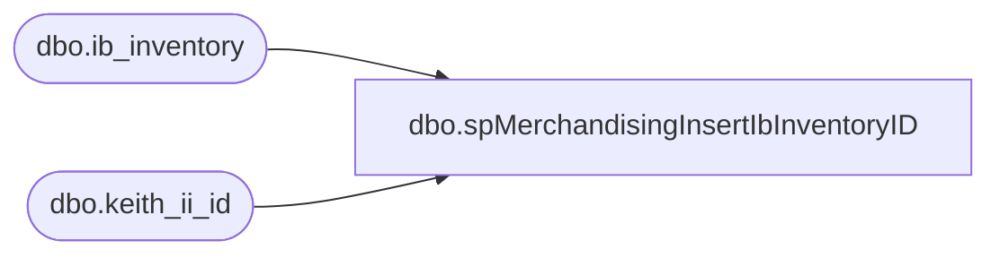

# dbo.spMerchandisingInsertIbInventoryID

**Database:** me_01  
**Server:** bedrockdb02  

## Architecture Diagram



## Table Dependencies

| Referenced Table |
|---|
| dbo.ib_inventory |
| dbo.keith_ii_id |

## Stored Procedure Code

```sql
CREATE procEDURE [dbo].[spMerchandisingInsertIbInventoryID]
AS
SET NOCOUNT ON

-- =====================================================================================================
-- Name: spMerchandisingInsertIbInventoryID
--
-- Revision History
--		Name:			Date:			Comments: This Proc is Replaces existing DTS pkg on Beehive called Validation_MEW_Capture_IB_Inventory_id.
--		Dan Tweedie 	    03/04/2015		Created proc.	
-- =====================================================================================================
------------------------------------ Update Yesterday ----------------------------------------------------

UPDATE keith_ii_id
SET end_ib_id = (
		SELECT max(ib_inventory_id)
		FROM ib_inventory
		)
WHERE cast(convert(VARCHAR, ib_date, 101) AS DATETIME) = cast(convert(VARCHAR, dateadd(dd, - 1, getdate()), 101) AS DATETIME)

------------------------------------ Insert for Today ----------------------------------------------------

INSERT INTO keith_ii_id
SELECT max(ii.ib_inventory_id) AS start_ib_id
	,max(ii.ib_inventory_id) AS end_ib_id
	,cast(convert(VARCHAR, getdate(), 101) AS DATETIME) AS ib_date
FROM ib_inventory ii
```

