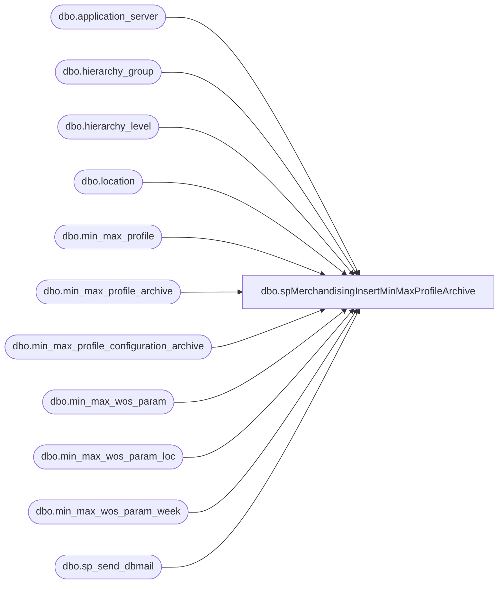

# dbo.spMerchandisingInsertMinMaxProfileArchive

**Database:** me_01  
**Server:** bedrockdb02  

## Architecture Diagram



## Table Dependencies

| Referenced Table |
|---|
| dbo.application_server |
| dbo.hierarchy_group |
| dbo.hierarchy_level |
| dbo.location |
| dbo.min_max_profile |
| dbo.min_max_profile_archive |
| dbo.min_max_profile_configuration_archive |
| dbo.min_max_wos_param |
| dbo.min_max_wos_param_loc |
| dbo.min_max_wos_param_week |
| dbo.sp_send_dbmail |

## Stored Procedure Code

```sql
CREATE proc [dbo].[spMerchandisingInsertMinMaxProfileArchive]
as

-- =====================================================================================================
-- Name: spMerchandisingInsertMinMaxProfileArchive
--
-- Description:	Archives data from min_max_profile table and also configuration data for the Min Max Profiles process.
--				The configuration data can be changed by the users and there is no historical reference, so this job
--				archives the configuration data for future reference.
--
-- Input: N/A
--
-- Output: 
--
-- Dependencies: 
--
-- Revision History
--		Name:			Date:			Comments:
--		Dan Tweedie		02/18/2011		Created proc.	
-- =====================================================================================================

set nocount on

---backup min_max_profile
insert min_max_profile_archive
select getdate(), *
from min_max_profile

---backup configuration data
insert min_max_profile_configuration_archive
select getdate() ArchiveDate,
	   hl.hierarchy_level_label MerchandiseLevel, 
	   hg.hierarchy_group_code MerchandiseCode, 
	   hg.hierarchy_group_label MerchandiseDescription,
	   case mmwp.cycle_period
		when 1 then 'Days'
		when 2 then 'Weeks'
	   end as CyclePeriod,
	   mmwp.cycle_frequency CycleFrequency, 
	   mmwp.review_on_sunday Sun, 
	   mmwp.review_on_monday Mon, 
	   mmwp.review_on_tuesday Tue, 
	   mmwp.review_on_wednesday Wed, 
	   mmwp.review_on_thursday Thurs, 
	   mmwp.review_on_friday Fri, 
	   mmwp.review_on_saturday Sat,
	   convert(varchar, mmwp.next_execution, 101) NextRunDate,
	   convert(varchar, mmwp.last_activity_date, 101) LastRunDate,
	   apps.server_name Application_server,
	   mmwp.last_number_of_weeks LastXWeeks,
	   mmwp.minimum_weeks_of_supply MinimumWeeksOfSupply,
	   mmwp.maximum_weeks_of_supply MaximumWeeksOfSupply,
	   case mmwp.process_level
		when 1 then 'SKU'
		when 2 then 'Style/Color'
		when 3 then 'Style'
	   end as ProcessLevel,
	   case when mmwp.use_seasonality = 1 then 'YES' else 'NO' end as UseSeasonality,
	   mmwpw.week_no XWeeksAgo,
	   mmwpw.weight Weight,
	   l.location_code LocationCode,
	   l.location_name LocationName
from min_max_wos_param mmwp (nolock)
join hierarchy_group hg (nolock) on hg.hierarchy_group_id = mmwp.hierarchy_group_id
join hierarchy_level hl (nolock) on hl.hierarchy_level_id = hg.hierarchy_level_id
join application_server apps (nolock) on apps.application_server_id = mmwp.application_server_id
join min_max_wos_param_week mmwpw (nolock) on mmwpw.min_max_wos_param_id = mmwp.min_max_wos_param_id
join min_max_wos_param_loc mmwpl (nolock) on mmwpl.min_max_wos_param_id = mmwp.min_max_wos_param_id
join location l (nolock) on l.location_id = mmwpl.location_id
order by hg.hierarchy_group_code, mmwpw.week_no, mmwpw.weight, l.location_code


---send email to ESS to if less than 1 profile was archived

declare @MinMax int,
		@Config int,
		@subject varchar(1000),
		@body nvarchar(max)

select @MinMax = count(*) 
				 from min_max_profile_archive
				 where datediff(dd, archive_date, getdate()) = 0

select @config = count(*)
				 from min_max_profile_configuration_archive
				 where datediff(dd, archivedate, getdate()) = 0

set @subject = 'Min/Max Profile Archive Process Executed'

set @body =	'The Min/Max Profile Archive Process Was Executed.' 
			+ char(10) + char(13) + 
			'This process is intended to archive the Min/Max Profile table, and the configuration data for the Min/Max Profile process.'
			+ char(10) + char(13) + 
			'-------------------------------------------------------------'
			+ char(10) + char(13) + 
			'Min/Max Records Archived: ' + convert(varchar, @MinMax)
			+ char(10) + char(13) + 
			'Configuration Records Archived: ' + convert(varchar, @config)
			+ char(10) + char(13) + 
			'-------------------------------------------------------------'
			+ char(10) + char(13) + 
			+ char(10) + char(13) + 
			'This process is managed by bedrockdb02.me_01.dbo.spMerchandisingInsertMinMaxProfileArchive.'
			
IF(@MinMax < 1)
	BEGIN
		EXEC bedrockdb02.msdb.dbo.sp_send_dbmail
			@profile_name = 'MerchAdmin',
			@recipients = 'EntSysSupport@buildabear.com',
			@subject = @subject,
			@body = @body
	END
```

