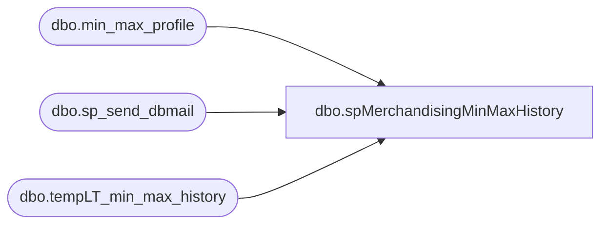

# dbo.spMerchandisingMinMaxHistory

**Database:** me_01  
**Server:** bedrockdb02  

## Architecture Diagram



## Table Dependencies

| Referenced Table |
|---|
| dbo.min_max_profile |
| dbo.sp_send_dbmail |
| dbo.tempLT_min_max_history |

## Stored Procedure Code

```sql
CREATE proc [dbo].[spMerchandisingMinMaxHistory]

as

-- =====================================================================================================
-- Name: spMerchandisingMinMaxHistory
--
-- Description:	Track the duration of the job "A&R: Generate Min/Max Profiles using WOS" along with tracking the total number of min/max profiles
--				 
-- Revision History
--		Name:			Date:			Comments:
--		Lizzy Timm		11/09/2020		Created proc.	
--		Lizzy Timm		03/01/2021		Added ProfilesUpdated column to #Profiles
-- =====================================================================================================

DECLARE @Date char(15)
	,@Begin datetime
	,@End datetime
	,@Count varchar(50)
	,@Updated varchar(50)
	,@Hour varchar(15)
	,@Minute varchar(15)
	,@text nvarchar(max)
	,@subj varchar(250)

SELECT @Date = convert(varchar, getdate()-1, 112)
SELECT @Begin = DATEADD(Hour,9,CONVERT(datetime,LEFT(@Date,4)+SUBSTRING(@Date,5,2)+SUBSTRING(@Date,7,2)))
SELECT @End = MAX(Last_Activity_Date) FROM Min_Max_Profile with (nolock)
SELECT @Count = COUNT(*) FROM Min_Max_Profile with (nolock)
SELECT @Updated = COUNT(*) FROM me_01.dbo.min_max_profile WHERE CAST(convert(varchar,last_activity_date,101) AS datetime) > CAST(convert(varchar, getdate()-2,101) AS datetime)
SELECT @Hour = CAST(DATEDIFF(hour,@Begin,@End) AS varchar(15))
SELECT @Minute = CAST((DATEDIFF(minute,@Begin,@End))-(DATEDIFF(hour,@Begin,@End)*60) AS varchar(15))


if (object_id('tempdb..#Profiles') is not null) drop table #Profiles
SELECT 
	convert(varchar, getdate()-1, 101) [Week]
	,@Begin [Start]
	,@End [End]
	,CASE
		WHEN LEN(@Minute) = 1
			THEN @Hour + ':0' + @Minute 
		ELSE @Hour + ':' + @Minute
	END	AS [Duration]
	,@Count [ProfileCount]
	,@Updated [UpdatedProfiles]
  INTO #Profiles

INSERT tempLT_min_max_history
SELECT * FROM #Profiles

IF (@Count > '2000000' AND @Hour > '10')
	BEGIN
		SET @text = 
			'<font face =arial size = 2>' + 
			'There are currently ' + '<b>' + @Count + ' min/max profiles' + '</b>'+ ' and the job took approximately ' + '<b>' + @Hour + ' hours' + '</b>' + ' to complete. Please work with the allocation team to clean up unneeded profiles' +
			'<br>' + 
			'<br>' +
			'<br>' +
			'<b>Technical Details:' +
			'<br>SQL Agent Job on BEDROCKDB02:</b> Min/Max History' +
			'<br><b>SQL Stored Procedure on Bedrockdb02.me_01:</b> spMerchandisingMinMaxHistory' +	
			'</font>'
		SET @subj = 'PROBLEM - High Min/Max Profile Count & Long Run Time'
		exec msdb.dbo.sp_send_dbmail
			 @profile_name = 'merchadmin',
			 @recipients = 'EntSysSupport@buildabear.com',
			 @body = @text,
			 @subject= @subj,
			 @body_format = 'HTML'
	END
IF (@Count > 2300000)
	BEGIN
		SET @text = 
			'<font face =arial size = 2>' + 
			'There are currently ' + '<b>' + @Count + '</b>' + ' min/max profiles.  This interferes with min/max job performance.  Please work with the allocation team to clean up unneeded profiles' +
			'</font><p>' +
			'<font face =arial size = 1 color="#C0C0C0">' +
			'<br>' +
			'Server:  BEDROCKDB02 <br>' +
			'Job Name:  Min/Max History <br>' +
			'Stored Proc:  [BEDROCKDB02].[me_01].[dbo].[spMerchandisingMinMaxHistory] <br>' +
			'Team Ownership:  Enterprise Systems'+
			'</font></p>'
		SET @subj = 'WARNING - High Min/Max Profile Count'
		exec msdb.dbo.sp_send_dbmail
			 @profile_name = 'merchadmin',
			 @recipients = 'EntSysSupport@buildabear.com',
			 @body = @text,
			 @subject= @subj,
			 @body_format = 'HTML'
	END
IF (@Hour > 10)
	BEGIN
		SET @text = 
			'<html><font face =arial size = 2>' + 
			'The min/max job took approximately ' + '<b>' + @Hour + ' hours' + '</b>' + ' to complete.' +
			'<br>' + 
			'<br>' +
			'<br>' +
			'<b>Technical Details:' +
			'<br>SQL Agent Job on BEDROCKDB02:</b> Min/Max History' +
			'<br><b>SQL Stored Procedure on Bedrockdb02.me_01:</b> spMerchandisingMinMaxHistory' +	
			'</font></html>'
		SET @subj = 'WARNING - Min/Max Long Run Time'
		exec msdb.dbo.sp_send_dbmail
			 @profile_name = 'merchadmin',
			 @recipients = 'EntSysSupport@buildabear.com',
			 @body = @text,
			 @subject= @subj,
			 @body_format = 'HTML'
	END
```

