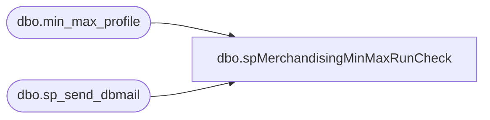

# dbo.spMerchandisingMinMaxRunCheck

**Database:** me_01  
**Server:** bedrockdb02  

## Architecture Diagram



## Table Dependencies

| Referenced Table |
|---|
| dbo.min_max_profile |
| dbo.sp_send_dbmail |

## Stored Procedure Code

```sql
CREATE proc [dbo].[spMerchandisingMinMaxRunCheck]
as 
-- =====================================================================================================
-- Name: spMerchandisingMinMaxRunCheck
--
-- Description:	Checks for the number of min/max profiles updated.
--
-- Revision History
--		Name:			Date:			Comments:
--		Lizzy Timm		03/01/2021		Created proc.
-- =====================================================================================================
SET NOCOUNT ON

DECLARE @ProfileCount VARCHAR(10),
		@text VARCHAR(MAX)
SELECT @ProfileCount = count(*) from me_01.dbo.min_max_profile where cast(convert(varchar,last_activity_date,101)as datetime) > cast(convert(varchar, getdate()-1,101)as datetime)

IF DATEPART(HOUR, GETDATE()) < '12'
	BEGIN
		IF (@ProfileCount) < 1
			BEGIN
				SET @text = '<html><p style="font-family: Arial; font-size: 1em; margin: 0% 3%;">No Min/Max profiles have updated today.  Please ensure the job A&R: Generate Min/Max Profiles using WOS is running in Aptos Merch.' +
					'</p><br/>' +
					'<font face =arial size = 1 color="#C0C0C0">' +
					'<br>' +
					'Server:  BEDROCKDB02 <br>' +
					'Job Name:  MERCHANDISING - Report - Min-Max Sunday <br>' +
					'Stored Proc:  [BEDROCKDB02].[me_01].[dbo].[spMerchandisingMinMaxRunCheck] <br>' +
					'Team Ownership:  Enterprise Systems <br>' +
					'</p>' +
					'</html>'
				exec msdb.dbo.sp_send_dbmail
				@profile_name = 'merchadmin',
				@recipients = 'EnterpriseSystemsAlerts@buildabear.com',
				@body = @text,
				@subject = 'Min/Max - Zero Profiles Updated',						
				@body_format = 'HTML'
			END
		ELSE
			BEGIN
				SET @text = '<html><p style="font-family: Arial; font-size: 1em; margin: 0% 3%;">'+ @ProfileCount + ' Min/Max profiles have updated today.  If zero, you should ensure the job is running.' +
					'</p><br/>' +
					'<font face =arial size = 1 color="#C0C0C0">' +
					'<br>' +
					'Server:  BEDROCKDB02 <br>' +
					'Job Name:  MERCHANDISING - Report - Min-Max Sunday <br>' +
					'Stored Proc:  [BEDROCKDB02].[me_01].[dbo].[spMerchandisingMinMaxRunCheck] <br>' +
					'Team Ownership:  Enterprise Systems <br>' +
					'</p>' +
					'</html>'
				exec msdb.dbo.sp_send_dbmail
				@profile_name = 'merchadmin',
				@recipients = 'Entsyssupport@buildabear.com;',
				@body = @text,
				@subject = 'Min/Max - Profiles Updated So Far This Morning',
				@body_format = 'HTML'
			END
	END

ELSE 
	BEGIN
		SET @text = '<html><p style="font-family: Arial; font-size: 1em; margin: 0% 3%;">'+ @ProfileCount + ' Min/Max profiles have updated today.' +
					'</p><br/>' +
					'<font face =arial size = 1 color="#C0C0C0">' +
					'<br>' +
					'Server:  BEDROCKDB02 <br>' +
					'Job Name:  MERCHANDISING - Report - Min-Max Sunday <br>' +
					'Stored Proc:  [BEDROCKDB02].[me_01].[dbo].[spMerchandisingMinMaxRunCheck] <br>' +
					'Team Ownership:  Enterprise Systems <br>' +
					'</p>' +
					'</html>'
		exec msdb.dbo.sp_send_dbmail
		@profile_name = 'merchadmin',
		@recipients = 'EntsysSupport@buildabear.com;',
		@body = @text,
		@subject = 'Min/Max Sunday Numbers',
		@body_format = 'HTML'
	END
```

