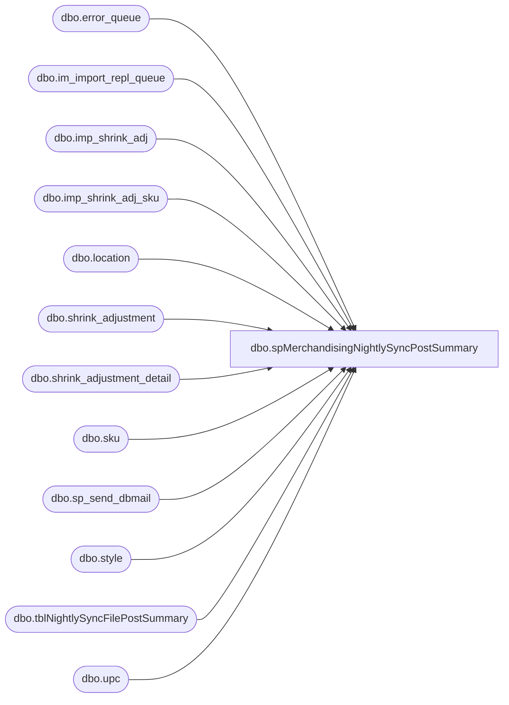

# dbo.spMerchandisingNightlySyncPostSummary

**Database:** me_01  
**Server:** bedrockdb02  

## Architecture Diagram



## Table Dependencies

| Referenced Table |
|---|
| dbo.error_queue |
| dbo.im_import_repl_queue |
| dbo.imp_shrink_adj |
| dbo.imp_shrink_adj_sku |
| dbo.location |
| dbo.shrink_adjustment |
| dbo.shrink_adjustment_detail |
| dbo.sku |
| dbo.sp_send_dbmail |
| dbo.style |
| dbo.tblNightlySyncFilePostSummary |
| dbo.upc |

## Stored Procedure Code

```sql
CREATE proc [dbo].[spMerchandisingNightlySyncPostSummary]
as

-- =====================================================================================================
-- Name: spMerchandisingNightlySyncPostSummary
--
-- Description:	Captures and emails a summary of Nightly Sync Postings 
--				Allows us to quickly reference to confirm whether Nightly Sync adjustments successfully posted to Merch
--
-- Input:	
--
-- Output: report is emailed
--
-- Dependencies: na
--				 
-- Revision History
--		Name:			Date:			Comments:
--		Dan Tweedie		07/14/2011		Created proc.	
--		Lizzy Timm		03/23/2021		Update email to only send when errors exist
-- =====================================================================================================

set nocount on

IF (Object_ID('tempdb..#sa_import') IS NOT NULL) DROP TABLE #sa_import
IF (Object_ID('tempdb..#sa_post') IS NOT NULL) DROP TABLE #sa_post
IF (Object_ID('tempdb..#sa_errors') IS NOT NULL) DROP TABLE #sa_errors
IF (Object_ID('tempdb..#sa_summary') IS NOT NULL) DROP TABLE #sa_summary

--import tables - - file is imported from warehouse, stored in these import tables
select iirq.action_date, ----actual date that file is processed
	   isa.document_no,
	   isa.submit_date, --submit date recorded in the file, this should be same as action date
	   isa.grouping_label,
	   isas.location_code, 
	   s.style_code,
	   sum(isas.units_to_adjust) qty,
	   isa.imp_file_name
into #sa_import
from imp_shrink_adj isa (nolock)
join imp_shrink_adj_sku isas (nolock) on isa.imp_shrink_adj_id = isas.imp_shrink_adj_id
join upc (nolock) on upc.upc_number = isas.upc_number
join sku (nolock) on sku.sku_id = upc.sku_id
join style s (nolock) on s.style_id = sku.style_id
join im_import_repl_queue iirq (nolock) on iirq.entity_id = isa.imp_shrink_adj_id and iirq.entity_code = 1
where datediff(hh, iirq.action_date, getdate()) <= 24
and isa.grouping_label = 'Nightly Sync'
group by iirq.action_date, isa.document_no, isa.submit_date, isas.location_code, s.style_code, isa.imp_file_name,
isa.grouping_label
order by iirq.action_date, isas.location_code, isa.document_no, s.style_code

--production tables -- data is parsed from the import tables and posted to these production tables
select sa.create_date, --timestamp of adjustment posting to Merch
       sa.external_doc_no,
       sa.document_no,
	   sa.submit_date, --submit date from adjustment file
	   sa.grouping_label,
	   l.location_code, 
	   s.style_code, 
	   sum(sad.units_to_adjust) qty	
into #sa_post   
from shrink_adjustment sa
join shrink_adjustment_detail sad on sad.shrink_adjustment_id = sa.shrink_adjustment_id
join style s on s.style_id = sad.style_id
join location l on l.location_id = sad.location_id
where datediff(hh, sa.create_date, getdate()) <= 24
and sa.grouping_label = 'Nightly Sync'
group by sa.create_date, sa.external_doc_no, sa.document_no, sa.submit_date, sa.grouping_label, l.location_code, s.style_code
order by sa.create_date, l.location_code, sa.external_doc_no, s.style_code


--Pipeline Errors -- if there is an error during the posting to the production tables, it is written in the error table
select iirq.action_date, ----actual date that file is processed
	   isa.document_no,
	   isa.submit_date, --submit date recorded in the file, this should be same as action date
	   isa.grouping_label,
	   isas.location_code, 
	   s.style_code,
	   substring(eq.error,166,CHARINDEX('.', substring(eq.error,167,500),1)+1) error_msg,
	   isa.imp_file_name
into #sa_errors
from imp_shrink_adj isa (nolock)
join imp_shrink_adj_sku isas (nolock) on isa.imp_shrink_adj_id = isas.imp_shrink_adj_id
join upc (nolock) on upc.upc_number = isas.upc_number
join sku (nolock) on sku.sku_id = upc.sku_id
join style s (nolock) on s.style_id = sku.style_id
join im_import_repl_queue iirq (nolock) on iirq.entity_id = isa.imp_shrink_adj_id and iirq.entity_code = 1
join pipeapp01.PipelineRepository.dbo.error_queue eq on iirq.im_import_repl_queue_id = eq.sequence_id 
where iirq.entity_id in (select substring(entity_key,1,CHARINDEX('~', substring(entity_key,1,30),1)-1)
							from pipeapp01.PipelineRepository.dbo.error_queue
							where segment_id = 19000 and entity_code = 1)
and datediff(hh, iirq.action_date, getdate()) <= 24
and isa.grouping_label = 'Nightly Sync'

-----summary
select cast(sai.action_date as varchar) PROCESS_START,
	   sai.location_code WHSE, 
	   sai.grouping_label GROUPING_LABEL,
	   sai.style_code STYLE,
	   sai.qty QTY,
       case when (sap.external_doc_no is null) then 'NO' else 'YES' end as POSTED, 
       isnull(cast(sap.create_date as varchar), 'n/a') POSTED_DATE,
	   case when sae.document_no is null then 'NO' else 'YES' end as ERROR,
	   isnull(sae.error_msg, 'n/a') ERROR_MSG,
	   sai.imp_file_name IMPORT_FILE,
	   sap.create_date
into #sa_summary
from #sa_import sai
left join #sa_post sap on sai.document_no = sap.external_doc_no
						and sai.location_code = sap.location_code
						and sai.grouping_label = sap.grouping_label
						and sai.style_code = sap.style_code
						and sai.qty = sap.qty
left join #sa_errors sae on sae.document_no = sai.document_no
						and sae.location_code = sai.location_code
						and sae.grouping_label = sai.grouping_label
						and sae.style_code = sai.style_code
group by cast(sai.action_date as varchar), sai.location_code, sai.grouping_label, sai.style_code,
sai.qty, sap.external_doc_no, cast(sap.create_date as varchar), sae.document_no, sae.error_msg, sai.imp_file_name, sap.create_date
order by sai.location_code, cast(sai.action_date as varchar), sai.grouping_label, sai.style_code

--------insert summary into permanent table to reference elsewhere, but only on same day, hence the truncate --10/18/2011
truncate table tblNightlySyncFilePostSummary
insert tblNightlySyncFilePostSummary
select * from #sa_summary


----------
/*declare @date varchar(12),
		@today varchar(12),
		@subj varchar(152),
		@text nvarchar(max),
		@recip varchar(1000),
		@cc varchar(100)

select @date = convert(varchar, getdate()-1, 101)
select @today = convert(varchar, getdate(), 101)

set @subj = 'Nightly Sync Post Summary for the Evening of ' + @date
--set @recip = 'PhysicalInventory@buildabear.com'

set @text = 
'<font face =arial size = 2><B>NIGHTLY SYNC POST SUMMARY</B><br>' +
	'The summary below confirms whether the Nightly Sync Adjustments successfully posted to Merch. <br>' +
'</font>' +
	'<table border="1">' +
		'<tr><th><font face =arial size = 2>PROCESS START</font></th>' +
			'<th><font face =arial size = 2>WHSE</font></th>' +
			'<th><font face =arial size = 2>POSTED</font></th>' +
			'<th><font face =arial size = 2>ERROR</font></th>' +
			'<th><font face =arial size = 2>ERROR MSG</font></th>' +
			'<th><font face =arial size = 2>IMPORT FILE</font></th>' +
			'<th><font face =arial size = 2>POST DATE</font></th></tr>' +
'<font face =arial size = 2>' +
    CAST ( ( SELECT td = max(process_start),'',
                    td = whse, '',
                    td = posted, '',
                    td = error, '',
                    td = error_msg, '',
                    td = max(import_file), '',
                    td = max(create_date), ''
              from #sa_summary group by whse, posted, error, error_msg order by whse
              FOR XML PATH('tr'), TYPE 
    ) AS NVARCHAR(MAX) ) +
    '</font></table></font></p></p>
    <br>
    <font face =arial size = 1><B>This report was run from bedrockdb02.me_01.dbo.spMerchandisingNightlySyncPostSummary.</B></font>
    <br>
    <br>
<font face =arial size = 1><i>The information in this message may be privileged, “confidential” and protected from disclosure and/or intended only for the addressee(s) named above.  If the reader of this message is not the intended recipient, or an employee or agent responsible for delivering this message to the intended recipient, you are hereby notified that any dissemination, distribution or copying of the communication is strictly prohibited.  If you have received this communication in error, please notify us immediately by replying to the message and deleting it from your computer.  Thank you beary much.</i></font>'

if (select count(*) from #sa_summary) > 0 
	begin
		exec msdb.dbo.sp_send_dbmail
			@profile_name = 'MerchAdmin',
			@recipients = @recip,
			@body = @text,
			@subject = @subj,
			@body_format = 'HTML'
	end
*/	
	
-----------------------------------------------------------------------------------------------------------------------
/*
select 
max(process_start),whse, posted, error, error_msg, max(import_file)
from #sa_summary 
group by whse, posted, error, error_msg 
order by whse
*/

declare @date varchar(12),
		@today varchar(12),
		@subj varchar(152),
		@text nvarchar(max),
		@recip varchar(1000),
		@xml NVARCHAR(MAX),
		@body NVARCHAR(MAX)

select @date = convert(varchar, getdate()-1, 101)
select @today = convert(varchar, getdate(), 101)

set @subj = 'ERROR Nightly Sync Post Summary for the Evening of ' + @date
set @recip = 'EntSysSupport@buildabear.com'

set @xml = CAST(( SELECT ISNULL(CAST(max(process_start) AS varchar), '') AS 'td',''
						,ISNULL(CAST([whse] AS varchar), '') AS 'td',''
						,ISNULL(CAST([posted] AS varchar), '') AS 'td',''
						,ISNULL(CAST([error] AS varchar), '') AS 'td',''
						,ISNULL(CAST([error_msg] AS varchar), '') AS 'td',''
						,ISNULL(CAST(max(import_file) AS varchar), '') AS 'td',''
						,ISNULL(CONVERT(nvarchar(30),max(create_date),101), '') AS 'td'
			FROM #sa_summary where [error] <> 'No' group by whse, posted, error, error_msg order by whse
			FOR XML PATH('tr'), ELEMENTS ) AS NVARCHAR(MAX))

set @body = '<html><body><H3>NIGHTLY SYNC POST ERROR SUMMARY</H3>
					<div>The summary below identifies errors encountered when the Nightly Sync Adjustments posted to Aptos Merch.</div> 
						<table border = 1 style="border-collapse: collapse;"> 
							<tr style="background-color: #0056a2; color: #ffffff;">
								<th> PROCESS START </th> <th> WHSE </th> <th> POSTED </th> <th> ERROR </th> <th> ERROR MSG </th> <th> IMPORT FILE </th> <th> POST DATE </th>
							</tr>'

set @text = @body + @xml + '</table>' +
			'<p style="font-size:1;font-family: Arial, Helvetica, sans-serif;color:#C0C0C0;">' +
			'<br>' +
			'Server:  BEDROCKDB02 <br>' +
			'Job Name:  MERCHANDISING - Process - Nightly Sync Post Summary <br>' +
			'Stored Proc:  [BEDROCKDB02].[me_01].[dbo].[spMerchandisingNightlySyncPostSummary] <br>' +
			'Team Ownership:  Enterprise Systems <br>' +
			'</p></body></html>'


if (select count(*) from #sa_summary where [error] <> 'No') > 0 
	begin
		exec msdb.dbo.sp_send_dbmail
			@profile_name = 'MerchAdmin',
			@recipients = @recip,
			@body = @text,
			@subject = @subj,
			@body_format = 'HTML'
	end
```

