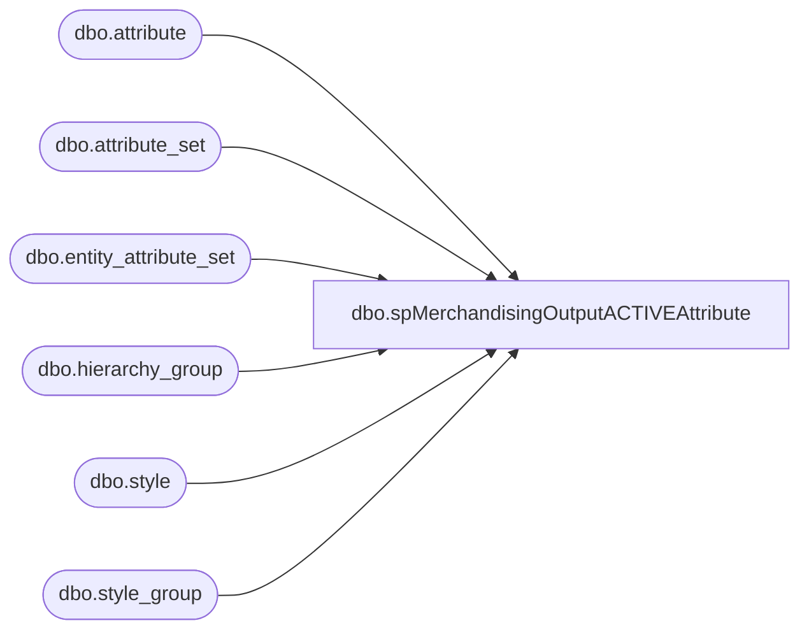

# dbo.spMerchandisingOutputACTIVEAttribute

**Database:** me_01  
**Server:** bedrockdb02  

## Architecture Diagram



## Table Dependencies

| Referenced Table |
|---|
| dbo.attribute |
| dbo.attribute_set |
| dbo.entity_attribute_set |
| dbo.hierarchy_group |
| dbo.style |
| dbo.style_group |

## Stored Procedure Code

```sql
CREATE proc [dbo].[spMerchandisingOutputACTIVEAttribute]

as 

-- =====================================================================================================
-- Name: spMerchandisingOutputACTIVEAttribute
--
-- Description:	Identifies styles which should have Active attribute set to YES based on a style list from UK Whs, generates file for Pipeline to add the attribute.
--				
--
-- Input:	NA
--
-- Output: 
--			
--
-- Dependencies: 
--
-- Revision History
--		Name:			Date:			Comments:
--		Dan Tweedie		09/23/2013		Created proc
-- =====================================================================================================

set nocount on

IF (Object_ID('tempdb..#a') IS NOT NULL) DROP TABLE #a
select s.style_code
into #a
from style s (nolock)
join style_group sg (nolock) on s.style_id = sg.style_id
join hierarchy_group hg (nolock) on sg.hierarchy_group_id = hg.hierarchy_group_id
join entity_attribute_set eas (nolock) on s.style_id = eas.parent_id
join attribute_set att (nolock) on eas.attribute_set_id = att.attribute_set_id
join attribute a (nolock) on att.attribute_id = a.attribute_id and a.parent_type = 1
where a.attribute_code in ('ACTIVE') --these are the hts attribute codes
and att.attribute_set_code = 'NO'
and s.active_flag = 1
and s.style_code in --enter style list below
	('017416','019936','019937','019938','019939','019941','019942','020316','400051','400052','400054','400055','400056','400057','400061','400062','400066','400067','400068','400629','401844','403026','403030','404127','404575','404935','405001','407211','407677','410356','411263','411910','411911','412104','412105','412106','412252','412870','413415','415015','415023','415216','415460','415467','415725','416498','416500','416501','416526','416527','416785','416816','417284','417285','417287','417298','417299','417300','418198','418202','418203','418204','418206','418359','418360','418956','418957','418958','418959','418985','419142','419200','419201','419251','419323','419381','419387','419388','419496','419511','419561','419953','419954','420175','420324','420415','420423','420443','420445','420464','420633','450046','450047','450048','450050','450051','450135','450136','450137','450146','450160','450188','450206','450293','450353','450554','450555','450556','450557','450558','450559','450560','450561','450562','450563','450564','450565','450567','450568','450569','450570','450571','450572','450573','450574','450576','450578','450579','450581','450582','450583','450584','450585','450838','450874','450914','450982','450983','451001','451002','451010','451011','451012','451013','451019','451022','451170','451173','451177','451181','451299','451393','451427','451429','451434','451436','451455','451638','451730','451777','451798','451814','452022','452069','452233','452243','452313','452367','452388','452503','452504','452505','452519','452520','452700','452874','452876','452929','452949','452951','452981','453002','453117','453146','453147','453159','453160','453185','453186','453189','453194','453195','453216','453220','453276','453277','453297','453304','453313','453316','453352','453374','453421','453478','453481','453514','453556','453595','453603','453609','453638','453669','453682','453683','453692','453695','453703','453709','453733','453734','453738','453793','453807','453808','453811','453812','453843','453876','453877','453925','453934','453952','453959','453976','453977','453978','453987','453988','454020','454021','454022','454023','454027','454043','454088','454120','454140','454141','454242','454243','454244','454245','454269','454276')
order by style_code, a.attribute_code


IF (select count(*) from #a) > 0

begin

	IF (Object_ID('me_01..tmpACTIVEattribute') IS NOT NULL) DROP TABLE tmpACTIVEattribute
	select distinct 'SA' a, 'M' b, style_code c, 'ACTIVE' d, 'YES' e
	into tmpACTIVEattribute
	from #a

	declare @query varchar(1000),
			@filename varchar(1000),
			@file_location varchar(100),
			@server varchar(20),
			@username varchar(20),
			@password varchar(20),
			@bcp varchar(1000)

	set @query = 'set nocount on select * from merch41query.dbo.tmpACTIVEattribute'
	set @filename = 'STSIMStyleAttribute.ACT.' + convert(varchar, datepart(yyyy, getdate())) + convert(varchar, datepart(mm, getdate())) + convert(varchar, datepart(dd, getdate())) + convert(varchar, datepart(hh, getdate())) + convert(varchar, datepart(mi, getdate())) + convert(varchar, datepart(ss, getdate())) + '.GO'
	set @file_location = '\\pipeapp01\Company01\Text File to EDM & PROD Import Tables - Imp Master Entities\'
	set @server = 'bedrockdb02'
	set @bcp = 'bcp "' + @query + '" queryout "' + @file_location + @filename + '" -T -c -S' + @server 

	exec master..xp_cmdshell @bcp

end
```

