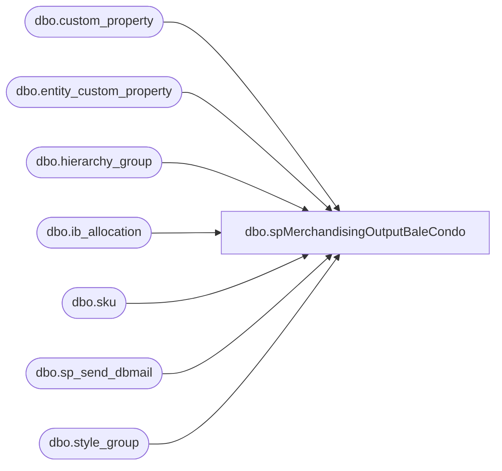

# dbo.spMerchandisingOutputBaleCondo

**Database:** me_01  
**Server:** bedrockdb02  

## Architecture Diagram



## Table Dependencies

| Referenced Table |
|---|
| dbo.custom_property |
| dbo.entity_custom_property |
| dbo.hierarchy_group |
| dbo.ib_allocation |
| dbo.sku |
| dbo.sp_send_dbmail |
| dbo.style_group |

## Stored Procedure Code

```sql
-- =====================================================================================================
-- Name: spMerchandisingOutputBaleCondo
--
-- Description:	Reports the daily allocations for bales & condos for both NA & EU. The query results are attached and emailed to MerchAdmin and selected recipients.
-- Revision History
--		Name:			Date:			Comments:
--		Scott Patten	10/13/16		Created proc.	
--		Scott Patten	03/29/17		Adjusted to exclude non-retail locations
--		Scott Patten	05/16/17		Excluded additional locations
-- =====================================================================================================
CREATE PROCEDURE [dbo].[spMerchandisingOutputBaleCondo] 
AS
BEGIN

IF (Object_ID('tempdb..##balecondo') IS NOT NULL) DROP TABLE ##balecondo
SELECT hierarchy_group_code,
              CASE WHEN right(hierarchy_group_code,8) = ('60-01-01')
                     THEN ('Bale') 
                     ELSE ('Condo') 
              END AS Type, 
              CASE WHEN left(hierarchy_group_code,5) = ('R-B-U') 
                     THEN ('EU') 
                     ELSE ('NA') 
              END AS Country,
              transaction_date, 
              transaction_type_code, 
              SUM(allocated_units)*-1 AS allocated_units, 
              custom_property_value AS 'ship_multiple', 
              SUM(allocated_units*-1)*custom_property_value AS 'total_eaches'
INTO ##balecondo
FROM sku
JOIN ib_allocation ib ON ib.sku_id = sku.sku_id
JOIN style_group sg ON sg.style_id = sku.style_id
JOIN hierarchy_group hg ON hg.hierarchy_group_id = sg.hierarchy_group_id
JOIN entity_custom_property ecp ON ecp.parent_id = sku.style_id
JOIN custom_property cp ON ecp.custom_property_id = cp.custom_property_id
WHERE transaction_type_code = '820'
AND cp.entity_type = '1'
AND cp.cust_prop_code = 'FRCSTM'
AND transaction_date > '2015-06-28 00:00:00'
AND ib.location_id NOT IN ('7', '8', '15', '16', '52', '53', '54', '55', '56', '57', '58', '59', '60', '61', '62', '63',
'64', '65', '66', '114', '115', '116', '117', '118', '119', '120', '121', '122', '123', '124', '125', '126', '127', '128',
'129', '130', '131', '137', '138', '139', '140', '141', '142', '143', '144', '145', '147', '148', '149', '150', '151', '152',
'154', '383', '384', '385', '386', '387', '388', '402', '497', '505', '506', '507', '525', '526', '527', '528', '529', '540',
'541', '542', '544', '545', '546', '547', '548', '549', '550', '551', '552', '553', '560', '562', '563', '564', '565', '566',
'567', '568', '569', '570', '571', '572', '573', '574', '575', '576', '578', '579', '580', '581', '582', '583', '599', '600',
'602', '603', '604', '605', '607', '608', '610', '614', '626', '627', '628', '629', '630', '631', '632', '633', '634', '635',
'636', '637', '638', '639', '640', '641', '645', '646', '647', '648', '649', '650', '651', '652', '653', '654', '655', '656',
'657', '658', '659', '660', '661', '662', '663', '664', '665', '666', '667', '668', '669', '670', '671', '680', '682', '683',
'684', '685', '686', '687', '693', '696', '698', '704', '705', '706', '707', '708', '709', '710', '711', '712', '714', '715',
'716', '717', '718', '719', '720', '721', '722', '723', '724', '738', '739', '740', '741', '742', '748', '749', '750', '751',
'758', '768', '773', '774', '775', '776', '777', '791', '794', '795', '799', '800', '801', '802', '803', '804', '805', '806',
'807', '808', '809', '810', '811', '812', '813', '820', '821', '849', '850', '851', '852')
AND right(hierarchy_group_code,8) in('60-01-01', '60-01-02', '60-01-14', '60-01-15')
GROUP BY hierarchy_group_code, transaction_date, transaction_type_code, allocated_units, custom_property_value
ORDER BY 3,1,2

IF (Object_ID('tempdb..##bcfinal') IS NOT NULL) DROP TABLE ##bcfinal
SELECT case when Type = 'Condo' 
                     then 'Condo'
                     else 'Bale' 
              end AS Item, 
              case when Country = 'EU' 
                     then 'EU'
                     else 'NA'
              end AS Country, 
              transaction_date, 
              SUM(total_eaches) AS allocated_eaches
INTO ##bcfinal
FROM ##balecondo
GROUP BY Type, Country, transaction_date
order by 3,1,2
	
SET NOCOUNT ON;

IF (SELECT COUNT(*) FROM ##balecondo) > 0

BEGIN

exec msdb.dbo.sp_send_dbmail
	@profile_name = 'merchadmin',
 	@recipients = 'chadv@buildabear.com;bradleyf@buildabear.com;tamib@buildabear.com;lisah@buildabear.com',
	@body = 'Attached is the weekly Bale/Condo shipped allocations report for NA & EU.',
	@subject = 'Bale/Condo Shipped Allocation Quantities',
	@query = 'set nocount on select * from ##bcfinal ORDER BY 3,1,2',
	@attach_query_result_as_file = '1',
	@query_attachment_filename = 'bale_condo.txt',
	@importance = normal
END
END
```

