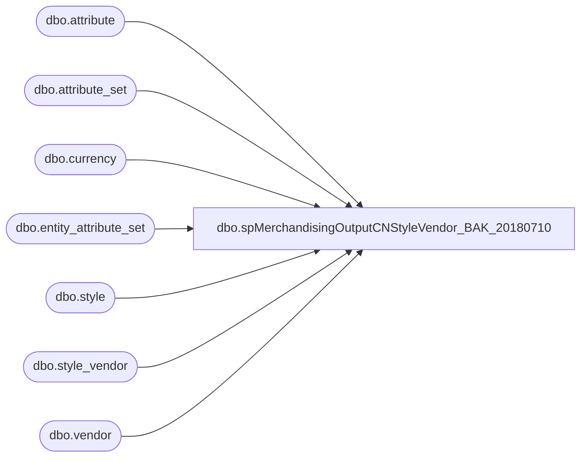

# dbo.spMerchandisingOutputCNStyleVendor_BAK_20180710

**Database:** me_01  
**Server:** bedrockdb02  

## Architecture Diagram



## Table Dependencies

| Referenced Table |
|---|
| dbo.attribute |
| dbo.attribute_set |
| dbo.currency |
| dbo.entity_attribute_set |
| dbo.style |
| dbo.style_vendor |
| dbo.vendor |

## Stored Procedure Code

```sql
-- =====================================================================================================
-- Name: spMerchandisingOutputCNStyleVendor_BAK_20180710
--
-- Description:	Creates .GO file to import new style vendor records via pipeline.
-- Revision History
--		Name:			Date:			Comments:
--		Scott Patten	05/17/2016		Created procedure	
--		Keith			07/19/2016		Updated CTC vendor for DANDEEE and DANDEES to DANBSTF
--		Scott Patten	01/17/2017		Updated the conversion rate to 6.8285 (Confirmed by Stephanie X.)
--		Scott Patten	05/01/2017		Updated CTC vendor for JSHOLLY, RPACHKL & DREAMIN
--		Tim Callahan	03/05/2018		Updated CTC vendor for JSKXINF which is the China to China vendor for standard vendor JSKYANT
--										See HEAT SR# 21848  - There is an attached e-mail thread on the topic\change. 
-- =====================================================================================================
CREATE PROCEDURE [dbo].[spMerchandisingOutputCNStyleVendor_BAK_20180710]
	
AS
BEGIN

-- Declare variable and drop all temp tables if they exist.

DECLARE @conversion decimal (10,4)
SET @conversion = 6.8285

IF (Object_ID('tempdb..##CNStyleVendor') IS NOT NULL) 
        DROP TABLE ##CNStyleVendor
IF (Object_ID('tempdb..#babwork') IS NOT NULL)
		DROP TABLE #babwork  
IF (Object_ID('tempdb..#babrmsl') IS NOT NULL)
		DROP TABLE #babrmsl
IF (Object_ID('tempdb..#bonded') IS NOT NULL)
		DROP TABLE #bonded 	
IF (Object_ID('tempdb..#nonbonded') IS NOT NULL)
		DROP TABLE #nonbonded
IF (Object_ID('tempdb..#nonbondedkp') IS NOT NULL)
		DROP TABLE #nonbondedkp
IF (Object_ID('tempdb..#nonbondedif') IS NOT NULL)
		DROP TABLE #nonbondedif
	  
-- STEP # 1 to add BABWORK to all CN styles where it doesn't exist.

SELECT 	s.style_code,
	vendor_code
INTO #babwork
FROM	style s,
	style_vendor sv,
	vendor v
WHERE 	s.style_id = sv.style_id
AND	sv.vendor_id = v.vendor_id
AND s.style_code between '800000' and '899999'
AND	v.vendor_code = 'BABWORK'

-- Reference created temp table to exclude any style code records that are included in the table.

SELECT	'VS' AS Record_Type,
	'A' AS Action_Type,
	s.style_code AS Style_Code,
	'BABWORK' AS Vendor_Code,
	sv.vendor_style AS Vendor_Style_Code,
	sv.current_cost AS Vendor_Current_Cost,
	'USD' AS Vendor_Current_Cost_Currency_Code,
	'N' AS Primary_Flag
INTO ##CNStyleVendor
FROM	style s,
	style_vendor sv,
	vendor v,
	currency cu
WHERE 	s.style_id = sv.style_id
AND	sv.vendor_id = v.vendor_id
AND	sv.currency_id = cu.currency_id
AND s.style_code between '800000' and '899999'
AND sv.primary_vendor_flag = '1'
AND NOT EXISTS (
SELECT * From #babwork st
WHERE s.style_code = st.style_code)
ORDER BY 3

-- STEP # 2 to add BABRMSL to all CN styles where it doesn't exist.

SELECT 	s.style_code,
	vendor_code
INTO #babrmsl
FROM	style s,
	style_vendor sv,
	vendor v
WHERE 	s.style_id = sv.style_id
AND	sv.vendor_id = v.vendor_id
AND s.style_code between '800000' and '899999'
AND	v.vendor_code = 'BABRMSL'

-- Reference created temp table to exclude any style code records that are included in the table.

INSERT INTO  ##CNStyleVendor
SELECT	'VS' as Record_Type,
	'A' as Action_Type,
	s.style_code as Style_Code,
	'BABRMSL' as Vendor_Code,
	sv.vendor_style as Vendor_Style_Code,
	sv.current_cost as Vendor_Current_Cost,
	'USD' as Vendor_Current_Cost_Currency_Code,
	'N' as Primary_Flag
FROM	style s,
	style_vendor sv,
	vendor v,
	currency cu
WHERE 	s.style_id = sv.style_id
AND	sv.vendor_id = v.vendor_id
AND	sv.currency_id = cu.currency_id
AND s.style_code between '800000' and '899999'
AND sv.primary_vendor_flag = '1'
AND NOT EXISTS (
SELECT * From #babrmsl st
WHERE s.style_code = st.style_code)
ORDER BY 3

-- STEP # 3 to add the appropriate Bonded vendor codes to all CN styles where they don't exist.

SELECT 	s.style_code,
	vendor_code
INTO #bonded
FROM	style s,
	style_vendor sv,
	vendor v
WHERE 	s.style_id = sv.style_id
AND	sv.vendor_id = v.vendor_id
AND s.style_code between '800000' and '899999'
AND v.vendor_code IN ('CENTBND', 'DANDBND', 'DANUBND', 'DREMBND', 'ELANBND', 'JINCBND', 'JUSTBND', 'KIDPBND', 'ROTUBND', 'VOXPBND')
ORDER BY 1

-- Reference created temp table to exclude any style code records that are included in the table.

INSERT INTO  ##CNStyleVendor
SELECT 	'VS' AS Record_Type,
	'A' AS Action_Type,
	s.style_code AS Style_Code,
	CASE WHEN v.vendor_code = 'CENTURY'
		THEN 'CENTBND'
	WHEN v.vendor_code = 'DANDEEE'
		THEN 'DANDBND'
	WHEN v.vendor_code = 'DANDEES'
		THEN 'DANDBND'
	WHEN v.vendor_code = 'DANUINT'
		THEN 'DANUBND'
	WHEN v.vendor_code = 'DREAMAN'
		THEN 'DREMBND'
	WHEN v.vendor_code = 'DREAMIN'
		THEN 'DREMBND'
	WHEN v.vendor_code = 'ELANPOL'
		THEN 'ELANBND'
	WHEN v.vendor_code = 'JINSOLL'
		THEN 'JINCBND'
	WHEN v.vendor_code = 'JUSTYAN'
		THEN 'JUSTBND'
	WHEN v.vendor_code = 'KIDQING'
		THEN 'KIDPBND'
	WHEN v.vendor_code = 'ROTUBAE'
		THEN 'ROTUBND'
	WHEN v.vendor_code = 'VOICEEX'
		THEN 'VOXPBND'
	END AS Vendor_Code,
	sv.vendor_style AS Vendor_Style_Code,
	sv.current_cost AS Vendor_Current_Cost,
	'USD' AS Vendor_Current_Cost_Currency_Code,
	'N' AS Primary_Flag
FROM	style s,
	style_vendor sv,
	vendor v,
	currency cu
WHERE 	s.style_id = sv.style_id
AND	sv.vendor_id = v.vendor_id
AND	sv.currency_id = cu.currency_id
AND s.style_code between '800000' and '899999'
AND	v.vendor_code IN ('CENTURY', 'DANDEEE', 'DANDEES', 'DANUINT', 'DREAMAN', 'DREAMIN', 'ELANPOL', 'JINSOLL', 'JUSTYAN', 'KIDQING', 'ROTUBAE', 'VOICEEX')
AND NOT EXISTS (
SELECT * FROM #bonded st
WHERE s.style_code = st.style_code)
ORDER BY 4,3

-- STEP # 4 to add the appropriate non-bonded vendor codes to all CN styles where they don't exist (Excluding KIDPSHA).

SELECT 	s.style_code,
	vendor_code
INTO #nonbonded
FROM	style s,
	style_vendor sv,
	vendor v
WHERE 	s.style_id = sv.style_id
AND	sv.vendor_id = v.vendor_id
AND s.style_code between '800000' and '899999'
AND v.vendor_code IN ('CENTHFF', 'DANBSTF', 'DANUANF', 'DRMCHTF', 'DRMLISF', 'ELNTPWF', 'JINSDZF', 'VXPRTWF', 'JSHWLIF', 'RPACSUP','JSKXINF')
ORDER BY 1

-- Reference created temp table to exclude any style code records that are included in the table.
-- Made the currency code 'CNY' as all non-bonded need to be CNY, calculated the cost in RMB using @conversion.

INSERT INTO  ##CNStyleVendor
SELECT 	'VS' AS Record_Type,
	'A' AS Action_Type,
	s.style_code AS Style_Code,
	CASE WHEN v.vendor_code = 'CENTURY'
		THEN 'CENTHFF'
	WHEN v.vendor_code = 'DANDEEE'
		THEN 'DANBSTF'
	WHEN v.vendor_code = 'DANDEES'
		THEN 'DANBSTF'
	WHEN v.vendor_code = 'DANUINT'
		THEN 'DANUANF'
	WHEN v.vendor_code = 'DREAMAN'
		THEN 'DRMCHTF'
	WHEN v.vendor_code = 'DREAMIN'
		THEN 'DRMLISF'
	WHEN v.vendor_code = 'ELANPOL'
		THEN 'ELNTPWF'
	WHEN v.vendor_code = 'JINSOLL'
		THEN 'JINSDZF'
	WHEN v.vendor_code = 'VOICEEX'
		THEN 'VXPRTWF'
	WHEN v.vendor_code = 'JSHOLLY'
		THEN 'JSHWLIF'
	WHEN v.vendor_code = 'RPACHKL'
		THEN 'RPACSUP'
	WHEN v.vendor_code = 'JSKYANT'
		THEN 'JSKXINF'
	END AS Vendor_Code,
	sv.vendor_style AS Vendor_Style_Code,
	CAST (sv.current_cost * @conversion AS DECIMAL(10,2)) AS Vendor_Current_Cost,
	'CNY' AS Vendor_Current_Cost_Currency_Code,
	'N' AS Primary_Flag
FROM	style s,
	style_vendor sv,
	vendor v,
	currency cu
WHERE 	s.style_id = sv.style_id
AND	sv.vendor_id = v.vendor_id
AND	sv.currency_id = cu.currency_id
AND s.style_code between '800000' and '899999'
AND	v.vendor_code IN ('CENTURY', 'DANDEEE', 'DANDEES', 'DANUINT', 'DREAMAN', 'DREAMIN', 'ELANPOL', 'JINSOLL', 'VOICEEX', 'JSHOLLY', 'RPACHKL','JSKYANT')
AND NOT EXISTS (
SELECT * FROM #nonbonded st
WHERE s.style_code = st.style_code)
ORDER BY 4,3

-- STEP # 5 to add the appropriate non-bonded vendor codes to all CN styles where they don't exist (KIDPSHA ONLY).

SELECT 	s.style_code,
	vendor_code,
	ats.attribute_set_code
INTO #nonbondedkp
FROM	style s,
	style_vendor sv,
	vendor v,
	attribute a,
	attribute_set ats,
	entity_attribute_set eas
WHERE 	s.style_id = sv.style_id
AND	sv.vendor_id = v.vendor_id
AND s.style_code between '800000' and '899999'
AND v.vendor_code IN ('KDPJSHF', 'KDPYANF', 'KDPWANF')
AND	s.style_id = eas.parent_id
AND	eas.attribute_id = a.attribute_id
AND	eas.attribute_set_id = ats.attribute_set_id
AND	a.attribute_code = 'FACTRY'
ORDER BY 1

-- Reference created temp table to exclude any style code records that are included in the table.
-- Made the currency code 'CNY' as all non-bonded need to be CNY, calculated the cost in RMB using @conversion.

INSERT INTO  ##CNStyleVendor
SELECT 	'VS' AS Record_Type,
	'A' AS Action_Type,
	s.style_code AS Style_Code,
	CASE WHEN ats.attribute_set_code = 'KDPJSH'
		THEN 'KDPJSHF'
	WHEN ats.attribute_set_code = 'KDPYAN'
		THEN 'KDPYANF'
	WHEN ats.attribute_set_code = 'KDPWAN'
		THEN 'KDPWANF'
	END AS Vendor_Code,
	sv.vendor_style AS Vendor_Style_Code,
	CAST (sv.current_cost * @conversion AS DECIMAL(10,2)) AS Vendor_Current_Cost,
	'CNY' AS Vendor_Current_Cost_Currency_Code,
	'N' AS Primary_Flag
FROM	style s,
	style_vendor sv,
	vendor v,
	currency cu,
	attribute a,
	attribute_set ats,
	entity_attribute_set eas
WHERE 	s.style_id = sv.style_id
AND	sv.vendor_id = v.vendor_id
AND	sv.currency_id = cu.currency_id
AND s.style_code between '800000' and '899999'
AND	v.vendor_code = 'KIDPSHA'
AND ats.attribute_set_code IN ('KDPJSH', 'KDPWAN', 'KDPYAN')
AND	s.style_id = eas.parent_id
AND	eas.attribute_id = a.attribute_id
AND	eas.attribute_set_id = ats.attribute_set_id
AND	a.attribute_code = 'FACTRY'
AND NOT EXISTS (
SELECT * FROM #nonbondedkp st
WHERE s.style_code = st.style_code)
ORDER BY 4,3

-- STEP # 6 to add the appropriate non-bonded vendor codes to all CN styles where they don't exist (INNOFLW ONLY).

SELECT 	s.style_code,
	vendor_code,
	ats.attribute_set_code
INTO #nonbondedif
FROM	style s,
	style_vendor sv,
	vendor v,
	attribute a,
	attribute_set ats,
	entity_attribute_set eas
WHERE 	s.style_id = sv.style_id
AND	sv.vendor_id = v.vendor_id
AND s.style_code between '800000' and '899999'
AND v.vendor_code IN ('INFEVEF', 'INFWANF')
AND	s.style_id = eas.parent_id
AND	eas.attribute_id = a.attribute_id
AND	eas.attribute_set_id = ats.attribute_set_id
AND	a.attribute_code = 'FACTRY'
ORDER BY 1

-- Reference created temp table to exclude any style code records that are included in the table.
-- Made the currency code 'CNY' as all non-bonded need to be CNY, calculated the cost in RMB using @conversion.

INSERT INTO  ##CNStyleVendor
SELECT 	'VS' AS Record_Type,
	'A' AS Action_Type,
	s.style_code AS Style_Code,
	CASE WHEN ats.attribute_set_code = 'INFEVE'
		THEN 'INFEVEF'
	WHEN ats.attribute_set_code = 'INFWAN'
		THEN 'INFWANF'
	END AS Vendor_Code,
	sv.vendor_style AS Vendor_Style_Code,
	CAST (sv.current_cost * @conversion AS DECIMAL(10,2)) AS Vendor_Current_Cost,
	'CNY' AS Vendor_Current_Cost_Currency_Code,
	'N' AS Primary_Flag
FROM	style s,
	style_vendor sv,
	vendor v,
	currency cu,
	attribute a,
	attribute_set ats,
	entity_attribute_set eas
WHERE 	s.style_id = sv.style_id
AND	sv.vendor_id = v.vendor_id
AND	sv.currency_id = cu.currency_id
AND s.style_code between '800000' and '899999'
AND	v.vendor_code = 'INNOFLW'
AND ats.attribute_set_code IN ('INFEVE', 'INFWAN')
AND	s.style_id = eas.parent_id
AND	eas.attribute_id = a.attribute_id
AND	eas.attribute_set_id = ats.attribute_set_id
AND	a.attribute_code = 'FACTRY'
AND NOT EXISTS (
SELECT * FROM #nonbondedif st
WHERE s.style_code = st.style_code)
ORDER BY 4,3

SET NOCOUNT ON

IF (SELECT COUNT(*) FROM ##CNStyleVendor) > 0

BEGIN

	DECLARE @query varchar(1000),
			@date varchar(20),
			@filename varchar(100),
			@filelocation varchar(100),
			@server varchar(20),
			@database varchar(20),
			@sqlcmd varchar(1000),
			@query_text varchar(1000)

	SELECT @query = 'SET NOCOUNT ON SELECT * FROM ##CNStyleVendor ORDER BY 4,3'
	SELECT @date = CAST(DATEPART(yyyy, GETDATE()) as varchar) + CAST(DATEPART(mm, GETDATE()) as varchar) + CAST(DATEPART(dd, GETDATE()) as varchar) + CAST(DATEPART(hh, GETDATE()) as varchar) + CAST(DATEPART(mi, GETDATE()) as varchar) + CAST(DATEPART(ss, GETDATE()) as varchar) 
	SELECT @filelocation = '\\PIPEAPP01\Company01\Text File to EDM & PROD Import Tables - Imp Master Entities\' -- change to pipetestapp01 for TEST environment
	SELECT @filename = 'CN_STYLE_VENDOR_' + @date + '.GO'
	SELECT @server = 'bedrockdb02'
	SELECT @database = 'me_01'
	SELECT @sqlcmd = 'sqlcmd -S' + @server + ' -d' + @database + ' -Q' + '"' + @query + '"' + ' -o' + '"' + @filelocation + @filename + '"' + ' -s"	" -W -h-1'-- (-h-1) removes headers - - (-f 65001 sets to unicode (for chinese characters))
	EXEC MASTER..xp_cmdshell @sqlcmd

END
END
```

