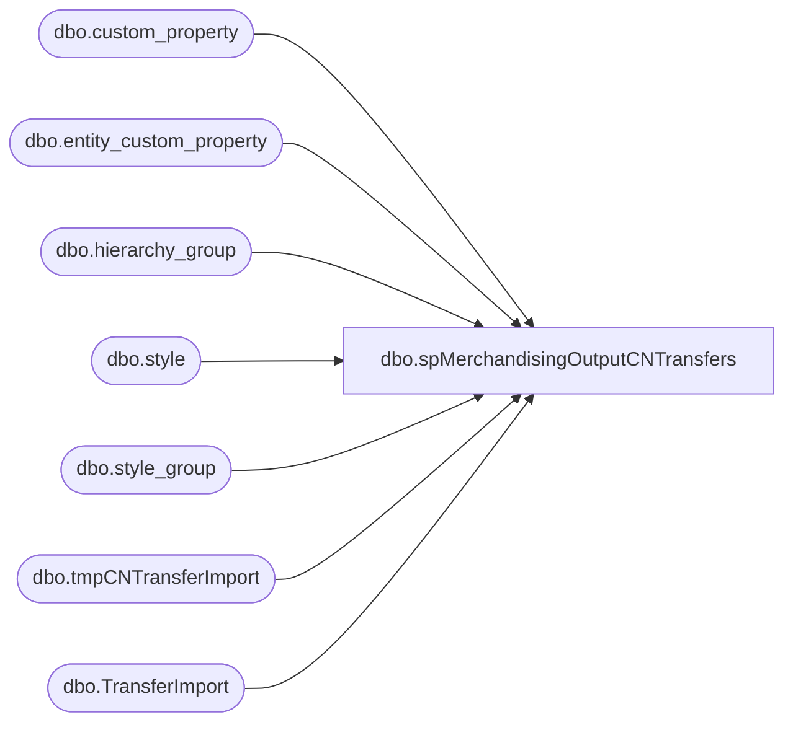

# dbo.spMerchandisingOutputCNTransfers

**Database:** me_01  
**Server:** bedrockdb02  

## Architecture Diagram



## Table Dependencies

| Referenced Table |
|---|
| dbo.custom_property |
| dbo.entity_custom_property |
| dbo.hierarchy_group |
| dbo.style |
| dbo.style_group |
| dbo.tmpCNTransferImport |
| dbo.TransferImport |

## Stored Procedure Code

```sql
create proc [dbo].[spMerchandisingOutputCNTransfers]

as

-- =====================================================================================================
-- Name: spMerchandisingOutputCNTransfers
--
-- Description:	Creates a transfer document to import into Merchandising via the Pipeline. 
--				
--				 
-- Revision History
--		Name:			Date:			Comments:
--		Dan Tweedie		01/25/2016		Created proc.	
-- =====================================================================================================

set nocount on 


if (object_id('tempdb..#supplies') is not null) drop table #supplies
select s.style_code, ecp.custom_property_value case_qty
into #supplies
from style s (nolock) 
join style_group sg (nolock) on s.style_id = sg.style_id
join hierarchy_group hg (nolock) on sg.hierarchy_group_id = hg.hierarchy_group_id
left join entity_custom_property ecp on s.style_id = ecp.parent_id and ecp.parent_type = 1
left join custom_property cp (nolock) on cp.custom_property_id = ecp.custom_property_id 
where substring(hg.hierarchy_group_code,7,2) = '60' --supplies
and cp.cust_prop_code = 'FRCSTM' --ensures we only capture hts related custom properties
order by s.style_code, cp.cust_prop_code


IF (Object_ID('tempdb..#a') IS NOT NULL) DROP TABLE #a
select  right(('0000' + cast(i.from_location_code as varchar)), 4) + right(('0000' + cast(i.to_location_code as varchar)), 4) + convert(varchar, getdate(), 112) + cast(datepart(hh, getdate()) as varchar) + cast(datepart(mm, getdate()) as varchar) as document_number,
            '0000' + right(('0000' + cast(i.from_location_code as varchar)), 4) + right(('0000' + cast(i.to_location_code as varchar)), 4) + convert(varchar, getdate(), 112) as carton_label,
            right(('0000' + cast(i.from_location_code as varchar)), 4) as from_location_code, -- hard coded
            right(('0000' + cast(i.to_location_code as varchar)), 4) as to_location_code, -- hard coded
            CONVERT(varchar,shipped_date,101) as date_shipped,
            'CORR' as reason_code,
            'ShanghaiWhseToWhse' as Grouping_Label,
            right(('000000000000' + i.style_code), 12) as upc,
            case when s.style_code is null then i.qty else (cast(i.qty as int) / s.case_qty) end as send_units,
			i.importfile
into #a
from  tmpCNTransferImport i
left join #supplies s on right(('000000' + i.style_code),6) = s.style_code


--archive import data for validation
insert TransferImport
select getdate(), *
from #a


declare
		@document varchar(20),
		@from varchar(4),
		@to varchar(4),
		@date varchar(12),
		@reason varchar(5),
		@grouping varchar(20),
		@carton varchar(20),
		@upc varchar(20),
		@send_units int,
		@counter1 int,
		@counter2 int,
		@total1 int,
		@total2 int
		

select @total1 = count(distinct document_number) from #a
declare header cursor for
		select  distinct
				document_number,
				from_location_code,
				to_location_code,
				date_shipped,
				reason_code,
				grouping_label
		from #a

open header
set @counter1 = 1
while @counter1 <= @total1
	begin
		fetch next from header into @document,@from,@to,@date,@reason,@grouping
		print 'H' + '	'	+ 'A' +	'	'+ @document + '	' + '	' + '	' + @from + '	' + '	' + @to + '	' + '	' + '	' + '	' + '	' + @date + '	' + '	' + '	' + '	' + '	' + '	' + @reason + '	' + '	'+ '	' + '	' + @grouping + '	' + '	' + '	' + 'T'
			select @total2 = count(distinct upc) from #a where document_number = @document
			declare detail cursor for
			select distinct
					document_number,
					carton_label,
					upc,
					sum(send_units)
			from #a 
			where document_number = @document
			group by document_number, carton_label, upc order by upc
			open detail
			set @counter2 = 1
			while @counter2 <= @total2
				begin
					fetch next from detail into @document,@carton,@upc,@send_units
					print 'D' + '	' + 'A' + '	' + @document + '	' + @carton + '	' + @upc + '	' + '	' + '	' + '	' + '	' + '	' + convert(varchar, @send_units)
					set @counter2 = @counter2 + 1
				end
			close detail
			deallocate detail		
		set @counter1 = @counter1 + 1
	end
close header
deallocate header
```

