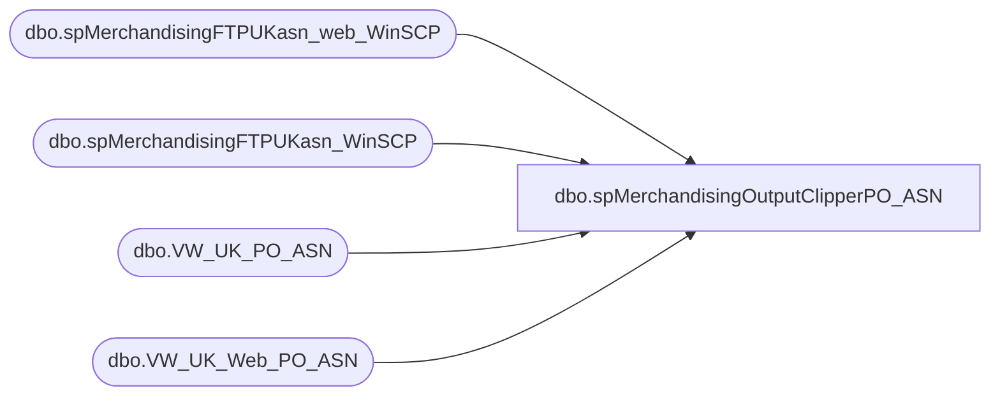

# dbo.spMerchandisingOutputClipperPO_ASN

**Database:** me_01  
**Server:** bedrockdb02  

## Architecture Diagram



## Table Dependencies

| Referenced Table |
|---|
| dbo.spMerchandisingFTPUKasn_web_WinSCP |
| dbo.spMerchandisingFTPUKasn_WinSCP |
| dbo.VW_UK_PO_ASN |
| dbo.VW_UK_Web_PO_ASN |

## Stored Procedure Code

```sql
CREATE proc [dbo].[spMerchandisingOutputClipperPO_ASN]

as

-- =====================================================================================================
-- Name: spMerchandisingOutputClipperPO_ASN
--
-- Description:	Creates CSV file to contain PO's shipping to Clipper warehouse (2970) or Clipper Webstore (2013)
-- Revision History
--		Name:			Date:			Comments:
--		Tim Callahan	09/05/2017		Created proc.	
-- =====================================================================================================

set nocount on

if (select count(*) from me_01.dbo.VW_UK_PO_ASN) > 0

begin

	declare @query varchar(1000),
			@date varchar(20),
			@filename varchar(100),
			@filelocation varchar(100),
			@server varchar(20),
			@database varchar(20),
			@sqlcmd varchar(1000),
			@query_text varchar(1000)

	select @query = 'set nocount on select * from VW_UK_PO_ASN order by PurchaseOrder, StyleCode'
	select @date = cast(datepart(yyyy, getdate()) as varchar) + cast(datepart(mm, getdate()) as varchar) + cast(datepart(dd, getdate()) as varchar) + cast(datepart(hh, getdate()) as varchar) + cast(datepart(mi, getdate()) as varchar) + cast(datepart(ss, getdate()) as varchar) 
	select @filelocation = '\\kermode\FileRepository\MERCHANDISING\UK_Distro\OUTBOUND\ASN_PO_Retail\'
	select @filename = 'UK_PO_ASN_' + @date + '.csv'
	select @server = 'bedrockdb02' -- Will need to update to PROD server
	select @database = 'me_01'
	select @sqlcmd = 'sqlcmd -S' + @server + ' -d' + @database + ' -Q' + '"' + @query + '"' + ' -o' + '"' + @filelocation + @filename + '"' + ' -s"," -W -h-1 -f 65001'-- (-h-1) removes headers - - (-f 65001 sets to unicode (for chinese characters))
	exec master..xp_cmdshell @sqlcmd

	exec spMerchandisingFTPUKasn_WinSCP 

end


if (select count(*) from me_01.dbo.VW_UK_Web_PO_ASN) > 0

begin

	declare @1query varchar(1000),
			@1date varchar(20),
			@1filename varchar(100),
			@1filelocation varchar(100),
			@1server varchar(20),
			@1database varchar(20),
			@1sqlcmd varchar(1000),
			@1query_text varchar(1000)
			
	select @1query = 'set nocount on select * from VW_UK_Web_PO_ASN order by PurchaseOrder, StyleCode'
	select @1date = cast(datepart(yyyy, getdate()) as varchar) + cast(datepart(mm, getdate()) as varchar) + cast(datepart(dd, getdate()) as varchar) + cast(datepart(hh, getdate()) as varchar) + cast(datepart(mi, getdate()) as varchar) + cast(datepart(ss, getdate()) as varchar) 
	select @1filelocation = '\\kermode\FileRepository\MERCHANDISING\UK_Distro\OUTBOUND\ASN_PO_Web\'
	select @1filename = 'UK_WEB_PO_ASN_' + @1date + '.csv'
	select @1server = 'bedrockdb02' -- Will need to update to PROD server
	select @1database = 'me_01'
	select @1sqlcmd = 'sqlcmd -S' + @1server + ' -d' + @1database + ' -Q' + '"' + @1query + '"' + ' -o' + '"' + @1filelocation + @1filename + '"' + ' -s"," -W -h-1 -f 65001'-- (-h-1) removes headers - - (-f 65001 sets to unicode (for chinese characters))
	exec master..xp_cmdshell @1sqlcmd

	exec spMerchandisingFTPUKasn_web_WinSCP

end
```

