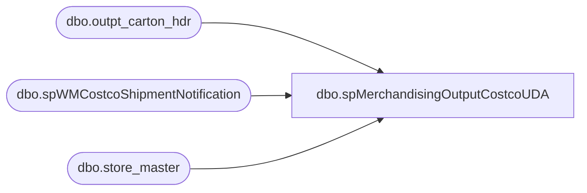

# dbo.spMerchandisingOutputCostcoUDA

**Database:** me_01  
**Server:** bedrockdb02  

## Architecture Diagram



## Table Dependencies

| Referenced Table |
|---|
| dbo.outpt_carton_hdr |
| dbo.spWMCostcoShipmentNotification |
| dbo.store_master |

## Stored Procedure Code

```sql
CREATE proc [dbo].[spMerchandisingOutputCostcoUDA]

as 

-- =====================================================================================================
-- Name: spMerchandisingOutputCostcoUDA
--
-- Description:	Captures WM Costco shipment data, dumps into a file and uploads the file to pipeline server
--				
-- Revision History
--		Name:			Date:			Comments:
--		Dan Tweedie		09/04/2013		Created proc.	
--		Dan Tweedie		01/21/2014		Added join to store_master and address tables to ensure we capture all shipments shipped to Costco, regardless of ship_via
--		Dan Tweedie		07/23/2014		Added query at beginning of process to get list of costco locations, consolidated the query to check for invoiced costco cartons
--		Dan Tweedie		08/18/2014		Added exec of spWMCostcoShipmentNotification to send Costco email and update gift card database
-- =====================================================================================================


set nocount on

--get list of costco location numbers
IF (Object_ID('tempdb..#locs') IS NOT NULL) DROP TABLE #locs
select store_nbr
into #locs
from wmdb01.wmprod.dbo.store_master
where name like '%costco%'

--if there are invoiced costco cartons from today, proceed
if (select count(*) 
	from wmdb01.wmprod.dbo.outpt_carton_hdr och 
	join #locs l on och.ship_to = l.store_nbr
	where datediff(dd, och.create_date_time, getdate()) = 0) > 0
	

begin

	declare		@query varchar(1000),
				@date varchar(200),
				@file_name varchar(100),
				@file_location varchar(100),
				@server varchar(20),
				@username varchar(20),
				@password varchar(20),
				@database varchar(20),
				@sqlcmd varchar(1000),
				@query_text varchar(1000)

		select @query_text = 'set nocount on exec spMerchandisingSelectCostcoUDA'

		set @date = convert(varchar, datepart(yyyy, getdate())) + convert(varchar, datepart(mm, getdate())) + convert(varchar, datepart(dd, getdate())) + convert(varchar, datepart(hh, getdate())) + convert(varchar, datepart(mm, getdate()))
		set @query = @query_text
		set @file_location = '\\pipeapp01\Company01\Text File to IM Import Tables - Import UDAs\'
		set @file_name = 'STSIMUDA.Costco.' + @date + '.GO'
		set @server = 'bedrockdb02'
		set @database = 'me_01'
		set @sqlcmd = 'sqlcmd -S' + @server + ' -d' + @database + ' -Q' + '"' + @query + '"' + ' -o' + '"' + @file_location + @file_name + '"' + ' -s"," -w1000 -W'
		exec master..xp_cmdshell @sqlcmd


		---run proc to send Costco email and update gift card database
		exec spWMCostcoShipmentNotification

end
```

