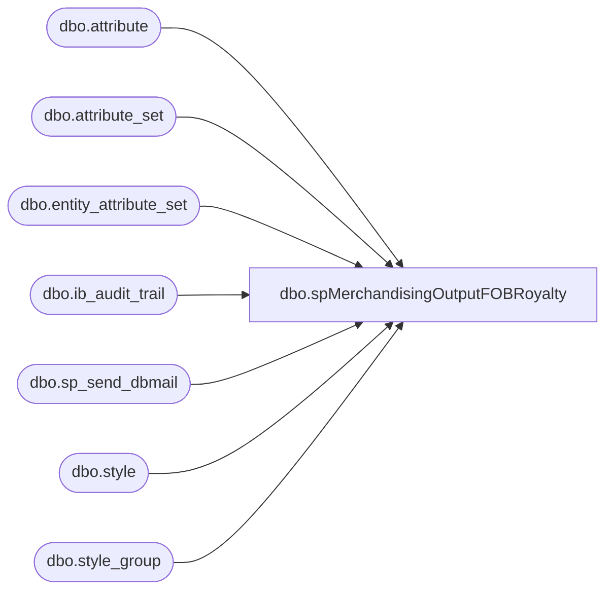

# dbo.spMerchandisingOutputFOBRoyalty

**Database:** me_01  
**Server:** bedrockdb02  

## Architecture Diagram



## Table Dependencies

| Referenced Table |
|---|
| dbo.attribute |
| dbo.attribute_set |
| dbo.entity_attribute_set |
| dbo.ib_audit_trail |
| dbo.sp_send_dbmail |
| dbo.style |
| dbo.style_group |

## Stored Procedure Code

```sql
-- =====================================================================================================
-- Name: spMerchandisingOutputFOBRoyalty
--
-- Description:	Generates a daily (M-F) report that details any style instances where the attribute_set "FOB" was added to the attribute "LICEN". Queries the ib_audit_trail table
--				for this info -- Report will then be emailed as an attachment to selected recipients, or an email will be generated stating no changes were made.
--		Name:			Date:			Comments:
--		Scott Patten	11/16/16		Created proc.	
-- =====================================================================================================
CREATE PROCEDURE [dbo].[spMerchandisingOutputFOBRoyalty] 
AS
BEGIN

IF (Object_ID('tempdb..##fobcost') IS NOT NULL) DROP TABLE ##fobcost
SELECT entry_date AS 'Entry Date', 
	   s.create_date AS 'Item Create Date',
	   CAST (application_identifier AS VARCHAR(16)) AS 'Style Code',
	   CAST (s.short_desc AS VARCHAR(20)) AS 'Description',
	   CAST (application_level AS VARCHAR(16)) AS 'Attribute',
	   CAST (old_value AS VARCHAR(8)) AS 'Old Value', 
	   CAST (new_value AS VARCHAR(8)) AS 'New Value'
	   
INTO ##fobcost
FROM ib_audit_trail ib
JOIN style s ON s.style_code = ib.application_identifier
JOIN entity_attribute_set eas ON eas.parent_id = s.style_id
JOIN attribute a ON a.attribute_id = eas.attribute_id
JOIN style_group sg ON sg.style_id = s.style_id
JOIN attribute_set at ON eas.attribute_set_id = at.attribute_set_id
WHERE at.attribute_id = '70'
AND ib.application_level = 'LICEN'
AND new_value = 'FOB'
AND entry_date >= DATEADD(day,-1, GETDATE())
GROUP BY entry_date, 
		 s.create_date, 
		 application_identifier, 
		 s.short_desc, 
		 application_level, 
		 old_value, 
		 new_value
ORDER BY entry_date DESC

SELECT [Entry Date],
	   [Item Create Date],
	   [Style Code],
	   [Description],
	   [Attribute],
	   [Old Value],
	   [New Value]
FROM ##fobcost
ORDER BY 1 DESC

SET NOCOUNT ON;

IF (SELECT COUNT(*) FROM ##fobcost) > 0

BEGIN

EXEC msdb.dbo.sp_send_dbmail
	@profile_name = 'merchadmin',
 	@recipients = 'BearAP@buildabear.com',
	--@recipients = 'scottp@buildabear.com',
	@body = 'Attached is the daily FOB Royalty Report. The attached file will detail any styles over the past day that had the LICEN attribute "FOB" added.',
	@subject = 'Daily FOB Royalty Report',
	@query = 'set nocount on select * from ##fobcost ORDER BY 1 DESC',
	@attach_query_result_as_file = '1',
	@query_attachment_filename = 'fob_cost.txt',
	@importance = normal
END

IF (SELECT COUNT(*) FROM ##fobcost) = 0

BEGIN

EXEC msdb.dbo.sp_send_dbmail
	@profile_name = 'merchadmin',
 	@recipients = 'BearAP@buildabear.com',
	--@recipients = 'scottp@buildabear.com',
	@body = 'There were no styles with attribute LICEN set to "FOB" in the past day.',
	@subject = 'Daily FOB Royalty Report',
	@importance = normal
END
END
```

