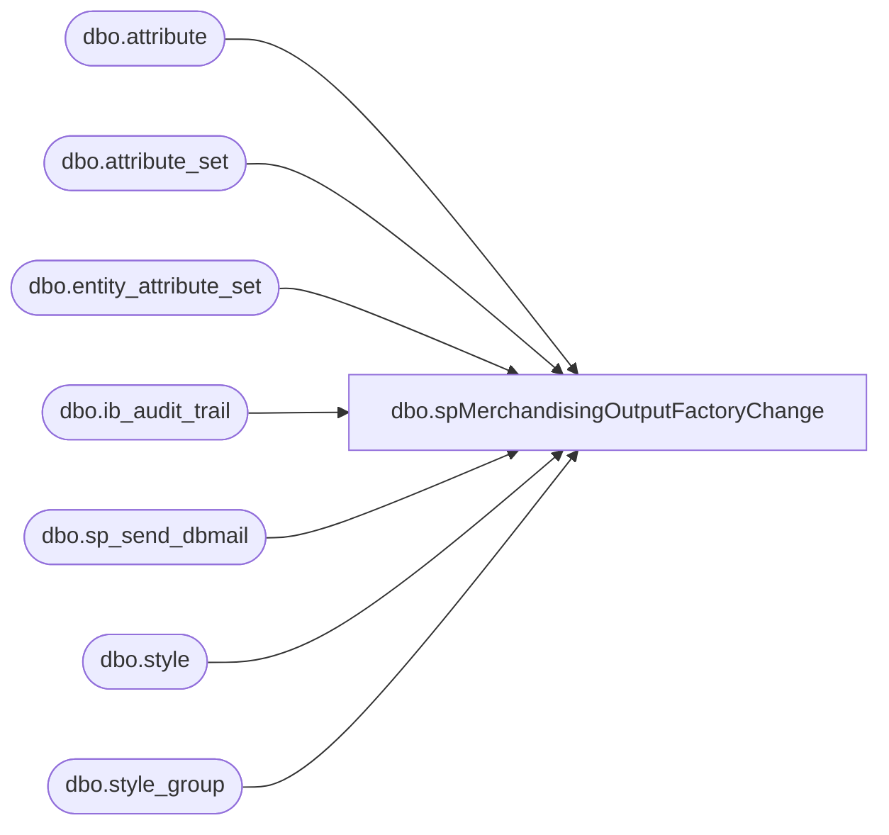

# dbo.spMerchandisingOutputFactoryChange

**Database:** me_01  
**Server:** bedrockdb02  

## Architecture Diagram



## Table Dependencies

| Referenced Table |
|---|
| dbo.attribute |
| dbo.attribute_set |
| dbo.entity_attribute_set |
| dbo.ib_audit_trail |
| dbo.sp_send_dbmail |
| dbo.style |
| dbo.style_group |

## Stored Procedure Code

```sql
-- =====================================================================================================
-- Name: spMerchandisingOutputFactoryChange
--
-- Description:	Generates a report that details any factory changes that were made for the preivous determined timeframe. Queries the ib_audit_trail table
--				for this info -- Report will then be emailed as an attachment to selected recipients, or an email will be generated stating no changes were made.
--		Name:			Date:			Comments:
--		Scott Patten	10/27/16		Created proc.	
--		Keith Lee		1/17/21			Removed Meredith and added Pamela as requested.
-- =====================================================================================================
CREATE PROCEDURE [dbo].[spMerchandisingOutputFactoryChange] 
AS
BEGIN

IF (Object_ID('tempdb..##factorychange') IS NOT NULL) DROP TABLE ##factorychange
SELECT entry_date AS 'Entry Date', 
	   CAST (application_identifier AS VARCHAR(16)) AS 'Style Code',
	   CAST (s.short_desc AS VARCHAR(20)) AS 'Description',
	   CAST (application_level AS VARCHAR(16)) AS 'Attribute',
	   CAST (old_value AS VARCHAR(8)) AS 'Old Value', 
	   CAST (new_value AS VARCHAR(8)) AS 'New Value',
	   MAX(CASE WHEN at.attribute_id = '392'
		    THEN attribute_set_code END) Licensed
INTO ##factorychange
FROM ib_audit_trail ib
JOIN style s ON s.style_code = ib.application_identifier
JOIN entity_attribute_set eas ON eas.parent_id = s.style_id
JOIN attribute a ON a.attribute_id = eas.attribute_id
JOIN style_group sg ON sg.style_id = s.style_id
JOIN attribute_set at ON eas.attribute_set_id = at.attribute_set_id
WHERE at.attribute_id = '392'
AND ib.application_level = 'FACTRY'
AND action = 'Modify'
AND old_value <> 'NONE'
AND entry_date >= DATEADD(day,-7, GETDATE())
GROUP BY entry_date, application_identifier, s.short_desc, application_level, action, old_value, new_value
ORDER BY entry_date DESC

SELECT [Entry Date],
	   [Style Code],
	   [Description],
	   [Attribute],
	   [Old Value],
	   [New Value],
	   Licensed
FROM ##factorychange
ORDER BY 1 DESC

SET NOCOUNT ON;

IF (SELECT COUNT(*) FROM ##factorychange) > 0

BEGIN

EXEC msdb.dbo.sp_send_dbmail
	@profile_name = 'merchadmin',
 	@recipients = 'helenh@buildabear.com;pamelab@buildabear.com',
	--@recipients = 'scottp@buildabear.com',
	@body = 'Attached is the weekly factory change report for factory changes happening within the last week. The attached file will detail the old/new factory, and whether or not the style is licensed.',
	@subject = 'Weekly Factory Change Report',
	@query = 'set nocount on select * from ##factorychange ORDER BY 1 DESC',
	@attach_query_result_as_file = '1',
	@query_attachment_filename = 'factory_change.txt',
	@importance = normal
END

IF (SELECT COUNT(*) FROM ##factorychange) = 0

BEGIN

EXEC msdb.dbo.sp_send_dbmail
	@profile_name = 'merchadmin',
 	@recipients = 'helenh@buildabear.com;pamelab@buildabear.com',
	--@recipients = 'scottp@buildabear.com',
	@body = 'There were no factory changes performed this week.',
	@subject = 'Weekly Factory Change Report',
	@importance = normal
END
END
```

