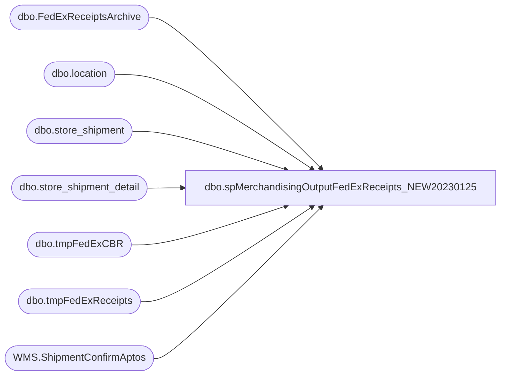

# dbo.spMerchandisingOutputFedExReceipts_NEW20230125

**Database:** me_01  
**Server:** bedrockdb02  

## Architecture Diagram



## Table Dependencies

| Referenced Table |
|---|
| dbo.FedExReceiptsArchive |
| dbo.location |
| dbo.store_shipment |
| dbo.store_shipment_detail |
| dbo.tmpFedExCBR |
| dbo.tmpFedExReceipts |
| WMS.ShipmentConfirmAptos |

## Stored Procedure Code

```sql
CREATE proc [dbo].[spMerchandisingOutputFedExReceipts_NEW20230125]
as 

-- =====================================================================================================
-- Name: spMerchandisingOutputFedExReceipts
--
-- Description:	Imports FedEx receipt file from FedEx, outputs carton batch receipt file to pipeapp01
--				
--
-- Input:	Imports FedEx receipt file from \\wmetl01\Informatica\TgtFiles\FEDEX
--
-- Output: CBR file output to \\pipeapp01\Company01\Text File to IM Import Tables  - Batch Carton
--         Emails exceptions
-- Dependencies: NA
--				 
-- Revision History
--		Name:			Date:			Comments:
--		Dan Tweedie		03/07/2012		created proc
--		Dan Tweedie		01/16/2014		Added lookup to WM if the location number isn't in the FedEx data
--		Dan Tweedie		02/24/2014		Added lookup to WM if carton number isn't in FedEx data, will match by tracking number
--		Dan Tweedie		04/08/2014		Modified the code to allow for lookups to WM, streamlined it
--		Dan Tweedie		11/03/2014		Added a check for received cartons previously archived but not found in the batch carton import table
--		Dan Tweedie		07/24/2015		The FedEx FTP was changed from wmetl01 to kermode, so code was changed to match this
--		Lizzy Timm		03/05/2020		Added logic to prevent creation of empty pipeline files and replaced references to WMDB01 with stl-ssis-p-01
--		Dan Tweedie		01/25/2023		Improved performance of proc by prestaging data from stl-ssis-p-01, and changing joins to FedExReceiptArchive to be where exists instead
-- =====================================================================================================
set nocount on

----PART ONE - IMPORT FEDEX RECEIPT FILES

set nocount on
IF (Object_ID('tempdb..#files') IS NOT NULL) DROP TABLE #files
create table #files (output varchar(1000))
--insert #files exec master..xp_cmdshell 'dir \\wmetl01\Informatica\TgtFiles\FEDEX\*.txt /B'
insert #files exec master..xp_cmdshell 'dir \\kermode\filerepository\MERCHANDISING\FEDEX\UploadFromFedEx\*.txt /B'
delete from #files where output is null or output = 'File Not Found'

if (select count(*) from #files) > 0

------------------------------------------------
BEGIN
		IF (Object_ID('me_01..tmpFedExReceipts') IS NOT NULL) DROP TABLE tmpFedExReceipts
		create table tmpFedExReceipts
		(tracking varchar(50),
		 carton_no varchar(50),
		 location varchar(50),
		 delivery_date varchar(50),
		 delivery_time varchar(50),
		 [signature] varchar(50))

		
		declare @files int,
				@filename varchar(52),
				@filepath1 varchar(1000),
				@filepath2 varchar(1000),
				@filepath3 varchar(1000),
				@filepath4 varchar(1000),
				@bulkinsert varchar(4000),
				@del varchar(1000),
				@copy varchar(1000),
				@move1 varchar(1000),
				@move2 varchar(1000)

		--select @filepath1 = '\\wmetl01\Informatica\TgtFiles\FEDEX\'
		select @filepath1 = '\\kermode\filerepository\MERCHANDISING\FEDEX\UploadFromFedEx\'
		select @filepath2 = '\\kermode\Filerepository\MERCHANDISING\FEDEX\'
		--select @filepath3 = '\\wmetl01\Informatica\TgtFiles\FEDEX\DONE\'
		select @filepath3 = '\\kermode\filerepository\MERCHANDISING\FEDEX\UploadFromFedEx\DONE'
		select @filepath4 = '\\kermode\FileRepository\MERCHANDISING\FEDEX\DONE\'
		
		select @files = count(*) from #files

		while @files > 0
			begin

				select @filename = max(output) from #files
				
				select @copy = 'copy ' + @filepath1 + @filename + ' ' + @filepath2
				exec master..xp_cmdshell @copy
				
				select @bulkinsert = 'bulk insert tmpFedExReceipts from ''' + @filepath2 + @filename + ''' with (FIRSTROW = 2, FIELDTERMINATOR = ''	'', ROWTERMINATOR = ''\n'', FORMATFILE = ''\\kermode\FileRepository\MERCHANDISING\FEDEX\FormatFile\FF_.fmt'')'
				exec (@bulkinsert)
				
				select @move1 = 'move ' + @filepath1 + @filename + ' ' + @filepath3
				exec master..xp_cmdshell @move1
								
				select @move2 = 'move ' + @filepath2 + @filename + ' ' + @filepath4
				exec master..xp_cmdshell @move2
												
				delete from #files where output = @filename
				select @files = count(*) from #files
								
				if @files < 1
					break
				else
					continue
			end

-------------------------------------
--archive receipt data for future reference ---this includes all receipt data in the file, not just bab locations
insert FedExReceiptsArchive
select * 
from tmpFedExReceipts
where len(delivery_date) > 0 
-------------------------------------
	if(select count(*) from tmpFedExReceipts) > 0

	begin

	
		---testing this took <10 seconds
		IF (Object_ID('tempdb..#ContainerManifest') IS NOT NULL) DROP TABLE #ContainerManifest
		select 
			sc.ContainerManifestID, sc.ContainerID
		into #ContainerManifest
		from [stl-ssis-p-01].IntegrationStaging.WMS.ShipmentConfirmAptos sc 
		where exists (
						select ssd.carton_no 
						from store_shipment_detail ssd 
						join store_shipment ss on ss.store_shipment_id = ssd.store_shipment_id 
						where document_status=3 
						group by ssd.carton_no
					)
		group by sc.ContainerManifestID, sc.ContainerID

		CREATE NONCLUSTERED INDEX [NCI_ContainerManifestTemp]
		ON [dbo].[#ContainerManifest] ([ContainerID])
		INCLUDE ([ContainerManifestID])


		IF (Object_ID('me_01..tmpFedExCBR') IS NOT NULL) DROP TABLE tmpFedExCBR
		select distinct
			'BC' BC,
			'A' A,
			ssd.carton_no,
			l.location_code location,
			'099060199' code 
		into tmpFedExCBR
		from store_shipment ss with (nolock)
		join store_shipment_detail ssd with (nolock) on ss.store_shipment_id = ssd.store_shipment_id
		join location l with (nolock) on ss.location_id = l.location_id
		--join FedExReceiptsArchive f on ssd.carton_no = f.carton_no
		where ss.document_status = 3
		and exists (select f.carton_no from FedExReceiptsArchive f where f.carton_no=ssd.carton_no)
		union
		select distinct
			'BC' BC,
			'A' A,
			ssd.carton_no,
			l.location_code location,
			'099060199' code 
		from store_shipment ss with (nolock)
		join store_shipment_detail ssd with (nolock) on ss.store_shipment_id = ssd.store_shipment_id
		join location l with (nolock) on ss.location_id = l.location_id
		JOIN #ContainerManifest sc on ssd.carton_no = sc.containerid
		--join FedExReceiptsArchive f on sc.ContainerManifestID  = f.tracking
		where ss.document_status = 3
		and exists (select f.tracking from FedExReceiptsArchive f where f.tracking=sc.ContainerManifestID)


			-------------------------------
			---output CBR file to pipeapp01
	if(select count(*) from tmpFedExCBR) > 0 -- 03/05/2020, added to prevent empty pipeline files
		BEGIN
			declare @query varchar(1000),
					@date varchar(200),
					@file_name varchar(100),
					@file_location varchar(1000),
					@server varchar(20),
					@database varchar(20),
					@bcp varchar(1000)

			set @date = convert(varchar, datepart(yyyy, getdate())) + convert(varchar, datepart(mm, getdate())) + convert(varchar, datepart(dd, getdate())) + convert(varchar, datepart(hh, getdate())) + convert(varchar, datepart(mi, getdate())) + convert(varchar, datepart(ss, getdate()))
			set @query = 'set nocount on select distinct * from me_01.dbo.tmpFedExCBR'
			set @file_location = '\\pipeapp01\Company01\Text File to IM Import Tables  - Batch Carton\'
			set @file_name = 'STSIMCTN.FEDEX.' + @date + '.GO'
			set @server = 'bedrockdb02'
			set @database = 'me_01'
			set @bcp = 'bcp "' + @query + '" queryout "' + @file_location + @file_name + '"  -T -c -S' + @server 
			exec master..xp_cmdshell @bcp
		end
	END
END
```

