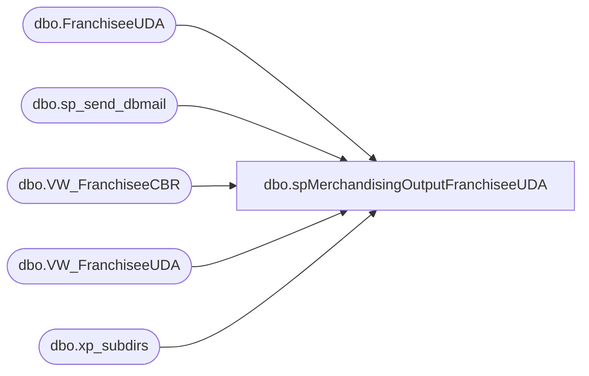

# dbo.spMerchandisingOutputFranchiseeUDA

**Database:** me_01  
**Server:** bedrockdb02  

## Architecture Diagram



## Table Dependencies

| Referenced Table |
|---|
| dbo.FranchiseeUDA |
| dbo.sp_send_dbmail |
| dbo.VW_FranchiseeCBR |
| dbo.VW_FranchiseeUDA |
| dbo.xp_subdirs |

## Stored Procedure Code

```sql
CREATE proc [dbo].[spMerchandisingOutputFranchiseeUDA]

as 
-- =====================================================================================================
-- Name: spMerchandisingOutputFranchiseeUDA
--
-- Description:	Outputs UDA file for Pipeline, executes procedure to create carton batch receipt file for Pipeline
--
-- Revision History
--		Name:			Date:			Comments:
--		Dan Tweedie		04/07/2015		Created proc
--		Tim Callahan	04/01/2016		Added Logic to Ensure Network Drive Exists for Accounting Report
-- =====================================================================================================

set nocount on

-- Ensure \\sharebear1\shared\Franchisee Shipments\ Directory exists, if not notify MerchAdmin and stop job. 
IF OBJECT_ID('tempdb..#ResultSet') IS NOT NULL
    DROP TABLE #ResultSet

CREATE TABLE 
#ResultSet (Directory varchar(200))

INSERT INTO #ResultSet
EXEC master.dbo.xp_subdirs '\\sharebear1\shared\'

--select * from #ResultSet where directory = 'Franchisee Shipments'

if (select count(*) from #ResultSet where directory = 'Franchisee Shipments') < 1 
	
	BEGIN
	exec msdb.dbo.sp_send_dbmail
		@profile_name = 'merchadmin',
		@recipients = 'EnterpriseSystemsAlerts@buildabear.com;',
		@subject = 'Franchise Shipment Directory is Missing!',
		@body = 'The following directory is missing \\sharebear1\shared\Franchisee Shipments\.
Because the directory is missing the MERCHANDISING - Process - Franchisee Transfer UDA and CBR job has exited.
Please create the directory and re-run the job.
Will also need to follow up with the Core Infrastructure team to restore this directory on Monday.

This message was brought to you by Bedrockdb02.me_01.dbo.spMerchandisingOutputFranchiseeUDA'
		
		
	END

Else 

Begin 


--STAGE UDA DATA	-- these are unreceived shipments and transfers to franchisee locations
IF (Object_ID('me_01..FranchiseeUDA') IS NOT null) DROP TABLE FranchiseeUDA
select *
into FranchiseeUDA
from VW_FranchiseeUDA

--IF UDA DATA IS STAGED, PROCEED TO REMAINING STEPS
if (select count(*) from FranchiseeUDA) > 0 

	BEGIN

	----STAGE SHIPMENT/TRANSFER DATA FOR CSV REPORT FOR ACCOUNTING
		IF (Object_ID('me_01..tmpFranchiseeTransfersShipments') IS NOT NULL) DROP TABLE tmpFranchiseeTransfersShipments
		select right(upc, 6) 'STYLE',
			   short_desc 'DESCRIPTION',
			   from_locn 'FROM',
			   location_code 'TO',
			   units 'UNITS'
		into tmpFranchiseeTransfersShipments
		from FranchiseeUDA
		order by from_locn, right(upc, 6)

	----STAGE SHIPMENT/TRANSFER CBR DATA
		IF (Object_ID('me_01..tmpFranchiseeCBR') IS NOT NULL) DROP TABLE tmpFranchiseeCBR
		select *
		into tmpFranchiseeCBR
		from VW_FranchiseeCBR

	----GENERATE CSV REPORT FOR ACCOUNTING	
		declare @CSVquery varchar(1000),
				@CSVdate varchar(200),
				@CSVfile_name varchar(100),
				@CSVfile_location varchar(100),
				@CSVserver varchar(20),
				@CSVdatabase varchar(20),
				@CSVsqlcmd varchar(1000),
				@CSVquery_text varchar(1000),
				@CSVfile varchar(1000),
				@CSVbody varchar(1000),
				@CSVsubj varchar(1000)

		select @CSVquery_text = 'set nocount on select * from tmpFranchiseeTransfersShipments'
		set @CSVdate = convert(varchar, datepart(yyyy, getdate())) + '-' + convert(varchar, datepart(mm, getdate())) + '-' + convert(varchar, datepart(dd, getdate())) 
		set @CSVquery = @CSVquery_text
		set @CSVfile_location = '\\sharebear1\shared\Franchisee Shipments\'  
		set @CSVfile_name = 'FranchiseeUDA' + @CSVdate + '.csv'
		set @CSVserver = 'bedrockdb02'
		set @CSVdatabase = 'me_01'
		set @CSVsqlcmd = 'sqlcmd -S' + @CSVserver + ' -d' + @CSVdatabase + ' -Q' + '"' + @CSVquery + '"' + ' -o' + '"' + @CSVfile_location + @CSVfile_name + '"' + ' -s"," -w1000 -W'
		exec master..xp_cmdshell @CSVsqlcmd

	---OUTPUT UDA FILE						
		declare	@UDAquery varchar(1000),
				@UDAdate varchar(200),
				@UDAfile_name varchar(100),
				@UDAfile_location varchar(100),
				@UDAserver varchar(20),
				@UDAdatabase varchar(20),
				@UDAsqlcmd varchar(1000),
				@UDAquery_text varchar(1000)

		select @UDAquery_text = 'set nocount on exec me_01.dbo.spMerchandisingSelectFranchiseeUDA'

		set @UDAdate = convert(varchar, datepart(yyyy, getdate())) + convert(varchar, datepart(mm, getdate())) + convert(varchar, datepart(dd, getdate())) + convert(varchar, datepart(hh, getdate())) + convert(varchar, datepart(mm, getdate()))
		set @UDAquery = @UDAquery_text
		set @UDAfile_location = '\\pipeapp01\Company01\Text File to IM Import Tables - Import UDAs\'
		set @UDAfile_name = 'STSIMUDA.FRANCHISEES.' + @UDAdate + '.GO'
		set @UDAserver = 'bedrockdb02'
		set @UDAdatabase = 'me_01'
		set @UDAsqlcmd = 'sqlcmd -S' + @UDAserver + ' -d' + @UDAdatabase + ' -Q' + '"' + @UDAquery + '"' + ' -o' + '"' + @UDAfile_location + @UDAfile_name + '"' + ' -w1000 -W'
		exec master..xp_cmdshell @UDAsqlcmd	
	

	----OUTPUT CBR FILE
		declare @CBRquery varchar(1000),
				@CBRdate varchar(200),
				@CBRfile_name varchar(100),
				@CBRfile_location varchar(1000),
				@CBRserver varchar(20),
				@CBRdatabase varchar(20),
				@CBRbcp varchar(1000)

		set @CBRdate = convert(varchar, datepart(yyyy, getdate())) + convert(varchar, datepart(mm, getdate())) + convert(varchar, datepart(dd, getdate())) + convert(varchar, datepart(hh, getdate())) + convert(varchar, datepart(mi, getdate())) + convert(varchar, datepart(ss, getdate()))
		set @CBRquery = 'set nocount on select * from me_01.dbo.tmpFranchiseeCBR'
		set @CBRfile_location = '\\pipeapp01\Company01\Text File to IM Import Tables  - Batch Carton\'
		set @CBRfile_name = 'STSIMCTN.FRANCHISEE.' + @CBRdate + '.GO'
		set @CBRserver = 'bedrockdb02'
		set @CBRdatabase = 'me_01'
		set @CBRbcp = 'bcp "' + @CBRquery + '" queryout "' + @CBRfile_location + @CBRfile_name + '"  -T -c -S' + @CBRserver 
		exec master..xp_cmdshell @CBRbcp


	END

END
```

