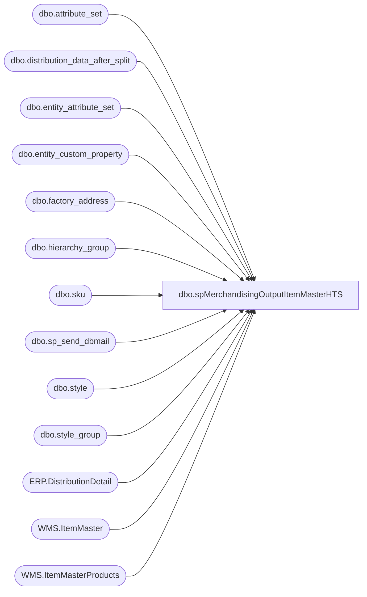

# dbo.spMerchandisingOutputItemMasterHTS

**Database:** me_01  
**Server:** bedrockdb02  

## Architecture Diagram



## Table Dependencies

| Referenced Table |
|---|
| dbo.attribute_set |
| dbo.distribution_data_after_split |
| dbo.entity_attribute_set |
| dbo.entity_custom_property |
| dbo.factory_address |
| dbo.hierarchy_group |
| dbo.sku |
| dbo.sp_send_dbmail |
| dbo.style |
| dbo.style_group |
| ERP.DistributionDetail |
| WMS.ItemMaster |
| WMS.ItemMasterProducts |

## Stored Procedure Code

```sql
CREATE proc [dbo].[spMerchandisingOutputItemMasterHTS]
as

-- =====================================================================================================
-- Name: spMerchandisingOutputItemMasterHTS
--
-- Description:	Captures Item Master HTS data from Merch and WM, outputs to CSV files, sends email
--				
--
-- Input:
--
-- Output: CSV files output to \\kermode\FileRepository\MERCHANDISING\APAC\ItemMaster 
--        
-- Dependencies: NA
--				 
-- Revision History
--		Name:			Date:			Comments:
--		Dan Tweedie		05/02/2012		created proc
--		Lizzy Timm		03/05/2020		Updated proc to account for WM upgrade
--		Dan Tweedie		2020-03-30		Updated to exclude supplies from Merch, get supplies from Dynamics
-- =====================================================================================================

set nocount on

IF (Object_ID('tempdb..#files') IS NOT NULL) DROP TABLE #files
create table #files (output varchar(1000))
insert #files exec master..xp_cmdshell 'dir \\kermode\FileRepository\MERCHANDISING\APAC\ItemMaster\*.csv /B'
delete from #files where output is null or output = 'File Not Found'

if (select count(*) from #files) > 0
begin
exec master..xp_cmdshell 'move \\kermode\FileRepository\MERCHANDISING\APAC\ItemMaster\*.csv \\kermode\FileRepository\MERCHANDISING\APAC\ItemMaster\History'
end

IF (Object_ID('tempdb..#factory') IS NOT null) DROP TABLE #factory
select style_code, country, hierarchy_group_label, hierarchy_group_code,
style_created, recent_distro_date, max(us_hts) US_HTS, max(ca_hts) CA_HTS, max(uk_hts) UK_HTS
into #factory
from 
(select distinct s.style_code, isnull(fa.country,'')country, hg.hierarchy_group_label, hg.hierarchy_group_code, 
s.create_date style_created, max(ddas.release_date) recent_distro_date, 
case when substring(hg.hierarchy_group_code,7,2)='60' 
		then substring(isnull(ecp3.custom_property_value,''),1,12)
		else substring(isnull(att.attribute_set_label,''),1,12)
		end as 'US_HTS',
'' as 'CA_HTS',
'' as 'UK_HTS'
from style s (nolock)
join sku sku (nolock) on sku.style_id = s.style_id
left join entity_attribute_set easfact (nolock)on s.style_id = easfact.parent_id and easfact.attribute_id = 122 
left join attribute_set ats (nolock) on ats.attribute_set_id = easfact.attribute_set_id
left join factory_address fa (nolock) on ats.attribute_set_code = fa.attribute_set_code
left join distribution_data_after_split ddas (nolock) on s.style_code = ddas.style_code
join style_group sg (nolock) on s.style_id = sg.style_id
join hierarchy_group hg (nolock) on sg.hierarchy_group_id = hg.hierarchy_group_id
left join distribution_data_after_split dd (nolock) on dd.style_code = s.style_code
left outer join entity_custom_property ecp3 (nolock) on s.style_id = ecp3.parent_id
		and	ecp3.custom_property_id =4 -- 4=HTSCD (US HTS) --- 24=UK ---23=CA
		and	ecp3.parent_type = 1
left outer join entity_attribute_set eas (nolock) on s.style_id = eas.parent_id
	and eas.attribute_id = 152 --152=US --- 156=UK ----154=CA
left join attribute_set att (nolock) on eas.attribute_set_id = att.attribute_set_id
where substring(hg.hierarchy_group_code,7,2)<>'60' 
group by s.style_code, fa.country, hg.hierarchy_group_label, hg.hierarchy_group_code, s.create_date, 
ecp3.custom_property_value, att.attribute_set_label, ecp3.custom_property_id, eas.attribute_id
union all
select distinct s.style_code, isnull(fa.country,'')country, hg.hierarchy_group_label, hg.hierarchy_group_code, 
s.create_date style_created, max(ddas.release_date) recent_distro_date, 
'' as 'US_HTS',
case when substring(hg.hierarchy_group_code,7,2)='60' 
		then substring(isnull(ecp3.custom_property_value,''),1,12)
		else substring(isnull(att.attribute_set_label,''),1,12)
		end as 'CA_HTS',
'' as 'UK_HTS'
from style s (nolock)
join sku sku (nolock) on sku.style_id = s.style_id
left join entity_attribute_set easfact (nolock)on s.style_id = easfact.parent_id and easfact.attribute_id = 122 
left join attribute_set ats (nolock) on ats.attribute_set_id = easfact.attribute_set_id
left join factory_address fa (nolock) on ats.attribute_set_code = fa.attribute_set_code
left join distribution_data_after_split ddas (nolock) on s.style_code = ddas.style_code
join style_group sg (nolock) on s.style_id = sg.style_id
join hierarchy_group hg (nolock) on sg.hierarchy_group_id = hg.hierarchy_group_id
left join distribution_data_after_split dd (nolock) on dd.style_code = s.style_code
left outer join entity_custom_property ecp3 (nolock) on s.style_id = ecp3.parent_id
		and	ecp3.custom_property_id =23 -- 4=HTSCD (US HTS) --- 24=UK ---23=CA
		and	ecp3.parent_type = 1
left outer join entity_attribute_set eas (nolock) on s.style_id = eas.parent_id
	and eas.attribute_id = 154 --152=US --- 156=UK ----154=CA
left join attribute_set att (nolock) on eas.attribute_set_id = att.attribute_set_id
where substring(hg.hierarchy_group_code,7,2)<>'60' 
group by s.style_code, fa.country, hg.hierarchy_group_label, hg.hierarchy_group_code, s.create_date, 
ecp3.custom_property_value, att.attribute_set_label, ecp3.custom_property_id, eas.attribute_id
union all
select distinct s.style_code, isnull(fa.country,'')country, hg.hierarchy_group_label, hg.hierarchy_group_code, 
s.create_date style_created, max(ddas.release_date) recent_distro_date, 
'' as 'US_HTS',
'' as 'CA_HTS',
case when substring(hg.hierarchy_group_code,7,2)='60' 
		then substring(isnull(ecp3.custom_property_value,''),1,12)
		else substring(isnull(att.attribute_set_label,''),1,12)
		end as 'UK_HTS'
from style s (nolock)
join sku sku (nolock) on sku.style_id = s.style_id
left join entity_attribute_set easfact (nolock)on s.style_id = easfact.parent_id and easfact.attribute_id = 122 
left join attribute_set ats (nolock) on ats.attribute_set_id = easfact.attribute_set_id
left join factory_address fa (nolock) on ats.attribute_set_code = fa.attribute_set_code
left join distribution_data_after_split ddas (nolock) on s.style_code = ddas.style_code
join style_group sg (nolock) on s.style_id = sg.style_id
join hierarchy_group hg (nolock) on sg.hierarchy_group_id = hg.hierarchy_group_id
left join distribution_data_after_split dd (nolock) on dd.style_code = s.style_code
left outer join entity_custom_property ecp3 (nolock) on s.style_id = ecp3.parent_id
		and	ecp3.custom_property_id =24 -- 4=HTSCD (US HTS) --- 24=UK ---23=CA
		and	ecp3.parent_type = 1
left outer join entity_attribute_set eas (nolock) on s.style_id = eas.parent_id
	and eas.attribute_id = 156 --152=US --- 156=UK ----154=CA
left join attribute_set att (nolock) on eas.attribute_set_id = att.attribute_set_id
where substring(hg.hierarchy_group_code,7,2)<>'60' 
group by s.style_code, fa.country, hg.hierarchy_group_label, hg.hierarchy_group_code, s.create_date, 
ecp3.custom_property_value, att.attribute_set_label, ecp3.custom_property_id, eas.attribute_id
UNION ALL
select
	p.ProductNumber as style_code,
	isnull(im.OriginCountryRegionID,'') country,
	NULL as hierarchy_group_label, 
	NULL as hierarchy_group_code,
	p.InsertDate as style_created, 
	max(dd.TransactionDateTime) recent_distro_date, 
	p.HarmonizedSystemCode as 'US_HTS', --in dynamics. there is only one HTS per item, not per item/country
	p.HarmonizedSystemCode as 'CA_HTS',
	p.HarmonizedSystemCode as 'UK_HTS'
from [stl-ssis-p-01].IntegrationStaging.WMS.ItemMasterProducts p with (nolock) 
join [stl-ssis-p-01].IntegrationStaging.WMS.ItemMaster im with (nolock) 
	on p.ProductNumber=im.ProductNumber
	and im.NecessaryProductionWorkingTimeSchedulingPropertyId='Supplies'
	and isnumeric(p.ProductNumber)=1
	and im.Entity=1100
left join [stl-ssis-t-01].IntegrationStaging.ERP.DistributionDetail dd with (nolock) 
	on p.ProductNumber=dd.ItemNumber
group by 
	p.ProductNumber,
	isnull(im.OriginCountryRegionID,''),
	p.InsertDate,
	p.HarmonizedSystemCode
) a
group by style_code, country, hierarchy_group_label, hierarchy_group_code,
style_created, recent_distro_date
order by style_code
------------------------------

/* IF (Object_ID('me_01..tmpALL') IS NOT null) DROP TABLE tmpALL
select im.style, im.sku_desc, f.hierarchy_group_label, f.hierarchy_group_code,
f.US_HTS, f.CA_HTS, f.UK_HTS, f.country
into tmpALL
from wmdb01.wmprod.dbo.item_master im 
left join wmdb01.wmprod.dbo.item_master_hts imh on im.style = imh.style_code
left join #factory f on im.style = f.style_code
order by im.style

IF (Object_ID('me_01..tmprecent') IS NOT null) DROP TABLE tmprecent
select im.style, im.sku_desc, f.hierarchy_group_label, f.hierarchy_group_code,
f.US_HTS, f.CA_HTS, f.UK_HTS,
f.country, f.style_created, f.recent_distro_date
into tmpRecent
from wmdb01.wmprod.dbo.item_master im 
left join wmdb01.wmprod.dbo.item_master_hts imh on im.style = imh.style_code
left join #factory f on im.style = f.style_code
where (datediff(dd, f.style_created, getdate()) <= 365 and f.recent_distro_date is null)
or datediff(dd, f.recent_distro_date, getdate()) <= 365
order by im.style */ -- Pre-upgrade

IF (Object_ID('me_01..tmpALL') IS NOT null) DROP TABLE tmpALL
select im.ProductNumber [style], im.ProductName [sku_desc], f.hierarchy_group_label, f.hierarchy_group_code,
f.US_HTS, f.CA_HTS, f.UK_HTS, f.country
into tmpALL
from [stl-ssis-p-01].IntegrationStaging.Wms.ItemMasterProducts im 
left join #factory f on im.ProductNumber = f.style_code
order by im.ProductNumber 

IF (Object_ID('me_01..tmprecent') IS NOT null) DROP TABLE tmprecent
select im.ProductNumber [style], im.ProductName [sku_desc], f.hierarchy_group_label, f.hierarchy_group_code,
f.US_HTS, f.CA_HTS, f.UK_HTS,
f.country, f.style_created, f.recent_distro_date
into tmpRecent
from [stl-ssis-p-01].IntegrationStaging.Wms.ItemMasterProducts im 
left join #factory f on im.ProductNumber = f.style_code
where (datediff(dd, f.style_created, getdate()) <= 365 and f.recent_distro_date is null)
or datediff(dd, f.recent_distro_date, getdate()) <= 365
order by im.ProductNumber

-----------------------
declare 
	@query varchar(1000),
	@date varchar(200),
	@file_name1 varchar(100),
	@file_name2 varchar(100),
	@file_location varchar(100),
	@server varchar(20),
	@username varchar(20),
	@password varchar(20),
	@database varchar(20),
	@sqlcmd varchar(1000),
	@query_text varchar(1000)

		
	set @date = convert(varchar, datepart(yyyy, getdate())) + '-' + convert(varchar, datepart(mm, getdate())) + '-' + convert(varchar, datepart(dd, getdate()))
	set @file_location = '\\kermode\FileRepository\MERCHANDISING\APAC\ItemMaster\'  --'\\kermode\FileRepository\MERCHANDISING\StoreDistroReports\'
	set @server = 'bedrockdb02'
	set @database = 'me_01'
	
	set @query = 'select style, quotename(sku_desc, ''""'') Sku_Desc, hierarchy_group_label, hierarchy_group_code, us_hts, ca_hts, uk_hts, country from tmpALL order by style'
	set @file_name1 = 'WMItemMasterHTS.ALL.' + @date + '.csv'
	set @sqlcmd = 'sqlcmd -S' + @server + ' -d' + @database + ' -Q' + '"' + @query + '"' + ' -o' + '"' + @file_location + @file_name1 + '"' + ' -s"," -w2000 -W'
	exec master..xp_cmdshell @sqlcmd
	
	set @query = 'select style, quotename(sku_desc, ''""'') Sku_Desc, hierarchy_group_label, hierarchy_group_code, us_hts, ca_hts, uk_hts, country, style_created, recent_distro_date from tmpRecent order by style'
	set @file_name2 = 'WMItemMasterHTS.Recent.' + @date + '.csv'
	set @sqlcmd = 'sqlcmd -S' + @server + ' -d' + @database + ' -Q' + '"' + @query + '"' + ' -o' + '"' + @file_location + @file_name2 + '"' + ' -s"," -w2000 -W'
	exec master..xp_cmdshell @sqlcmd
	

	exec msdb.dbo.sp_send_dbmail
		@profile_name = 'merchadmin',
		@recipients = 'santiagob@buildabear.com',
		@body = 'The WM Item Master HTS Export process has completed. <br>Please locate the HTS files at \\kermode\FileRepository\MERCHANDISING\APAC\ItemMaster\ .',
		@subject = 'WM Item Master HTS',
		@body_format = 'HTML'
```

