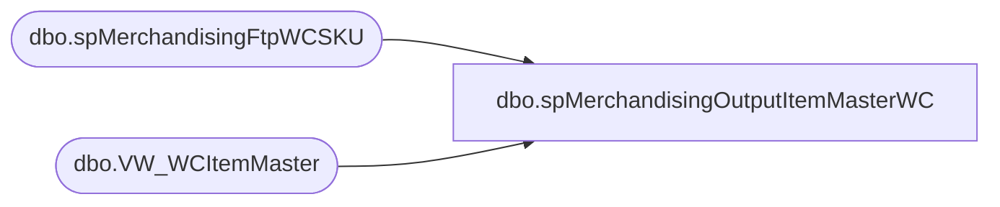

# dbo.spMerchandisingOutputItemMasterWC

**Database:** me_01  
**Server:** bedrockdb02  

## Architecture Diagram



## Table Dependencies

| Referenced Table |
|---|
| dbo.spMerchandisingFtpWCSKU |
| dbo.VW_WCItemMaster |

## Stored Procedure Code

```sql
CREATE proc [dbo].[spMerchandisingOutputItemMasterWC]

as 

-- =====================================================================================================
-- Name: spMerchandisingOutputItemMasterWC
--
-- Description:	Outputs CSV file for WC Item Master
--
-- Revision History
--		Name:			Date:			Comments:
--		Dan Tweedie		03/31/2015		Created proc
-- =====================================================================================================

set nocount on

if (select count(*) from VW_WCItemMaster) > 0

begin

declare @query varchar(1000),
		@date varchar(52),
		@filename varchar(100),
		@file_location varchar(100),
		@server varchar(20),
		@database varchar(20),
		@bcp varchar(1000)

		set @query = 'set nocount on select * from me_01.dbo.VW_WCItemMaster order by SKU'
		select @date = cast(datepart(yyyy, getdate()) as varchar) + cast(datepart(mm, getdate()) as varchar) + cast(datepart(dd, getdate()) as varchar)
		set @file_location = '\\kermode\FileRepository\MERCHANDISING\WC_Distro\OUTBOUND\ItemMaster\'
		set @filename = 'ItemMaster' + @date + '.csv'
		set @server = 'bedrockdb02'
		set @database = 'me_01'
		set @bcp = 'bcp "' + @query + '" queryout "' + @file_location + @filename + '"  -T -w -S' + @server 

		exec master..xp_cmdshell @bcp 

		exec bedrockdb02.me_01.dbo.spMerchandisingFtpWCSKU

end
```

