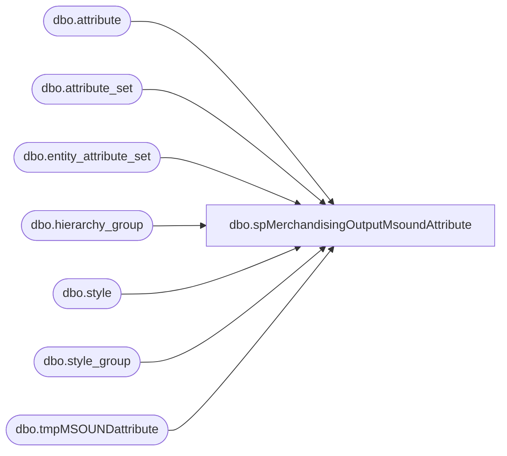

# dbo.spMerchandisingOutputMsoundAttribute

**Database:** me_01  
**Server:** bedrockdb02  

## Architecture Diagram



## Table Dependencies

| Referenced Table |
|---|
| dbo.attribute |
| dbo.attribute_set |
| dbo.entity_attribute_set |
| dbo.hierarchy_group |
| dbo.style |
| dbo.style_group |
| dbo.tmpMSOUNDattribute |

## Stored Procedure Code

```sql
CREATE proc [dbo].[spMerchandisingOutputMsoundAttribute]
as 

-- =====================================================================================================
-- Name: spMerchandisingOutputMsoundAttribute
--
-- Description:	Identifies styles which should have MSOUND attribute, generates file for Pipeline to add the attribute.
--				
--
-- Input:	NA
--
-- Output: 
--			
--
-- Dependencies: 
--
-- Revision History
--		Name:			Date:			Comments:
--		Dan Tweedie		07/23/2012		Created proc
--		Lizzy Timm		04/02/2019		Updated 16615 to 27500
-- =====================================================================================================

set nocount on

IF (Object_ID('tempdb..#a') IS NOT NULL) DROP TABLE #a
select distinct s.style_code, s.short_desc, hg.hierarchy_group_code, a.attribute_code, att.attribute_set_code
into #a
from style s (nolock)
join style_group sg (nolock) on s.style_id = sg.style_id
join hierarchy_group hg (nolock) on sg.hierarchy_group_id = hg.hierarchy_group_id
join entity_attribute_set eas (nolock) on s.style_id = eas.parent_id
join attribute_set att (nolock) on eas.attribute_set_id = att.attribute_set_id
join attribute a (nolock) on att.attribute_id = a.attribute_id 
where (substring(hg.hierarchy_group_code,1,4) = 'R-B-' and substring(hg.hierarchy_group_code,7,5) = '20-07')
or substring(hierarchy_group_code, 5, 11) = 'K-12-01-07' --new hierarchy 1/2015
order by s.style_code, a.attribute_code


IF (Object_ID('me_01..tmpMSOUNDattribute') IS NOT NULL) DROP TABLE tmpMSOUNDattribute
select distinct 'SA' a, 'A' b, style_code c, 'MSOUND' d, '027500' e --'016615' e; Updated 04/02/2019
into tmpMSOUNDattribute
from #a
where style_code not in (select distinct style_code from #a where attribute_code = 'MSOUND')
and left(style_code, 1) = '0'
union all
select distinct 'SA' a, 'A' b, style_code c, 'MSOUND' d, '127500' e --'116615' e; Updated 04/02/2019
from #a
where style_code not in (select distinct style_code from #a where attribute_code = 'MSOUND')
and left(style_code, 1) = '1'
union all
select distinct 'SA' a, 'A' b, style_code c, 'MSOUND' d, '427500' e --'416615' e; Updated 04/02/2019
from #a
where style_code not in (select distinct style_code from #a where attribute_code = 'MSOUND')
and left(style_code, 1) = '4'


IF (select count(*) from tmpMSOUNDattribute) > 0

begin

	declare @query varchar(1000),
			@filename varchar(1000),
			@file_location varchar(100),
			@server varchar(20),
			@username varchar(20),
			@password varchar(20),
			@bcp varchar(1000)

	set @query = 'set nocount on select * from me_01.dbo.tmpMSOUNDattribute'
	set @filename = 'STSIMStyleAttribute.' + convert(varchar, datepart(yyyy, getdate())) + convert(varchar, datepart(mm, getdate())) + convert(varchar, datepart(dd, getdate())) + convert(varchar, datepart(hh, getdate())) + convert(varchar, datepart(mi, getdate())) + convert(varchar, datepart(ss, getdate())) + '.GO'
	set @file_location = '\\pipeapp01\Company01\Text File to EDM & PROD Import Tables - Imp Master Entities\'
	set @server = 'bedrockdb02'
	set @bcp = 'bcp "' + @query + '" queryout "' + @file_location + @filename + '" -T -c -S' + @server 

	exec master..xp_cmdshell @bcp

end
```

