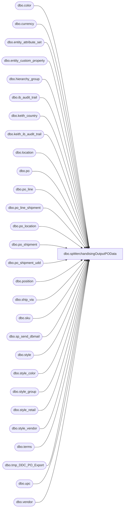

# dbo.spMerchandisingOutputPOData

**Database:** me_01  
**Server:** bedrockdb02  

## Architecture Diagram



## Table Dependencies

| Referenced Table |
|---|
| dbo.color |
| dbo.currency |
| dbo.entity_attribute_set |
| dbo.entity_custom_property |
| dbo.hierarchy_group |
| dbo.ib_audit_trail |
| dbo.keith_country |
| dbo.keith_ib_audit_trail |
| dbo.location |
| dbo.po |
| dbo.po_line |
| dbo.po_line_shipment |
| dbo.po_location |
| dbo.po_shipment |
| dbo.po_shipment_udd |
| dbo.position |
| dbo.ship_via |
| dbo.sku |
| dbo.sp_send_dbmail |
| dbo.style |
| dbo.style_color |
| dbo.style_group |
| dbo.style_retail |
| dbo.style_vendor |
| dbo.terms |
| dbo.tmp_DDC_PO_Export |
| dbo.upc |
| dbo.vendor |

## Stored Procedure Code

```sql
CREATE proc [dbo].[spMerchandisingOutputPOData]
as

set nocount on
-- =====================================================================================================
-- Name: spMerchandisingOutputPOData
--
-- Description:	outputs po data to west coast warehouse
--
-- Input: NA
--
-- Output:
--
-- Dependencies: na
--
-- Revision History
--		Name:			Date:			Comments:
--		Dan Tweedie		5/10/2012		Created proc.	
--		Dan Tweedie     5/11/2015		Removed implicit outer joinos
-- =====================================================================================================

IF (Object_ID('me_01..tmp_DDC_PO_Export') IS NOT null) DROP TABLE tmp_DDC_PO_Export

select 	po.po_no,
	v.vendor_code,
	v.vendor_name,
	s.style_code,
	replace(s.short_desc,',',' ') as "ItemDesc",
	case when ecp.custom_property_value is not null and substring(hg.hierarchy_group_code,7,2)='60' 
		then 
			case when ecp.custom_property_value = '0.00' 
				then pls.quantity * 1 
				else pls.quantity * ecp.custom_property_value 
			end
		else pls.quantity
	end Qty,
	ps.expected_receipt_date as "EndDeliverDateTime"
into tmp_DDC_PO_Export
from po po with (nolock)
join position p with (nolock) on po.position_id = p.position_id
join po_line pl with (nolock) on po.po_id = pl.po_id
join po_shipment ps with (nolock) on po.po_id = ps.po_id
join po_line_shipment pls with (nolock) on pl.po_id = pls.po_id
	and pl.po_line_id = pls.po_line_id
	and ps.po_shipment_id = pls.po_shipment_id
join po_location ploc with (nolock) on po.po_id = ploc.po_id
join vendor v with (nolock) on po.vendor_id = v.vendor_id
join currency cy with (nolock) on po.currency_id = cy.currency_id
left join ship_via sv with (nolock) on po.ship_via_id = sv.ship_via_id
left join terms t with (nolock) on po.terms_id = t.terms_id
join sku sk with (nolock) on pl.style_color_id = sk.style_color_id
join style s with (nolock) on sk.style_id = s.style_id
join style_group sg with (nolock) on s.style_id = sg.style_id
join hierarchy_group hg with (nolock) on sg.hierarchy_group_id = hg.hierarchy_group_id
join style_retail sr with (nolock) on s.style_id = sr.style_id
join style_color sc with (nolock) on sk.style_color_id = sc.style_color_id
join color clr with (nolock) on sc.color_id = clr.color_id
join upc u with (nolock) on sk.sku_id = u.sku_id 
join style_vendor stv with (nolock) on s.style_id = stv.style_id
	and po.vendor_id = stv.vendor_id
join po_shipment_udd udd1 with (nolock) on ps.po_id = udd1.po_id
	and ps.po_shipment_id = udd1.po_shipment_id
	and udd1.po_date_type_id = 2
join po_shipment_udd udd2 with (nolock) on ps.po_id = udd2.po_id
	and ps.po_shipment_id = udd2.po_shipment_id
	and udd2.po_date_type_id = 3
left join entity_custom_property ecp with (nolock) on s.style_id = ecp.parent_id
	and ecp.custom_property_id = 2
	and ecp.parent_type = 1
join keith_country cty with (nolock) on v.country_id = cty.country_id
join location l with (nolock) on ploc.location_id = l.location_id
join keith_ib_audit_trail iat with (nolock) on po.po_no = iat.po_no
join entity_attribute_set eas with (nolock) on v.vendor_id = eas.parent_id
	and eas.attribute_id = 7
where po.po_no >= '1000000'
and	po.approval_status in (3,7) -- Approval
and	po.po_status in (4,7) -- Open	
and	pls.quantity <> 0
and	u.upc_number < '000000999999'
and	sr.jurisdiction_id = 1 -- home
and l.location_code = '0960'
and (datediff(dd, po.create_date, getdate()) = 0
	or po.po_no in (select distinct application_identifier from ib_audit_trail with (nolock) where datediff(dd, entry_date, getdate()) = 0))
order by ps.expected_receipt_date, po.po_no

if (select count(*) from tmp_DDC_PO_Export) > 0

begin
declare @query varchar(1000),
			@date varchar(200),
			@file_name1 varchar(100),
			@file_location varchar(100),
			@server varchar(20),
			@database varchar(20),
			@sqlcmd varchar(1000),
			@query_text varchar(1000),
			@attach varchar(1000)

		
	set @date = convert(varchar, datepart(yyyy, getdate())) + '-' + convert(varchar, datepart(mm, getdate())) + '-' + convert(varchar, datepart(dd, getdate()))+ '-' + convert(varchar, datepart(hh, getdate()))+ '-' + convert(varchar, datepart(mi, getdate()))+ '-' + convert(varchar, datepart(ss, getdate()))
	set @file_location = '\\kermode\FileRepository\MERCHANDISING\WC_Distro\OUTBOUND\PO_Export\'
	set @server = 'bedrockdb02'
	set @database = 'me_01'
	set @query = 'select * from tmp_DDC_PO_Export order by EndDeliverDateTime, po_no '
	set @file_name1 = 'BABWtoDDC_POeXport.' + @date + '.csv'
	set @sqlcmd = 'sqlcmd -S' + @server + ' -d' + @database + ' -Q' + '"' + @query + '"' + ' -o' + '"' + @file_location + @file_name1 + '"' + ' -s"," -w2000 -W'
	exec master..xp_cmdshell @sqlcmd
	
	set @attach = @file_location + @file_name1

	exec msdb.dbo.sp_send_dbmail
	@profile_name = 'merchadmin',
	@recipients = 'wcdclogistics@buildabear.com',
	@copy_recipients = 'merchadmin@buildabear.com',
	@body = 'The attached CSV contains data for PO''s created or updated today.',
	@subject = 'BABW-to-DDC PO Export',
	@file_attachments = @attach,
	@body_format = 'HTML'
		
end
```

