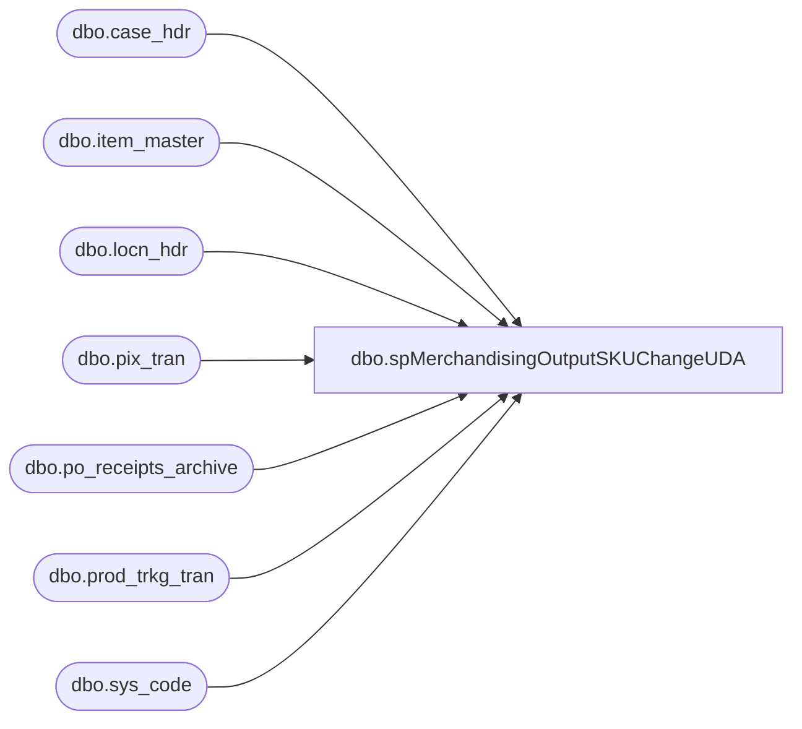

# dbo.spMerchandisingOutputSKUChangeUDA

**Database:** me_01  
**Server:** bedrockdb02  

## Architecture Diagram



## Table Dependencies

| Referenced Table |
|---|
| dbo.case_hdr |
| dbo.item_master |
| dbo.locn_hdr |
| dbo.pix_tran |
| dbo.po_receipts_archive |
| dbo.prod_trkg_tran |
| dbo.sys_code |

## Stored Procedure Code

```sql
CREATE proc [dbo].[spMerchandisingOutputSKUChangeUDA]

as

-- =====================================================================================================
-- Name: spMerchandisingOutputSKUChangeUDA
--
-- Description:	Captures data from WM if they add a Canadian SKU into inventory and flag it with 'SKU Change' in the blind ASN in WM.
--				
--
-- Input:
--
-- Output: CSV files output to \\pipeapp01\Company01\Text File to IM Import Tables - Import UDAs
--        
-- Dependencies: NA
--				 
-- Revision History
--		Name:			Date:			Comments:
--		Dan Tweedie		11/14/2013		created proc
-- =====================================================================================================

set nocount on

IF (Object_ID('tempdb..#a') IS NOT NULL) DROP TABLE #a
select top 1 pt.ref_field_3 as uno
into #a
from wmdb01.wmprod.dbo.pix_tran pt (nolock)
join wmdb01.wmprod.dbo.item_master im (nolock) on im.style = pt.style
where	pt.tran_type = 300
		and pt.tran_code = 01
		and pt.actn_code in (06, 20)
		and pt.ref_field_4 = 'PP'
		and pt.ref_field_3 = 'SKU CHANGE'
		and datediff(dd, pt.create_date_time, getdate()) = 0 
		and pt.case_nbr not in (select case_nbr from wmdb01.wmprod.dbo.po_receipts_archive)
union all
select top 1 ptt.ref_field_3 as uno
	from wmdb01.wmprod.dbo.prod_trkg_tran ptt 
join wmdb01.wmprod.dbo.item_master im on ptt.sku_id = im.sku_id
join wmdb01.wmprod.dbo.sys_code sc on ptt.rsn_code = sc.code_id 
	and sc.code_type = 051 and sc.rec_type = 'B'
join wmdb01.wmprod.dbo.case_hdr ch on ptt.cntr_nbr = ch.case_nbr and ch.stat_code = 99
join wmdb01.wmprod.dbo.locn_hdr lh on ch.prev_locn_id = lh.locn_id
where datediff(dd, ptt.create_date_time, getdate()) = 0
and ptt.module_name = 'Modify'
and ptt.menu_optn_name = 'Modify Cs Contents'
and lh.locn_brcd like 'tag%'
and ptt.ref_field_3 = 'SKU Change'

if (select count(*) from #a) > 0


begin

	declare		@query varchar(1000),
				@date varchar(200),
				@file_name varchar(100),
				@file_location varchar(100),
				@server varchar(20),
				@username varchar(20),
				@password varchar(20),
				@database varchar(20),
				@sqlcmd varchar(1000),
				@query_text varchar(1000)

		select @query_text = 'set nocount on exec spMerchandisingSelectSKUChangeUDA'

		set @date = convert(varchar, datepart(yyyy, getdate())) + convert(varchar, datepart(mm, getdate())) + convert(varchar, datepart(dd, getdate())) + convert(varchar, datepart(hh, getdate())) + convert(varchar, datepart(mm, getdate()))
		set @query = @query_text
		set @file_location = '\\pipeapp01\Company01\Text File to IM Import Tables - Import UDAs\'
		set @file_name = 'STSIMUDA.SKUChange.' + @date + '.GO'
		set @server = 'bedrockdb02'
		set @database = 'me_01'
		set @sqlcmd = 'sqlcmd -S' + @server + ' -d' + @database + ' -Q' + '"' + @query + '"' + ' -o' + '"' + @file_location + @file_name + '"' + ' -s"," -w1000 -W'
		exec master..xp_cmdshell @sqlcmd

end
```

