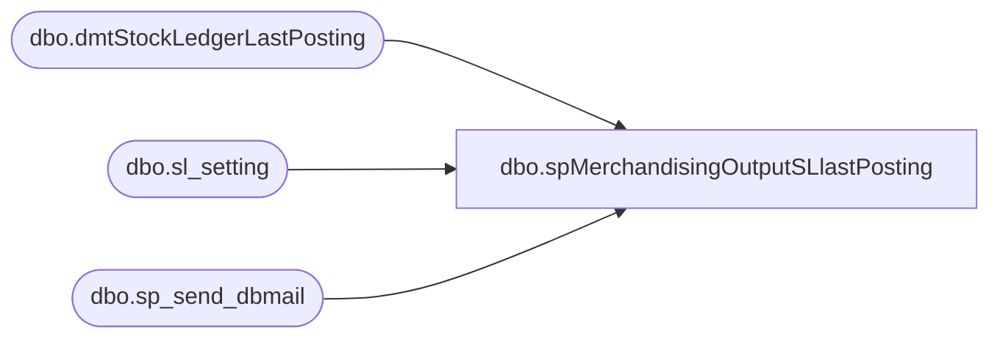

# dbo.spMerchandisingOutputSLlastPosting

**Database:** me_01  
**Server:** bedrockdb02  

## Architecture Diagram



## Table Dependencies

| Referenced Table |
|---|
| dbo.dmtStockLedgerLastPosting |
| dbo.sl_setting |
| dbo.sp_send_dbmail |

## Stored Procedure Code

```sql
CREATE proc [dbo].[spMerchandisingOutputSLlastPosting]
as
-- =====================================================================================================
-- Name: spMerchandisingOutputSLlastPosting
--
-- Description:	Outputs to a text file, replace DTS job which does this
--
-- Input:	
--
-- Output: File output to \\sharebear1\Shared\last_posting
--
-- Dependencies: NA
--				 
-- Revision History
--		Name:			Date:			Comments:
--		Dan Tweedie		03/12/2012		created proc
-- =====================================================================================================

set nocount on 

--archive data 
insert dmtStockLedgerLastPosting
select last_id, getdate()
from sl_setting (nolock)

---------------
--send email
exec msdb.dbo.sp_send_dbmail
@profile_name = 'MerchAdmin',
@recipients = 'physicalinventory@buildabear.com',
--@body = @text,
@subject = 'Stock Ledger Last Posting',
@query = 'set nocount on select last_id from me_01.dbo.dmtStockLedgerLastPosting where datediff(dd, posting_date, getdate()) = 0'
--@body_format = 'html'

-------------------------
--export data to \\sharebear1\Shared\last_posting\
declare @query varchar(1000),
		@date varchar(100),
		@file_name varchar(100),
		@file_location varchar(1000),
		@server varchar(20),
		@database varchar(20),
		@bcp varchar(1000)

set @query = 'set nocount on select last_id from me_01.dbo.dmtStockLedgerLastPosting where datediff(dd, posting_date, getdate()) = 0'
select @date = convert(varchar, getdate(),112)
set @file_location = '\\sharebear1\Shared\last_posting\'
set @file_name = 'last_posting_' + @date + '.txt'
set @server = 'bedrockdb02'
set @bcp = 'bcp "' + @query + '" queryout "' + @file_location + @file_name + '"  -T -c -S' + @server 
exec master..xp_cmdshell @bcp
```

