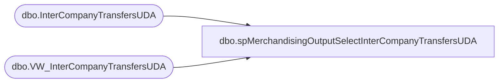

# dbo.spMerchandisingOutputSelectInterCompanyTransfersUDA

**Database:** me_01  
**Server:** bedrockdb02  

## Architecture Diagram



## Table Dependencies

| Referenced Table |
|---|
| dbo.InterCompanyTransfersUDA |
| dbo.VW_InterCompanyTransfersUDA |

## Stored Procedure Code

```sql
CREATE proc [dbo].[spMerchandisingOutputSelectInterCompanyTransfersUDA]

as 
-- =====================================================================================================
-- Name: spMerchandisingOutputSelectInterCompanyTransfersUDA
--
-- Description:	Outputs UDA file for Pipeline.
--
-- Revision History
--		Name:			Date:			Comments:
--		Keith Lee		10/20/2020		Created proc
-- =====================================================================================================

set nocount on

Begin 


--STAGE UDA DATA	-- these are unreceived shipments and transfers to franchisee locations
IF (Object_ID('me_01..InterCompanyTransfersUDA ') IS NOT null) DROP TABLE InterCompanyTransfersUDA 
select *
into InterCompanyTransfersUDA 
from VW_InterCompanyTransfersUDA 

--IF UDA DATA IS STAGED, PROCEED TO REMAINING STEPS
if (select count(*) from InterCompanyTransfersUDA) > 0 

	BEGIN

	---OUTPUT UDA FILE						
		declare	@UDAquery varchar(1000),
				@UDAdate varchar(200),
				@UDAfile_name varchar(100),
				@UDAfile_location varchar(100),
				@UDAserver varchar(20),
				@UDAdatabase varchar(20),
				@UDAsqlcmd varchar(1000),
				@UDAquery_text varchar(1000)

		select @UDAquery_text = 'set nocount on exec me_01.dbo.spMerchandisingSelectInterCompanyTransfersUDA'

		set @UDAdate = convert(varchar, datepart(yyyy, getdate())) + convert(varchar, datepart(mm, getdate())) + convert(varchar, datepart(dd, getdate())) + convert(varchar, datepart(hh, getdate())) + convert(varchar, datepart(mm, getdate()))
		set @UDAquery = @UDAquery_text
		set @UDAfile_location = '\\pipeapp01\Company01\Text File to IM Import Tables - Import UDAs\'
		set @UDAfile_name = 'STSIMUDA.INTERCOMPANYTRANSFERS.' + @UDAdate + '.GO'
		set @UDAserver = 'bedrockdb02'
		set @UDAdatabase = 'me_01'
		set @UDAsqlcmd = 'sqlcmd -S' + @UDAserver + ' -d' + @UDAdatabase + ' -Q' + '"' + @UDAquery + '"' + ' -o' + '"' + @UDAfile_location + @UDAfile_name + '"' + ' -w1000 -W'
		exec master..xp_cmdshell @UDAsqlcmd	

	END

END
```

