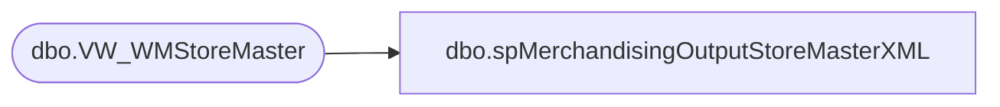

# dbo.spMerchandisingOutputStoreMasterXML

**Database:** me_01  
**Server:** bedrockdb02  

## Architecture Diagram



## Table Dependencies

| Referenced Table |
|---|
| dbo.VW_WMStoreMaster |

## Stored Procedure Code

```sql
CREATE proc [dbo].[spMerchandisingOutputStoreMasterXML]

as 

-- =====================================================================================================
-- Name: spMerchandisingOutputStoreMasterXML
--
-- Description:	Outputs XML file to WM for Store Master Bridge
--
-- Revision History
--		Name:			Date:			Comments:
--		Dan Tweedie		03/30/2015		Created proc
-- =====================================================================================================

set nocount on

declare @xml xml

select @xml = (select
		whse as [Warehouse],
        store_nbr as [StoreNumber],
		name as [StoreDetail/StoreName],
	    addr_line_1 as [StoreDetail/StoreAddr1],
	    addr_line_2 as [StoreDetail/StoreAddr2],
	    city as [StoreDetail/StoreCity],
	    state as [StoreDetail/StoreState],
	    zip as [StoreDetail/StoreZip],
	    cntry as [StoreDetail/StoreCountry],
		open_date as [StoreDetail/StoreOpenDate],
		phone as [StoreFields/TelephoneNumber],
	    email as [StoreFields/Email],
		dflt_co as [StoreFields/DefaultCompany],
		dflt_div as [StoreFields/DefaultDivision],
		stat_code as [StoreFields/StatusCode],
		carton_cnt_type as [StoreFields/CtnCounterRecType],
		carton_label_type as [StoreFields/CartonLabelType],
		carton_cubng_indic as [StoreFields/CartonCubingIndic],
		use_inbd_lpn_as_out_bd_lpn as [StoreFields/CaseAsCarton]
from VW_WMStoreMaster
for xml path('StoreMaster'), root ('StoreMasterBridge'))--, ELEMENTS XSINIL)

	IF (Object_ID('tempdb..##xml') IS NOT null) DROP TABLE ##xml
	create table ##xml
	(XMLData xml)

	insert ##xml
	select @xml

	declare @query varchar(1000),
			@date varchar(52),
			@StoreMasterFile varchar(100),
			@XMLout varchar(100),
			@file_location varchar(1000),
			@fileDestination varchar(1000),
			@server varchar(20),
			@database varchar(20),
			@bcp varchar(1000),
			@type varchar(1000),
			@delete varchar(100),
			@move varchar(2000)

			set @query = 'select * from ##xml'
			select @date = replace(replace(replace(replace(convert(varchar, getdate(), 121), ' ', ''), '-', ''), ':', ''), '.', '')
			set @file_location = '\\kermode\FileRepository\MERCHANDISING\WM\OUTBOUND\StoreMaster\'
			set @fileDestination = '\\wminteg01\interfaces\storemaster\'
			set @StoreMasterFile = 'ISMstoremasterbridge.xml'
			set @XMLout = 'XML.out'
			set @server = 'bedrockdb02'
			set @database = 'me_01'
			set @bcp = 'bcp "' + @query + '" queryout "' + @file_location + @XMLout + '"  -T -w -S' + @server 

			exec master..xp_cmdshell @bcp --export xml file

			set @type = 'TYPE ' + @file_location + @XMLout + ' > ' + @file_location + @StoreMasterFile 
			exec master..xp_cmdshell @type --this is needed because wm eis couldn't read the xml file due to encoding(?)
			
			set @delete = 'DEL ' + @file_location + @XMLout
			exec master..xp_cmdshell @delete

			set @move = 'MOVE ' + @file_location + @StoreMasterFile + ' ' + @fileDestination
			exec master..xp_cmdshell @move
```

