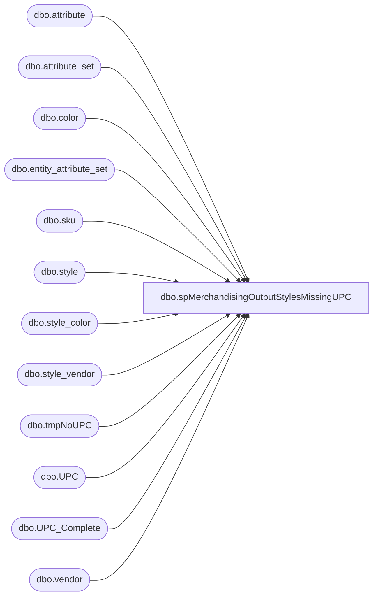

# dbo.spMerchandisingOutputStylesMissingUPC

**Database:** me_01  
**Server:** bedrockdb02  

## Architecture Diagram



## Table Dependencies

| Referenced Table |
|---|
| dbo.attribute |
| dbo.attribute_set |
| dbo.color |
| dbo.entity_attribute_set |
| dbo.sku |
| dbo.style |
| dbo.style_color |
| dbo.style_vendor |
| dbo.tmpNoUPC |
| dbo.UPC |
| dbo.UPC_Complete |
| dbo.vendor |

## Stored Procedure Code

```sql
CREATE proc [dbo].[spMerchandisingOutputStylesMissingUPC]
as

-- =====================================================================================================
-- Name: spMerchandisingOutputStylesMissingUPC
--
-- Description:	Checks for styles without UPC, generates a file for the pipeline to process so UPC can be generated
--				
--
-- Input:	
--
-- Output: CBR file output to \\pipeapp01\e$\Company01\Text File to EDM & PROD Import Tables - Imp Master Entities\
--
-- Dependencies: NA
--				 
-- Revision History
--		Name:			Date:			Comments:
--		Dan Tweedie		03/09/2012		created proc
--		Dan Tweedie		06/24/2013		Updated query to exclude Inactive styles (s.active_flag <> 1)
--		Dan Tweedie		02/29/2016		Added handling for GS1 UPC's, to detect styles which need upc assigned and to assign it
--		Keith Lee		03/18/2016		Changed Activation Date for BABW UPC to be created with an older date so that the PO Print report picks up the new UPC
--										Also added code to only grab styles with a MSTAT attribute set code of SEAS or REPL and removed date restriction in case older styles get modified.
--		Tim Callahan	01/03/2018		Added MSTAT attribute set code to include REPL-C at the request of Kim Hammond, see HEAT Service Request #21078
--		Lizzy Timm		03/29/2021		Added MSTAT attribute set code to include WEB-S at the request of Helen Hagan, see HEAT Service Request #30361
-- =====================================================================================================

set nocount on 

--STEP 1
	---NEW GS1 CODE -- STYLE CODES WILL BE ASSIGNED TO UPC_COMPLETE RECORDS
		-------------------------------------------------------------------------------------------------------------------------------
		--CAPTURE STYLES FROM MERCH THAT DO NOT HAVE STYLE NUMBER ASSIGNED TO UPC IN THE UPC_COMPLETE TABLE
		-------------------------------------------------------------------------------------------------------------------------------

		if (object_id('tempdb..#style_no_upc') is not null) drop table #style_no_upc
		select distinct s.style_code, c.color_code, v.vendor_code, sv.vendor_style,
		tc.upc_complete UPC_Assigned_In_Table,
		upc.upc_number UPC_Assigned_In_Merch
		into #style_no_upc
		from style s with (nolock)
		join entity_attribute_set eas with (nolock) on s.style_id = eas.parent_id
		join attribute_set att with (nolock) on eas.attribute_set_id = att.attribute_set_id
		join attribute a with (nolock) on att.attribute_id = a.attribute_id
		join style_color sc with (nolock) on s.style_id = sc.style_id and sc.reorder_flag = 1
		join color c with (nolock) on sc.color_id = c.color_id
		join style_vendor sv (nolock) on s.style_id = sv.style_id and sv.primary_vendor_flag = 1
		join vendor v (nolock) on sv.vendor_id = v.vendor_id and v.active_flag = 1
		join sku with (nolock) on sc.style_color_id = sku.style_color_id and s.style_id = sku.style_id
		left join UPC_Complete tc on s.style_code = tc.style_code 
		left join UPC with (nolock) on sku.sku_id = upc.sku_id and tc.upc_complete = upc.upc_number
		where --s.style_code between '000000' and '099999' -- in ('300542')
		LEFT(s.style_code,1) IN ('0','2','3') -- updated to accomodate USA SC and SNC styles
		and a.parent_type = 1
		and a.attribute_code = 'MSTAT'
		and att.attribute_set_code in ('SEAS','REPL','REPL-C','WEB-S')	-- Added REPL-C  on 1/3/2018, Added WEB-S on 03/29/21
		and s.active_flag = 1
		--and cast(S.create_date as date) >= '2016-02-25' --new GS1 UPC process went live on 2/25/2016, so we want only styles created on or after that date 
		and tc.upc_complete is null --GS1 UPC HAS NOT BEEN ASSIGNED
		order by s.style_code

		-----------------------------------------------------
		--ASSIGN STYLE CODES TO UPC'S IN UPC_COMPLETE TABLE
		-----------------------------------------------------

		----find upc's in upc_complete that do not exist as upc in Merch
		--select *
		--from upc_complete
		--where not exists (select upc_number from upc where upc_number = upc_complete)


		declare @style_code varchar(6),
				@upc varchar(20),
				@count int

		select @count = count(*) from #style_no_upc

		while @count > 0 

		begin

			select @style_code = min(style_code) from #style_no_upc 
			select @upc = min(upc_complete) from upc_complete where style_code is null
	
			update UPC_Complete
			set style_code = @style_code
			where upc_complete = @upc

			delete from #style_no_upc where style_code = @style_code

			select @count = count(*) from #style_no_upc

			if @count = 0
				break
			else
				continue

		end

--=====================================================================================================================
--=====================================================================================================================

--STEP 2
	--(GS1 UPC QUERY, INCLUDES UPC'S ASSIGNED IN STEP 1)
	if (object_id('tempdb..#GS1') is not null) drop table #GS1
	select distinct s.style_code, c.color_code, v.vendor_code, sv.vendor_style, tc.upc_complete
	into #GS1
	from style s with (nolock)
	join style_color sc with (nolock) on s.style_id = sc.style_id and sc.reorder_flag = 1
	join color c with (nolock) on sc.color_id = c.color_id
	join style_vendor sv (nolock) on s.style_id = sv.style_id and sv.primary_vendor_flag = 1
	join vendor v (nolock) on sv.vendor_id = v.vendor_id and v.active_flag = 1
	join sku with (nolock) on sc.style_color_id = sku.style_color_id and s.style_id = sku.style_id
	left join UPC_Complete tc on s.style_code = tc.style_code 
	left join UPC with (nolock) on sku.sku_id = upc.sku_id and tc.upc_complete = upc.upc_number
	where s.active_flag = 1
	and tc.upc_complete is not null
	and upc.upc_number is null
	--and cast(S.create_date as date) >= '2016-02-25' --new GS1 UPC process went live on 2/25/2016, so we want only styles created on or after that date 

	--Stage File Data
	-- (ORIGINAL UPC QUERY)
	IF (Object_ID('me_01..tmpNoUPC') IS NOT NULL) DROP TABLE tmpNoUPC
	select 	'UP' as ET,
		'A' as A_C,
		v.vendor_code as V_C,
		sv.vendor_style as V_S,
		isnull(c.color_code,'000') as C_C,  --- double check all color codes exist!
		'' as C_S_D,
		'' as C_L_D,
		'' as F_F,
		'' as R_F,
		'' as NRF,
		'' as S_C_C,
		'' as S_S_C,
		'' as T_L_O,
		'' as R_F2,
		'000000' + s.style_code as UPC,
		'V' as U_T,
		convert(varchar, getdate()-1,101) as A_D,
		'' as P_C,
		'' as F_P_I_H_U,
		'' as filler,
		s.style_code
	into tmpNoUPC
	from style s (nolock)
	join style_color sc (nolock) on s.style_id = sc.style_id
	join style_vendor sv (nolock) on s.style_id = sv.style_id
	join color c (nolock) on sc.color_id = c.color_id
	join vendor v (nolock) on sv.vendor_id = v.vendor_id
	where sc.reorder_flag = 1
	and s.active_flag = 1 --added 06/24/2013 DanT
	and len(s.style_code) = 6
	and	('000000' + s.style_code) not in (select upc_number from upc)
	UNION 
	--(GS1 UPC QUERY)
	select 	'UP' as ET,
		'A' as A_C,
		vendor_code as V_C,
		vendor_style as V_S,
		isnull(color_code,'000') as C_C,  
		'' as C_S_D,
		'' as C_L_D,
		'' as F_F,
		'' as R_F,
		'' as NRF,
		'' as S_C_C,
		'' as S_S_C,
		'' as T_L_O,
		'' as R_F2,
		upc_complete as UPC,
		'V' as U_T,
		convert(varchar, getdate(),101) as A_D,
		'' as P_C,
		'' as F_P_I_H_U,
		'' as filler,
		style_code
	from #GS1

--=====================================================================================================================
--=====================================================================================================================
--STEP 3
	--OUTPUT UPC FILE

	--if data found in previous step, output file
	if (select count(*) from tmpNoUPC) > 0 
	begin

		declare @query varchar(1000),
				@file_name varchar(100),
				@file_location varchar(1000),
				@server varchar(20),
				@database varchar(20),
				@bcp varchar(1000)

		set @query = 'set nocount on select * from me_01.dbo.tmpNoUPC'
		set @file_location = '\\pipeapp01\Company01\Text File to EDM & PROD Import Tables - Imp Master Entities\'
		set @file_name = 'upc_core-in.' + cast(datepart(yyyy, getdate()) as varchar) + cast(datepart(mm, getdate()) as varchar) + cast(datepart(dd, getdate()) as varchar) + cast(datepart(hh, getdate()) as varchar) + cast(datepart(mi, getdate()) as varchar) + cast(datepart(ss, getdate()) as varchar) + '.GO'
		set @server = 'bedrockdb02'
		set @database = 'me_01'
		set @bcp = 'bcp "' + @query + '" queryout "' + @file_location + @file_name + '"  -T -c -S' + @server 
		exec master..xp_cmdshell @bcp

	end

	---check for error files, delete files if found

	set nocount on
	IF (Object_ID('tempdb..#err_files') IS NOT NULL) DROP TABLE #err_files
	create table #err_files (output varchar(1000))
	insert #err_files exec master..xp_cmdshell 'dir "\\pipeapp01\Company01\Text File to EDM & PROD Import Tables - Imp Master Entities\*.ERR" /B'
	delete from #err_files where output is null or output = 'File Not Found'

	if (select count(*) from #err_files) > 0
	begin
		declare @del varchar(1000)
		select @del = 'del /q "\\pipeapp01\Company01\Text File to EDM & PROD Import Tables - Imp Master Entities\*.ERR"'
		exec master..xp_cmdshell @del
	end
```

