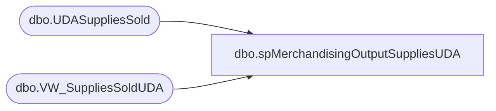

# dbo.spMerchandisingOutputSuppliesUDA

**Database:** me_01  
**Server:** bedrockdb02  

## Architecture Diagram



## Table Dependencies

| Referenced Table |
|---|
| dbo.UDASuppliesSold |
| dbo.VW_SuppliesSoldUDA |

## Stored Procedure Code

```sql
CREATE proc [dbo].[spMerchandisingOutputSuppliesUDA]

as 

-- =====================================================================================================
-- Name: spMerchandisingOutputSuppliesUDA
--
-- Description:	Outputs UDA file for Pipeline
--
-- Revision History
--		Name:			Date:			Comments:
--		Dan Tweedie		04/07/2015		Created proc
-- =====================================================================================================

set nocount on

IF (Object_ID('me_01..UDASuppliesSold') IS NOT null) DROP TABLE UDASuppliesSold
select *
into UDASuppliesSold
from VW_SuppliesSoldUDA

if(select count(*) from UDASuppliesSold) > 0

begin

---OUTPUT UDA FILE						
	declare	@query varchar(1000),
			@date varchar(200),
			@file_name varchar(100),
			@file_location varchar(100),
			@server varchar(20),
			@database varchar(20),
			@sqlcmd varchar(1000),
			@query_text varchar(1000)

			select @query_text = 'set nocount on exec me_01.dbo.spMerchandisingSelectSuppliesUDA'

			set @date = convert(varchar, datepart(yyyy, getdate())) + convert(varchar, datepart(mm, getdate())) + convert(varchar, datepart(dd, getdate())) + convert(varchar, datepart(hh, getdate())) + convert(varchar, datepart(mm, getdate()))
			set @query = @query_text
			set @file_location = '\\pipeapp01\Company01\Text File to IM Import Tables - Import UDAs\'
			set @file_name = 'STSIMUDA.Supplies.' + @date + '.GO'
			set @server = 'bedrockdb02'
			set @database = 'me_01'
			set @sqlcmd = 'sqlcmd -S' + @server + ' -d' + @database + ' -Q' + '"' + @query + '"' + ' -o' + '"' + @file_location + @file_name + '"' + ' -s"," -w1000 -W'
			exec master..xp_cmdshell @sqlcmd	
			
	
end
```

