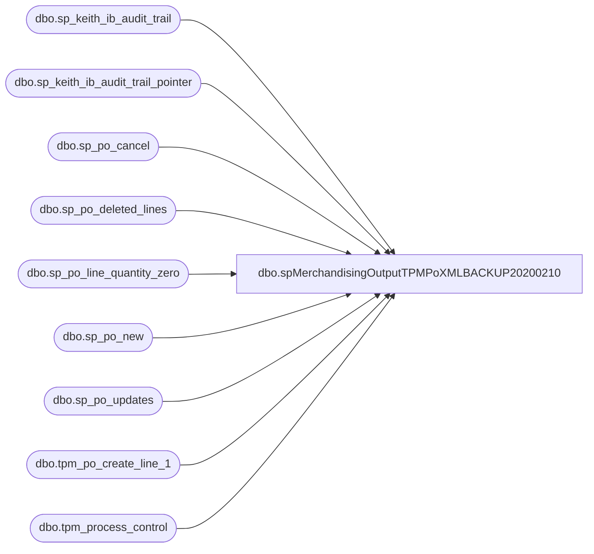

# dbo.spMerchandisingOutputTPMPoXMLBACKUP20200210

**Database:** me_01  
**Server:** bedrockdb02  

## Architecture Diagram



## Table Dependencies

| Referenced Table |
|---|
| dbo.sp_keith_ib_audit_trail |
| dbo.sp_keith_ib_audit_trail_pointer |
| dbo.sp_po_cancel |
| dbo.sp_po_deleted_lines |
| dbo.sp_po_line_quantity_zero |
| dbo.sp_po_new |
| dbo.sp_po_updates |
| dbo.tpm_po_create_line_1 |
| dbo.tpm_process_control |

## Stored Procedure Code

```sql
CREATE proc [dbo].[spMerchandisingOutputTPMPoXMLBACKUP20200210]

as
-- =====================================================================================================
-- Name: spMerchandisingOutputTPMPoXML
--
-- Description:	Exports PO XML files from Merchandising to TPM
--
--
-- Revision History
--		Name:			Date:			Comments:
--		Dan Tweedie		06/05/2015		Created Proc
-- =====================================================================================================


set nocount on

---The 7 procs below are carried over from the original Informatica Workflows
--The procs below prepare and stage the data for export
exec sp_keith_ib_audit_trail
exec sp_keith_ib_audit_trail_pointer
exec sp_po_new
exec sp_po_updates
exec sp_po_cancel
exec sp_po_deleted_lines
exec sp_po_line_quantity_zero

----the code below will output and upload the xml files
If (select count(*) from tpm_po_create_line_1) > 0

BEGIN
			--insert data into historical table
			insert tpm_process_control
			select po_no, line_no, OrderLine as po_line_shipment_id, internalstatus as po_status, 
			transactiontype as process_name, getdate() as process_date
			from tpm_po_create_line_1
			-------------------------------


			declare @count int,
					@po varchar(10),
					@xml xml,
					@query varchar(1000),
					@date varchar(52),
					@POFile varchar(100),
					@XMLout varchar(100),
					@file_location varchar(100),
					@server varchar(20),
					@database varchar(20),
					@bcp varchar(1000),
					@type varchar(1000),
					@delete varchar(100),
					@move varchar(100)
					
			select @count = count(distinct po_no) from tpm_po_create_line_1

			while @count > 0
			
			begin

					select @po = max(po_no) from tpm_po_create_line_1

					--HEADER
					IF (Object_ID('tempdb..#header') IS NOT NULL) DROP TABLE #header
					select distinct
						po_no,
						AcceptedFlag,
						Type,
						AcceptRqdMode,
						OwnerID,
						eventcode,
						EventLocationInternalId,
						EventSourceLocationInternalId,
						ShipToldRef,
						TransportMethodDesc,
						FOBDesc,
						COOCode,
						ShipFromId,
						SupplierId,
						BillTold,
						Rep1Id,
						Rep2Id,
						FulFillFlag,
						InternalStatus,
						TypeCode,
						CurrencyDesc,
						OrderDate,
						PayTermsDesc,
						ShipToId
					into #header
					from tpm_po_create_line_1
					where po_no = @po

					--DETAIL
					IF (Object_ID('tempdb..#detail') IS NOT NULL) DROP TABLE #detail
					select distinct
						AcceptedItemFlag,
						ItemDesc,
						OrderLine,
						ItemId,
						AltDetailKey,
						UOMCode,
						CurrQty,
						UnitCost,
						RetailPrice,
						InternalStatusDetail,
						StartShipDate,
						EndDeliverDateTime,
						CancelDate,
						ColorDesc,
						ColorCode,
						ItemAttr1,
						CatchWeightFlag,
						ShipToldRef,
						SupplierItemId,
						SupplierItemDesc,
						StdPackQty,
						StdCaseQty
					into #detail
					from tpm_po_create_line_1
					where po_no = @po
					----------------------------------

					select @xml =
					(
							--HEADER DATA
							SELECT convert(varchar, getdate(), 120) + '-' + 'TPMOr' as '@Id',
								   '6.0.0' as '@Version',
								   left(convert(varchar, getdate(), 126), 19) as '@Timestamp', --no milliseconds
								   '2' as '@DocSourceType',
								  (select '' as 'SenderId',
										'' as 'ReceiverId'
								   for xml path('Delivery'), Type), 
								  (select po_no as '@Id',
										  AcceptedFlag as '@AcceptedFlag',
										  Type as '@Type',
										  AcceptRqdMode as '@AcceptRqd',
										  (select OwnerID as '@OrgInternalId'
										   for xml path('Owner'), Type),
										  '' as 'PartnerVisibility',
										  (select convert(varchar, getdate(), 101) + ' ' + convert(varchar, getdate(), 108) as '@Id',
												  eventcode as '@Code',
												 (select EventLocationInternalId as '@InternalId'
												   for xml path('EventLocation'), Type),
												 '' as EventRefLocation,
												 (select EventSourceLocationInternalId as '@InternalId'
												   for xml path('EventSrcLocation'), Type),
												 (select '' as 'EntityType',
													(select '' as 'Ref1',
														'' as 'Ref2',
														'' as 'Ref3',
														'' as 'Ref4',
														'' as 'Ref5'
													 for xml path('EventRefs'), Type)
												   for xml path('EventInfo'), Type)
												 for xml path('Event'), Type),
										 (select ShipToldRef as '@ShipToIdRef',
											(select TransportMethodDesc as '@Desc'
											  for xml path('TransportationMethod'),Type),
											(select FOBDesc as '@Desc'
											  for xml path('FOB'), Type),
											'' as 'Carrier',
											(select COOCode as '@Code'
											  for xml path('COO'), Type),
											(select '' as 'OriginPort',
													'' as 'DestinationPort'
											   for xml path('Ports'), Type)
											 for xml path('ShipInfo'), Type),
											(select ShipFromId as '@Id',
											 (select '' as 'ContactInfo'
												for xml path('Address'), Type)
											  for xml path('ShipFrom'), Type),
											(select
											  (select '' as 'ReceivingLocation'
												for xml path('Receipt'), Type),
											'' as 'MiscInfo'
											 for xml path('OrderShipment'), Type),
											(Select
											(select '' as 'Weight',
													'' as 'Volume',
													'' as 'EstWeight',
													'' as 'EstVolume'
												for xml path('Measures'), Type)
											for xml path('Loaded'), Type),
											(Select
											(select '' as 'Weight',
													'' as 'Volume',
													'' as 'EstWeight',
													'' as 'EstVolume'
												for xml path('Measures'), Type)
											for xml path('Received'), Type),
											(select SupplierId as '@Id',
													(select '' as 'ContactInfo'
														for xml path('Address'), Type)
												for xml path('Supplier'), Type),
											(select 
											(select '' as 'ContactInfo'
												for xml path('Address'), Type)
												for xml path('Agent'), Type),
											(select
											(select '' as '@Id',
												(select '' as 'ContactInfo'
													for xml path('Address'), Type)
												for xml path('Hub1'), Type),
											(select
											(select '' as 'ContactInfo'
												for xml path('Address'), Type)
												for xml path('Hub2'), Type)
												for xml path('Hubs'), Type),
											(select
											(select '' as 'ContactInfo'
												for xml path('Address'), Type)
												for xml path('SoldTo'), Type),
											(Select BillTold as '@Id',
													(select '' as 'ContactInfo'
														for xml path('Address'), Type)
												for xml path('BillTo'), Type),
											(select
											(select '' as 'ContactInfo'
												for xml path('Address'), Type)
												for xml path('Store'), Type),
											(select
											(select Rep1Id as '@Id',
													(select '' as 'ContactInfo'
														for xml path('Address'), Type)
												for xml path('Rep1'), Type),
											(select Rep2Id as '@Id',
													(select '' as 'ContactInfo'
														for xml path('Address'), Type)
												for xml path('Rep2'), Type),
													(select
													(select '' as 'ContactInfo'
														for xml path('Address'), Type)
														for xml path('Rep3'), Type)
												for xml path('Reps'), Type),
											'' as 'Instructions',
											(select
											(select '' as 'Status'
												for xml path('Alert'), Type),
												(select FulFillFlag as '@FulfillFlag'
													for xml path('OrderAttributes'), Type),
												'' as 'Revision',
												'' as 'OrderRefs',
											(select InternalStatus as '@Nbr'
												for xml path('Status'), Type),
											'' as 'Priority',
											'' as 'Points',
											'' as 'OwnerPriority',
											'' as 'Style',
											(select TypeCode as '@Code'
												for xml path('OrderType'), Type),
											'' as 'Category',
											'' as 'Dept',
											'' as 'CustomerDivision',
											'' as 'CustomerDepartment',
											 (select '' as 'Class01',
													 '' as 'Class02',
													 '' as 'Class03',
													 '' as 'Class04',
													 '' as 'Class05',
													 '' as 'Class06',
													 '' as 'Class07',
													 '' as 'Class08',
													 '' as 'Class09'
												for xml path('Classes'), Type),
											 (select CurrencyDesc as '@Desc'
												for xml path('Currency'), Type),
											'' as 'PartnerCurrency',
											'' as 'CreditHold',
											(select OrderDate as '@Ordered'
												for xml path('OrderDates'), Type),
											(select PayTermsDesc as '@Desc'
												for xml path('PayTerms'), Type),
											'' as 'LetterOfCredit',
											(select
											(select '' as 'ContactInfo'
												for xml path('Address'), Type)
												for xml path('Notify'), Type),
											(select '' as 'HTS01',
													'' as 'HTS02'
												for xml path('HTS'), Type),
											'' as 'Quota',
											'' as 'DocTypes',
											'' as 'MiscInfo',
											'' as 'Policies'
												for xml path('OrderInfo'), Type),
											(select
											(select 
											(select '' as 'ContactInfo'
												for xml path('Address'), Type)
												for xml path('Location'), Type),
											'' as 'Status',
											(select
											(select
											(select '' as 'Defect'
												for xml path('Item'), Type),
												'' as 'Defect'
												for xml path('InspectedLPN'), Type),
													(select '' as 'Defect'
														for xml path('Item'), Type)
												for xml path('Sample'), Type)
												for xml path('Inspections'), Type)
												for xml path('Order'), type),
												(select 
												(select ShipToId as '@Id',
														'' as 'Address'
													for xml path('ShipTo'), Type)
													for xml path('ShipTos'), Type),

							(--DETAIL DATA
							select AcceptedItemFlag as '@AcceptedFlag',
													ItemDesc as '@Desc',
													OrderLine as '@OrderLine',
													ItemId as '@Id',
													AltDetailKey as '@AltKey',
													(select '' as 'Measures'
														for xml path('Loaded'), Type),
													(select '' as 'Measures'
														for xml path('Received'), Type),
													(select UOMCode as '@UOMCode',
															CurrQty as '@OrderQty'
														for xml path('ItemQuantities'), Type),
													(select UnitCost as '@Value'
														for xml path('UnitCost'), Type),
													(select RetailPrice as '@Value'
														for xml path('RetailPrice'), Type),
													(select
													(select
													(select InternalStatusDetail as '@Nbr'
														for xml path('Status'), Type)
														for xml path('Alert'), Type),
													(select '' as 'Address'
														for xml path('Store'), Type),
													(select StartShipDate as '@StartShip',
															EndDeliverDateTime as '@EndDeliver',
															CancelDate as '@Cancel'
														for xml path('OrderDates'), Type),
													(select ColorDesc as '@Desc',
															ColorCode as '@Code'
														for xml path('Color'), Type),
													(select ItemAttr1 as '@Attr1',
															CatchWeightFlag as '@CatchWeightFlag'
														for xml path('ItemAttributes'), Type),
													(select '' as 'Address'
														for xml path('ShipFrom'), Type),
													(select ShipToldRef as '@ShipToIdRef'
														for xml path('ItemShipInfo'), Type),
													(select SupplierItemId as '@Id',
															SupplierItemDesc as '@Desc'
														for xml path('SupplierItem'), Type),
													(select StdPackQty as '@Qty'
														for xml path('StdPack'), Type),
													(select StdCaseQty as '@Qty'
														for xml path('StdCase'), Type),
													'' as 'HTS'
													for xml path('ItemInfo'), Type)
													from #detail
												for xml path('OrderItem'), Type
							)
							from #header
							for xml path('MANH_TPM_Order')
					)

					IF (Object_ID('tempdb..##POxml') IS NOT null) DROP TABLE ##POxml
					create table ##POxml
					(XMLData xml)

					insert ##POxml
					select @xml

					set @query = 'select * from ##POxml'
					set @file_location = '\\wmtpmdbs\e$\TPMInterfaces\Host_TPM_Order\10_TPM_Order_XML\'
					set @PoFile = 'TPM_HOST_to_TPM_PO_' + @po + '.xml'
					set @XMLout = 'XML' + @po + '.out'
					set @server = 'bedrockdb02'
					set @database = 'me_01'
					set @bcp = 'bcp "' + @query + '" queryout "' + @file_location + @XMLout + '"  -T -w -S' + @server 

					exec master..xp_cmdshell @bcp --export xml file

					set @type = 'TYPE ' + @file_location + @XMLout + ' > ' + @file_location + @PoFile 
					exec master..xp_cmdshell @type --this is needed because tpm integration services couldn't read the xml file due to encoding(?)
			
					set @delete = 'DEL ' + @file_location + @XMLout
					exec master..xp_cmdshell @delete

					delete from tpm_po_create_line_1
					where po_no = @po
			
					select @count = count(distinct po_no) from tpm_po_create_line_1

						if @count < 1
							break
						else
							continue

			end

END
```

