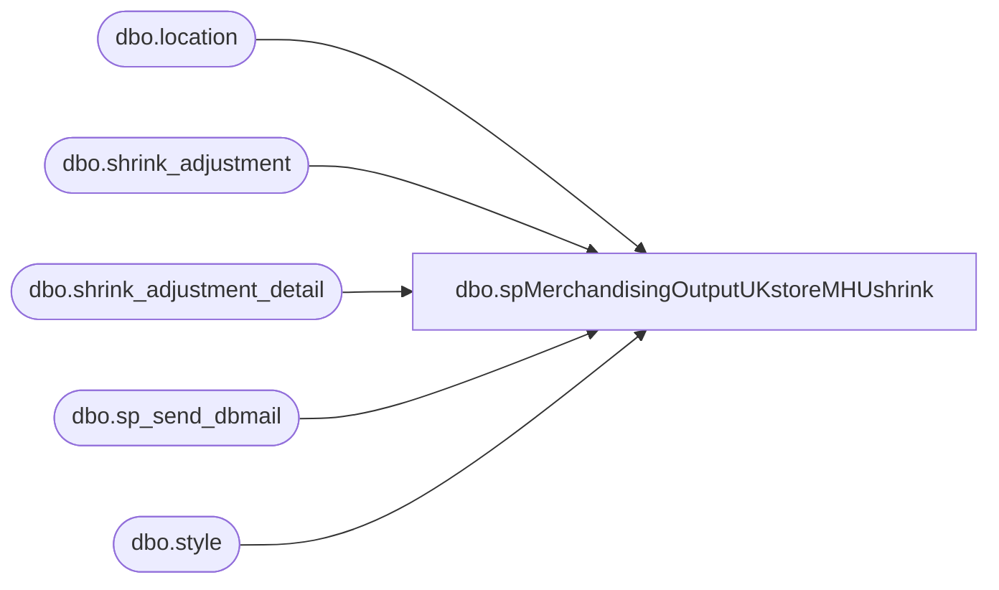

# dbo.spMerchandisingOutputUKstoreMHUshrink

**Database:** me_01  
**Server:** bedrockdb02  

## Architecture Diagram



## Table Dependencies

| Referenced Table |
|---|
| dbo.location |
| dbo.shrink_adjustment |
| dbo.shrink_adjustment_detail |
| dbo.sp_send_dbmail |
| dbo.style |

## Stored Procedure Code

```sql
CREATE proc [dbo].[spMerchandisingOutputUKstoreMHUshrink]
as

-- =====================================================================================================
-- Name: spMerchandisingOutputUKstoreMHUshrink
--
-- Description:	Sends email summary of UK shrink adjustments from MHU
--				
--
-- Input:	NA
--
-- Output: 
--			
--
-- Dependencies: 
--
-- Revision History
--		Name:			Date:			Comments:
--		Dan Tweedie		07/25/2012		Created proc
-- =====================================================================================================


set nocount on 

declare @subj varchar(1000),
		@text nvarchar(max)
		
select @subj = 'Store MHU Shrink Adjustment Monthly Summary ' + cast(getdate() as varchar)
	
set @text = '<font face =arial size = 2>' + 
	@subj +
	'<br><br>' +
		'<table border="1">' +
		'<tr><th>LOCATION</th><th>STYLE</th><th>MONTH</th><th>UNITS</th></tr>' +
		CAST ( ( SELECT td = l.location_code,'',
						td = s.style_code, '',
						td = datename(mm, sa.create_date), '',
						td = sum(sad.units_to_adjust), ''
				  from shrink_adjustment sa (nolock)
					join shrink_adjustment_detail sad (nolock) on sad.shrink_adjustment_id = sa.shrink_adjustment_id
					join style s (nolock) on s.style_id = sad.style_id
					join location l (nolock) on l.location_id = sad.location_id
					where sa.external_system_name = 'STS_DistroShrink'
					and sa.performed_by = 'distro'
					and datepart(yyyy, sa.create_date) = datepart(yyyy, getdate())
					and datename(mm, sa.create_date) = datename(mm, getdate())
					and l.jurisdiction_id = 2
					group by l.location_code, s.style_code, datename(mm, sa.create_date)
					order by l.location_code, s.style_code
				  FOR XML PATH('tr'), TYPE 
		) AS NVARCHAR(MAX) ) +
		'</font></table></font></p></p>
		<br>
		<br>
		<br>
	<font face =arial size = 1><i>The information in this message may be privileged, “confidential” and protected from disclosure and/or intended only for the addressee(s) named above.  If the reader of this message is not the intended recipient, or an employee or agent responsible for delivering this message to the intended recipient, you are hereby notified that any dissemination, distribution or copying of the communication is strictly prohibited.  If you have received this communication in error, please notify us immediately by replying to the message and deleting it from your computer.  Thank you beary much.</i></font>'

exec msdb.dbo.sp_send_dbmail
@profile_name = 'merchadmin',
@recipients = 'bl-uk@buildabear.com',
--@copy_recipients = 'merchadmin@buildabear.com',
@body = @text,
@subject = @subj,
@body_format = 'HTML'
```

