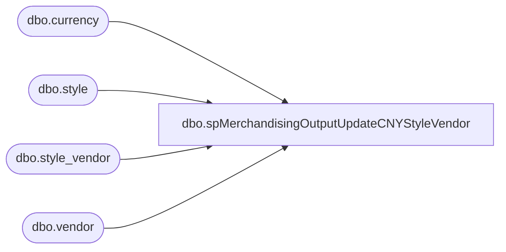

# dbo.spMerchandisingOutputUpdateCNYStyleVendor

**Database:** me_01  
**Server:** bedrockdb02  

## Architecture Diagram



## Table Dependencies

| Referenced Table |
|---|
| dbo.currency |
| dbo.style |
| dbo.style_vendor |
| dbo.vendor |

## Stored Procedure Code

```sql
-- =====================================================================================================
-- Name: spMerchandisingOutputUpdateCNYStyleVendor
--
-- Description:	Creates .GO file to Update 'CNY' style vendor records via pipeline using current conversion rate and cost of value flagged as primary.
--						The current conversion rate for CNY costs is stored in @conversion. The business team will reach out when the conversion rate need to be updated.
--
-- Revision History
--		Name:			Date:			Comments:
--		Thomas Tyler	10/26/2017		Added new WHERE condition in Step 2 to only pull costs flagged as primary that are USD cost codes
--		Thomas Tyler	10/25/2017		Created procedure	
--		Lizzy T			02/08/2019		Updated the conversion rate from 6.8285 to 6.8701 
-- =====================================================================================================
CREATE PROCEDURE [dbo].[spMerchandisingOutputUpdateCNYStyleVendor] 

AS
BEGIN

-- Declare conversion variable and drop all temp tables if they exist.

DECLARE @conversion decimal (10,4)
SET @conversion = 6.8701 

IF (Object_ID('tempdb..##CNStyleVendorConv') IS NOT NULL)
		DROP TABLE ##CNStyleVendorConv
IF (Object_ID('tempdb..#CNStyleVendorWork') IS NOT NULL)
		DROP TABLE #CNStyleVendorWork


--	STEP 1: Populate #CNStyleVendorConv table with all Vendor_Styles using CNY Currency Codes from CN Styles.
SELECT 	'VS' AS Record_Type,
	'M' AS Action_Type,
	s.style_code AS Style_Code,
	v.vendor_code AS Vendor_Code,
	sv.vendor_style AS Vendor_Style_Code,
	sv.current_cost,
	'CNY' AS Vendor_Current_Cost_Currency_Code,
	'N' as Primary_Flag
INTO ##CNStyleVendorConv
FROM style s,
	style_vendor sv,
	vendor v,
	currency cu
WHERE s.style_id = sv.style_id
AND	sv.vendor_id = v.vendor_id
AND	sv.currency_id = cu.currency_id
AND	sv.currency_id = '9'
AND s.style_code  between '800000' AND '899999'

--	STEP 2: Find all style_vendors who are tagged as primary and import into #CNStyleVendorWork, importing
--			their current_cost value multiplied by the @conversion rate.
SELECT s.style_code,
	v.vendor_code,
	sv.vendor_style,
	--CAST(sv.current_cost * 6.8285 AS decimal(10,2)) AS Vendor_Current_Cost, --Replaced hard coded rate with @conversion variable on 02/08/2019, Lizzy T
	CAST(sv.current_cost * @conversion AS decimal(10,2)) AS Vendor_Current_Cost,
	sv.primary_vendor_flag
INTO #CNStyleVendorWork 
FROM style s,
	vendor v,
	style_vendor sv,
	##CNStyleVendorConv
WHERE s.style_code  between '800000' AND '899999'
AND s.style_code = ##CNStyleVendorConv.Style_Code
AND sv.style_id = s.style_id
and sv.vendor_id = v.vendor_id
AND sv.primary_vendor_flag = '1'
AND sv.current_cost != '0'
AND sv.currency_id = '1'


--	STEP 3: Find all styles whose CNY Vendor style cost value is different from the new value in #CNStyleVendorWork
--			and update #CNStyleVendorConv where they are different.
IF (SELECT COUNT(*) FROM ##CNStyleVendorConv, #CNStyleVendorWork WHERE ##CNStyleVendorConv.Vendor_Style_Code = #CNStyleVendorWork.vendor_style AND ##CNStyleVendorConv.current_cost != #CNStyleVendorWork.Vendor_Current_Cost) > 1
BEGIN
UPDATE ##CNStyleVendorConv
SET ##CNStyleVendorConv.current_cost = #CNStyleVendorWork.Vendor_Current_Cost
FROM #CNStyleVendorWork
WHERE ##CNStyleVendorConv.Style_Code = #CNStyleVendorWork.style_code
AND ##CNStyleVendorConv.Vendor_Style_Code = #CNStyleVendorWork.vendor_style
AND ##CNStyleVendorConv.current_cost != #CNStyleVendorWork.Vendor_Current_Cost

--	STEP 4: Create the .GO file and drop it in the Text File to EDM & PROD Import Tables - IMP Master Entities Directory, referencing the temp CNStyleVendorConv Table.
BEGIN

	DECLARE @query varchar(1000),
			@date varchar(20),
			@filename varchar(100),
			@filelocation varchar(100),
			@server varchar(20),
			@database varchar(20),
			@sqlcmd varchar(1000),
			@query_text varchar(1000)

	SELECT @query = 'SET NOCOUNT ON SELECT * FROM ##CNStyleVendorConv ORDER BY 3,4'
	SELECT @date = CAST(DATEPART(yyyy, GETDATE()) AS varchar) + CAST(DATEPART(mm, GETDATE()) AS varchar) + CAST(DATEPART(dd, GETDATE()) AS varchar) + CAST(DATEPART(hh, GETDATE()) AS varchar) + CAST(DATEPART(mi, GETDATE()) AS varchar) + CAST(DATEPART(ss, GETDATE()) AS varchar) 
	SELECT @filelocation = '\\PIPEAPP01\Company01\Text File to EDM & PROD Import Tables - Imp Master Entities\'
	SELECT @filename = 'CN_STYLE_VENDOR_UPDATE_' + @date + '.GO'
	SELECT @server = 'bedrockdb02'
	SELECT @database = 'me_01'
	SELECT @sqlcmd = 'sqlcmd -S' + @server + ' -d' + @database + ' -Q' + '"' + @query + '"' + ' -o' + '"' + @filelocation + @filename + '"' + ' -s"	" -W -h-1'-- (-h-1) removes headers - - (-f 65001 sets to unicode (for chinese characters))
	EXEC MASTER..xp_cmdshell @sqlcmd

END
END;
END
```

