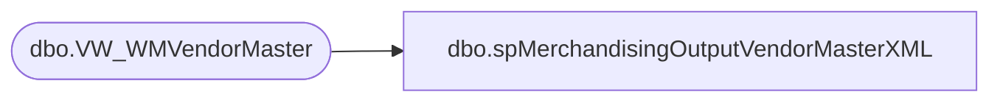

# dbo.spMerchandisingOutputVendorMasterXML

**Database:** me_01  
**Server:** bedrockdb02  

## Architecture Diagram



## Table Dependencies

| Referenced Table |
|---|
| dbo.VW_WMVendorMaster |

## Stored Procedure Code

```sql
CREATE proc [dbo].[spMerchandisingOutputVendorMasterXML]

as

-- =====================================================================================================
-- Name: spMerchandisingOutputVendorMasterXML
--
-- Description:	Outputs XML file to WM for Store Master Bridge
--
-- Revision History
--		Name:			Date:			Comments:
--		Dan Tweedie		03/31/2015		Created proc
-- =====================================================================================================

set nocount on

declare @xml xml

select @xml = (select
	vendor_id as [VendorNumber],
	vendor_name as [VendorName],
	addr_1 as [VendorMasterFields/Address1],
	addr_2 as [VendorMasterFields/Addres2],
	city as [VendorMasterFields/City],
	state as [VendorMasterFields/StateCode],
	cntry as [VendorMasterFields/Country],
	tel_nbr as [VendorMasterFields/TelephoneNumber],
	stat_code as [VendorMasterFields/StatusCode],
	dflt_batch_stat as [VendorMasterFields/DefaultBatchStat]
from VW_WMVendorMaster
for xml path ('VendorMaster'), root ('VendorMasterBridge'))

IF (Object_ID('tempdb..##vendorxml') IS NOT null) DROP TABLE ##vendorxml
create table ##vendorxml
(XMLData xml)

insert ##vendorxml
select @xml

declare @query varchar(1000),
			@date varchar(52),
			@VendorMasterFile varchar(1000),
			@XMLout varchar(100),
			@file_location varchar(1000),
			@fileDestination varchar(1000),
			@server varchar(20),
			@database varchar(20),
			@bcp varchar(1000),
			@type varchar(1000),
			@delete varchar(1000),
			@move varchar(1000)

			set @query = 'select * from ##vendorxml'
			select @date = replace(replace(replace(replace(convert(varchar, getdate(), 121), ' ', ''), '-', ''), ':', ''), '.', '')
			set @file_location = '\\kermode\FileRepository\MERCHANDISING\WM\OUTBOUND\VendorMaster\'
			set @fileDestination = '\\wminteg01\interfaces\vendormaster\'
			set @VendorMasterFile = 'ISMVendormasterbridge.xml'
			set @XMLout = 'XML.out'
			set @server = 'bedrockdb02'
			set @database = 'me_01'
			set @bcp = 'bcp "' + @query + '" queryout "' + @file_location + @XMLout + '"  -T -w -S' + @server 

			exec master..xp_cmdshell @bcp --export xml file

			set @type = 'TYPE ' + @file_location + @XMLout + ' > ' + @file_location + @VendorMasterFile 
			exec master..xp_cmdshell @type --this is needed because wm eis couldn't read the xml file due to encoding(?)
			
			set @delete = 'DEL ' + @file_location + @XMLout
			exec master..xp_cmdshell @delete

			set @move = 'MOVE ' + @file_location + @VendorMasterFile + ' ' + @fileDestination
			exec master..xp_cmdshell @move
```

