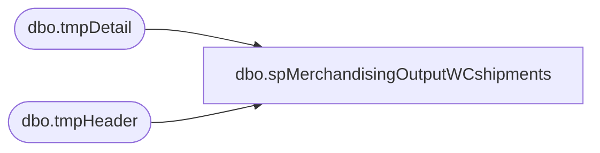

# dbo.spMerchandisingOutputWCshipments

**Database:** me_01  
**Server:** bedrockdb02  

## Architecture Diagram



## Table Dependencies

| Referenced Table |
|---|
| dbo.tmpDetail |
| dbo.tmpHeader |

## Stored Procedure Code

```sql
CREATE proc [dbo].[spMerchandisingOutputWCshipments]
as
-- =====================================================================================================
-- Name: spMerchandisingOutputWCshipments
--
-- Description:	selects shipment records, presented in a format that is readable by the Merchandising Pipeline.
--				
-- Input:	
--
-- Output: 

-- Dependencies: this is designed to be called from spMerchandisingProcessWCShipmentsAllocAdj
--				 
-- Revision History
--		Name:			Date:			Comments:
--		Dan Tweedie		03/15/2012		created proc
--		Lizzy Timm		05/08/2025		Lengthened @distro varchar(6) fro varchar(7)  to accommodate longer distribution numbers
-- =====================================================================================================


set nocount on

declare @headers int,
		@document_no varchar(10),
		@date_shipped varchar(12),
		@erd varchar(12),
		@location varchar(4),
		@rec_type varchar(100),
		@distro varchar(7),
		@carton varchar(20),
		@upc varchar(12),
		@qty int,
		@cartons int


select @headers = count(*) from tmpHeader
while @headers > 0 
begin
	select 
		   @document_no = max(document_no),
		   @date_shipped = date_shipped,
		   @erd = expected_receipt_date,
		   @location = location_code,
		   @rec_type = left(external_system_name, 20)
	from tmpHeader
	group by date_shipped, expected_receipt_date, location_code, external_system_name
	order by 1

	print 'H' + '	' + 'A' + '	' +	@document_no + '	' + @date_shipped + '	' + '	' + @erd + '	' + @location + '	' + '0960' + '	' + 'S' + '	' + '	' + '	' + '	' + @rec_type + '	' + '0'

	select @cartons = count(carton_no) from tmpDetail where document_no = @document_no

	while @cartons > 0
		begin
			select top 1
				   @distro = distribution_no,
				   @carton = carton_no,
				   @upc = upc_no,
				   @qty = sent_units
			from tmpDetail
			where document_no = @document_no

			print 'D' + '	' + 'A' + '	' +	@document_no + '	' + @distro + '	' + @carton + '	' + @upc + '	' + '	' + '	' + '	' + '	' + convert(varchar, @qty)  + '	' + '0960'
			
			delete from tmpDetail where carton_no = @carton and upc_no = @upc and distribution_no = @distro
			
			select @cartons = count(carton_no) from tmpDetail where document_no = @document_no
			
			if @cartons < 1
				break
			else
				continue	
		end
	
	delete from tmpHeader where document_no = @document_no
	select @headers = count(*) from tmpHeader
	
	if @headers < 1
		break
	else
		continue
end
```

