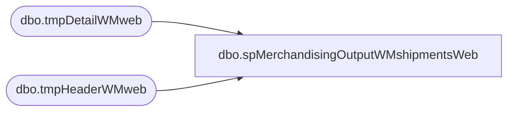

# dbo.spMerchandisingOutputWMshipmentsWeb

**Database:** me_01  
**Server:** bedrockdb02  

## Architecture Diagram



## Table Dependencies

| Referenced Table |
|---|
| dbo.tmpDetailWMweb |
| dbo.tmpHeaderWMweb |

## Stored Procedure Code

```sql
CREATE proc [dbo].[spMerchandisingOutputWMshipmentsWeb]

as

-- =====================================================================================================
-- Name: spMerchandisingOutputWMshipmentsWeb
--
-- Description:	Outputs WM (980 to web) store shipments to Merch Pipeline
--				 
-- Revision History
--		Name:			Date:			Comments:
--		Dan Tweedie		05/07/2015		created proc
-- =====================================================================================================

set nocount on

declare @headers int,
		@document_no varchar(100),
		@date_shipped varchar(12),
		@erd varchar(12),
		@location varchar(4),
		@rec_type varchar(100),
		@distro varchar(6),
		@carton varchar(20),
		@upc varchar(12),
		@qty int,
		@cartons int


select @headers = count(*) from tmpHeaderWMweb
while @headers > 0 
begin
	select 
		   @document_no = max(document_no),
		   @date_shipped = date_shipped,
		   @erd = expected_receipt_date,
		   @location = location_code,
		   @rec_type = left(external_system_name, 20)
	from tmpHeaderWMweb
	group by date_shipped, expected_receipt_date, location_code, external_system_name
	order by 1

	print 'H' + '	' + 'A' + '	' +	@document_no + '	' + @date_shipped + '	' + '	' + @erd + '	' + @location + '	' + '0980' + '	' + 'S' + '	' + '	' + '	' + '	' + @rec_type + '	' + '0'

	select @cartons = count(carton_nbr) from tmpDetailWMweb where document_no = @document_no

	while @cartons > 0
		begin
			select top 1
				   @distro = distribution_no,
				   @carton = carton_nbr,
				   @upc = upc_no,
				   @qty = sent_units
			from tmpDetailWMweb
			where document_no = @document_no

			print 'D' + '	' + 'A' + '	' +	@document_no + '	' + @distro + '	' + @carton + '	' + @upc + '	' + '	' + '	' + '	' + '	' + convert(varchar, @qty)  + '	' + '0980'
			
			delete from tmpDetailWMweb where carton_nbr = @carton and upc_no = @upc and distribution_no = @distro
			
			select @cartons = count(carton_nbr) from tmpDetailWMweb where document_no = @document_no
			
			if @cartons < 1
				break
			else
				continue	
		end
	
	delete from tmpHeaderWMweb where document_no = @document_no
	select @headers = count(*) from tmpHeaderWMweb
	
	if @headers < 1
		break
	else
		continue
end
```

