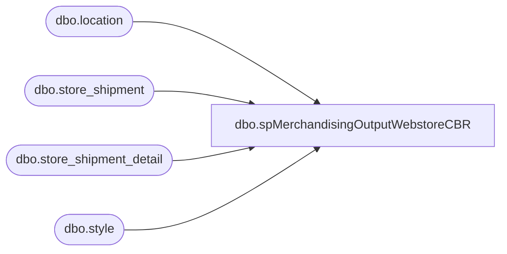

# dbo.spMerchandisingOutputWebstoreCBR

**Database:** me_01  
**Server:** bedrockdb02  

## Architecture Diagram



## Table Dependencies

| Referenced Table |
|---|
| dbo.location |
| dbo.store_shipment |
| dbo.store_shipment_detail |
| dbo.style |

## Stored Procedure Code

```sql
CREATE proc [dbo].[spMerchandisingOutputWebstoreCBR]
as
-- =====================================================================================================
-- Name: spMerchandisingOutputWebstoreCBR
--
-- Description:	Selects Store Shipments for the US Webstore (0013) that were expected to be received today and marks the shipment as received as sent 
--				This is ultimately replacing the old CBR logic (WMDBO1.DBO.spWebCBR) that became unreliable as the WMOS 2004R2 aged and application bugs related to Task Detail statuses emerged
--				
-- Input:	
--
-- Output: 

-- Dependencies: 
--				 
-- Revision History
--		Name:			Date:			Comments:
--		Tim Callahan    02/06/2019		created proc
--		Lizzy Timm		02/09/2021		Removed datediff filter so that shipments will get picked up regardless of ERD 
-- =====================================================================================================

IF (Object_ID('tempdb..##WebCBR_NEW') IS NOT NULL) DROP TABLE ##WebCBR_NEW
select 'BC' a,
		'A' b,
		ssd.carton_no c, 
		l.location_code d, 
		'099060199' e
into ##WebCBR_NEW
from store_shipment ss (nolock) 
join store_shipment_detail ssd (nolock) on ss.store_shipment_id=ssd.store_shipment_id
join location l (nolock) on l.location_id=ss.location_id
join location l2 (nolock) on l2.location_id=ss.from_location_id
join style s (nolock) on s.style_id=ssd.style_id
where l.location_code = '0013' -- US Webstore
and l2.location_code = '0980' -- Only want to specify those 
and ss.document_status = '3' -- Only those Shipments in Sent\In-Transit Status 
-- and datediff(dd, ss.expected_receipt_date, getdate()) = 0 --LT commented out 02/09/21
order by ss.create_date


if (select count(*) from ##WebCBR_NEW) > 0

begin

	declare @query2 varchar(1000),
			@date2 varchar(52),
			@file_name2 varchar(100),
			@file_location2 varchar(100),
			@server2 varchar(20),
			@database2 varchar(20),
			@bcp2 varchar(1000)

	set @query2 = 'select * from ##WebCBR_NEW'
	select @date2 = convert(varchar, datepart(yyyy, getdate())) + convert(varchar, datepart(mm, getdate())) + convert(varchar, datepart(dd, getdate())) + convert(varchar, datepart(hh, getdate())) + convert(varchar, datepart(mi, getdate())) + convert(varchar, datepart(ss, getdate())) + convert(varchar, datepart(ms, getdate()))
	set @file_location2 = '\\pipeapp01\Company01\Text File to IM Import Tables  - Batch Carton\'
	set @file_name2 = 'STSIMCTN.WEB.RcvSent.' + @date2 + '.GO'
	set @server2 = 'bedrockdb02'
	set @database2 = 'me_01'
	set @bcp2 = 'bcp "' + @query2 + '" queryout "' + @file_location2 + @file_name2 + '"  -T -c -S' + @server2

	exec master..xp_cmdshell @bcp2

end
```

