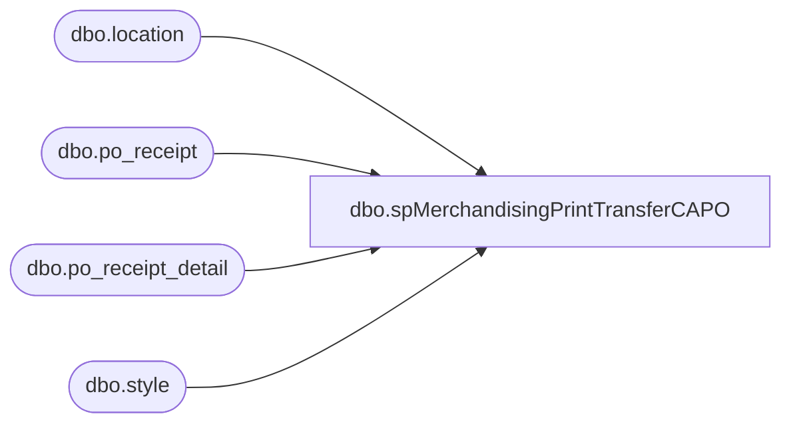

# dbo.spMerchandisingPrintTransferCAPO

**Database:** me_01  
**Server:** bedrockdb02  

## Architecture Diagram



## Table Dependencies

| Referenced Table |
|---|
| dbo.location |
| dbo.po_receipt |
| dbo.po_receipt_detail |
| dbo.style |

## Stored Procedure Code

```sql
CREATE proc [dbo].[spMerchandisingPrintTransferCAPO]
as


-- =====================================================================================================
-- Name: spMerchandisingPrintTransferCAPO
--
-- Description:	creates a shipment record for the Merch Pipeline to import
--
-- Input: NA
--
-- Output: outputs to pipeline outbound transfers interface
--
-- Dependencies: na
--
-- Revision History
--		Name:			Date:			Comments:
--		Dan Tweedie		09/26/2011		Created proc.	
-- =====================================================================================================
set nocount on
		
		
if (select count(*)
	from  po_receipt pr
	join  po_receipt_detail prd
	on          pr.po_receipt_id = prd.po_receipt_id
	join  style s
	on          prd.style_id = s.style_id
	join  location l
	on          pr.location_id = l.location_id
	where CONVERT(varchar,GETDATE(),101) = CONVERT(varchar,pr.receive_date,101) 
	and         l.location_code = '0975'
	and         pr.performed_by = 'Administrator') > 0
	
begin
		
		declare @query varchar(1000),
				@date varchar(200),
				@file_name varchar(100),
				@file_location varchar(100),
				@server varchar(20),
				@username varchar(20),
				@password varchar(20),
				@database varchar(20),
				@sqlcmd varchar(1000),
				@query_text varchar(1000)

		select @query_text = 'exec bedrockdb02.me_01.dbo.spMerchandisingSelectTransferCAPO'

		set @date = convert(varchar, datepart(yyyy, getdate())) + convert(varchar, datepart(mm, getdate())) + convert(varchar, datepart(dd, getdate()))
		set @query = @query_text
		set @file_location = '\\pipeapp01\E$\Company01\Text File to IM Import Tables - Import Outbound Xfers\'
		set @file_name = 'STSIMOUTBOUNDTRANSFER.CAPOTRANSFERS' + convert(varchar, @date) +'.GO'
		set @server = 'bedrockdb02'
		set @database = 'me_01'
		set @sqlcmd = 'sqlcmd -S' + @server + ' -d' + @database + ' -Q' + '"' + @query + '"' + ' -o' + '"' + @file_location + @file_name + '"' + ' -s"," -w100 -W'
		exec master..xp_cmdshell @sqlcmd

EXEC pipeapp01.master..xp_cmdshell 'PipelineScheduleClient Start 16002 0'
EXEC pipeapp01.master..xp_cmdshell 'PipelineScheduleClient Start 19000 0'

end
```

