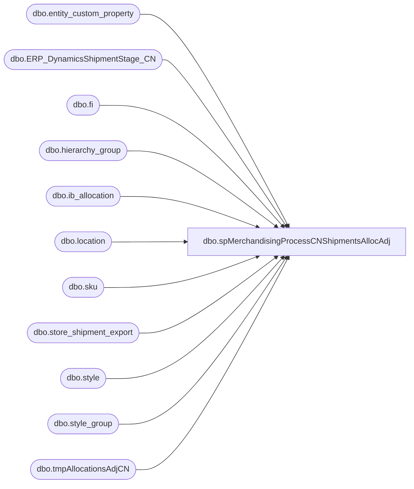

# dbo.spMerchandisingProcessCNShipmentsAllocAdj

**Database:** me_01  
**Server:** bedrockdb02  

## Architecture Diagram



## Table Dependencies

| Referenced Table |
|---|
| dbo.entity_custom_property |
| dbo.ERP_DynamicsShipmentStage_CN |
| dbo.fi |
| dbo.hierarchy_group |
| dbo.ib_allocation |
| dbo.location |
| dbo.sku |
| dbo.store_shipment_export |
| dbo.style |
| dbo.style_group |
| dbo.tmpAllocationsAdjCN |

## Stored Procedure Code

```sql
CREATE proc [dbo].[spMerchandisingProcessCNShipmentsAllocAdj]

as 
-- =====================================================================================================
-- Name: spMerchandisingProcessCNShipmentsAllocAdj
--
-- Description:	Imports shipment records from Shanghai warehouse, generates shipment and allocation adjustment files for Merchandising Pipeline
--
-- Revision History
--		Name:			Date:			Comments:
--		Dan Tweedie		01/25/2016		created proc
--		Dan Tweedie		05/15/2016		Corrected style_code in file input table, so it has the 6 leading zero's
--		Keith Lee		05/18/2016		Changed code so that allocated adjustment file would use shipped_qty and not varience_qty
--		Keith Lee		06/1/2016		Changed code since Kerry Logistics is providing a space in the carton number field so changed to use len.  Also removed -1 code when calculating the allocated units.
--		Tim Callahan	06/26/2017		The change made on 5/18/2016 was still not properly creating alloc adjustment, see date stamp notes below 
--		Dan Tweedie		2018-07-03		Added Stage Data For Dynamics
--		Tim Callahan	07-03-2018		Extended the max character of #file_input from 6 to 12 to accomodated D365 distro data 
--										Added logic to remove D365 distros from being include in Merchandising Pipeline files
--		Dan Tweedie		2019-01-22		Updated insert statement for stage to Dynamics
-- =====================================================================================================

set nocount on

----PART ONE - IMPORT SHIPMENT FILES

IF (Object_ID('tempdb..#files') IS NOT NULL) DROP TABLE #files
create table #files (output varchar(1000))
insert #files exec master..xp_cmdshell 'dir \\kermode\FileRepository\MERCHANDISING\CN_Distro\INBOUND\SHIPMENTS\*.csv /B'
delete from #files where output is null or output = 'File Not Found'

if (select count(*) from #files) > 0

BEGIN
		IF (Object_ID('tempdb..#file_input') IS NOT NULL) DROP TABLE #file_input
			create table #file_input
			(fromLocation varchar(4),
			 document_no varchar(10),
			 location_code varchar(10),
			 date_shipped varchar(10),
			 distribution_no varchar(12),
			 distribution_line int,
			 style_code varchar(12),
			 ordered_qty int,
			 shipped_qty int,
			 variance_qty int,
			 carton_no varchar(20))
		
		declare @files int,
				@filename varchar(52),
				@filepath varchar(100),
				@bulkinsert varchar(4000),
				@del varchar(1000),
				@move varchar(1000),
				@query varchar(1000),
				@file_name varchar(100),
				@file_location varchar(1000),
				@server varchar(20),
				@database varchar(20),
				@bcp varchar(1000)


		select @filepath = '\\kermode\FileRepository\MERCHANDISING\CN_Distro\INBOUND\SHIPMENTS\'
		select @files = count(*) from #files

		while @files > 0
			begin

				select @filename = max(output) from #files
				select @bulkinsert = 'bulk insert #file_input from ''' + @filepath + @filename + ''' with (FIELDTERMINATOR = '','', ROWTERMINATOR = ''\n'')'
				exec (@bulkinsert)
				
				select @move = 'move ' + @filepath + @filename + ' \\kermode\FileRepository\MERCHANDISING\CN_Distro\INBOUND\SHIPMENTS\Done'

				exec master..xp_cmdshell @move
								
				delete from #files where output = @filename
				select @files = count(*) from #files
								
				if @files < 1
					break
				else
					continue
			end

		---Need to add RecType to shipment imported data, since this is not in the file and we need it for ERD
		alter table #file_input
		add rec_type int, external_system_name varchar(100)

		update fi
		set fi.rec_type = sse.rec_type,
			fi.external_system_name = sse.rec_label,
			fi.style_code = fi.style_code
		from #file_input fi
		join store_shipment_export sse 
			on fi.distribution_no = sse.distribution_number
			and fi.document_no = sse.document_number
			and fi.distribution_line = sse.distribution_line_number
			and fi.fromLocation = sse.warehouse
			and fi.location_code = sse.location_code
			and fi.style_code = sse.style_code

			
			----STAGE SHIPMENTS FOR DYNAMICS
			insert ERP_DynamicsShipmentStage_CN
			select *
			from #file_input
			where len(carton_no) > 1
			and carton_no is not null
			and carton_no not in (select carton_no from ERP_DynamicsShipmentStage_CN where carton_no is NOT NULL)
			--------------------------------------

			-- Exclude D365 Distros from posting to Merchandising 
			delete 
			from #file_input
			where distribution_no like 'S%' or distribution_no like 'T%'

	----------------------------------------------------------------------------------------------------------------------------------------------------
--PART TWO - GENERATE SHIPMENT RECORDS FOR PIPELINE

--step 1 - build shipment header and detail tables
--Mike Schmitz advised that transit days will always be 0, but I have this code in place in case this changes
--IF (Object_ID('me_01..tmpHeader_workCN') IS NOT NULL) DROP TABLE tmpHeader_workCN
--select distinct
--	   fi.fromLocation,
--	   fi.document_no,
--	   fi.ship_date date_shipped, 
--	   datepart(dw, fi.ship_date) day_shipped,
--	   case when fi.rec_type in ('1','6','8','9','56','61','1006') then case when fi.fromLocation = '3970' then isnull(we.truck_3970,7) else isnull(we.truck_3980,7) end --truck
--			when fi.rec_type in ('54','58','80','81','82','83','84','1004') then case when fi.fromLocation = '3970' then isnull(we.ground_3970,0) else isnull(we.ground_3970,7) end--ground
--			when fi.rec_type in ('51','52','73','85','86','1001','1002') then '1'--1 day
--			when fi.rec_type in ('53','74','87','1003','57','1007','62') then '2'--2 day -- includes courier and intnl priority
--			when fi.rec_type in ('60','88','1010') then '3'--3 day
--			when fi.rec_type in ('55','89','1005') then datediff(dd, datepart(dw, fi.ship_date),7) -- saturday
--			when fi.rec_type in ('63') then case when fi.fromLocation = '3970' then isnull(we.intnl_econ_3970,7) else isnull(we.intnl_econ_3980,7) end--Intl Economy -- 
--			when fi.rec_type in ('64','65') then '30'--30
--			when fi.rec_type = '3' then case when fi.fromLocation = '3970' then isnull(we.supplySecond_3970,7) else isnull(we.supplySecond_3980,7) end
--			when fi.rec_type = '7' then case when fi.fromLocation = '3970' then isnull(we.supplyThird_3970,7) else isnull(we.supplyThird_3980,7) end
--			else 7
--		end as transit_days,
--	    --as expected_receipt_date,
--	   fi.location_code,
--	   rt.[message] as external_system_name
--into tmpHeader_workCN
--from #file_input fi
--left join rec_type rt (nolock) on fi.rec_type = rt.rectype
--left join whse_erd we (nolock) on fi.location_code = we.location_code
--where fi.carton_no is not null
--order by fi.fromLocation, fi.document_no


----apply erd value with weekend buffer
--IF (Object_ID('me_01..tmpHeaderCN') IS NOT NULL) DROP TABLE tmpHeaderCN
--select fromLocation, document_no, date_shipped, 
--case when (datepart(dw, date_shipped) = 2 and transit_days > 4)
--			or (datepart(dw, date_shipped) = 3 and transit_days > 3)
--			or (datepart(dw, date_shipped) = 4 and transit_days > 2)
--			or (datepart(dw, date_shipped) = 5 and transit_days > 1)
--			or (datepart(dw, date_shipped) = 6)
--		then convert(varchar, dateadd(day, (transit_days + 2), cast(date_shipped as datetime)), 101)
--	when transit_days is NULL then convert(varchar, dateadd(day, (7), cast(date_shipped as datetime)), 101)
--	else convert(varchar, dateadd(day, (transit_days), cast(date_shipped as datetime)), 101)
--end as expected_receipt_date,
--location_code, external_system_name
--into tmpHeaderCN
--from tmpHeader_workCN
--order by fromLocation, document_no

IF (Object_ID('me_01..tmpHeaderCN') IS NOT NULL) DROP TABLE tmpHeaderCN
select  distinct
		fromLocation, 
		document_no, 
		date_shipped, 
		date_shipped as expected_receipt_date,
		location_code, 
		external_system_name
into tmpHeaderCN
from #file_input
order by fromLocation, document_no

IF (Object_ID('me_01..tmpDetailCN') IS NOT NULL) DROP TABLE tmpDetailCN
select 
	   fi.document_no,
	   fi.distribution_no,
	   fi.carton_no,
	   cast('000000' as varchar) + fi.style_code as UPC_no,
	   case when substring(hg.hierarchy_group_code,7,2)='60' 
			then fi.shipped_qty / ecp.custom_property_value
			else fi.shipped_qty
		end as sent_units
into tmpDetailCN
from #file_input fi
join style s (nolock) on fi.style_code = s.style_code
join style_group sg (nolock) on s.style_id = sg.style_id
join hierarchy_group hg (nolock) on sg.hierarchy_group_id = hg.hierarchy_group_id
left join entity_custom_property ecp on s.style_id = ecp.parent_id and ecp.custom_property_id = 2 and ecp.parent_type = 1
where len(carton_no) > 1 -- Kerry Logistics is providing a space in the carton number field so changed to use len.
--where carton_no is not null -- Kerry Logistics is providing a space in the carton number field so changed to use len.
order by document_no, distribution_no, carton_no


-------------------------------
--step 2 - output shipment file

declare @query_shipment varchar(1000),
		@date varchar(200),
		@file_name_shipment varchar(100),
		@file_location_shipment varchar(100),
		@server_shipment varchar(20),
		@database_shipment varchar(20),
		@sqlcmd varchar(1000),
		@query_text varchar(1000)
	

set @date = convert(varchar, datepart(yyyy, getdate())) + convert(varchar, datepart(mm, getdate())) + convert(varchar, datepart(dd, getdate())) + convert(varchar, datepart(hh, getdate())) + convert(varchar, datepart(mi, getdate())) + convert(varchar, datepart(ss, getdate()))
set @query_shipment = 'set nocount on exec me_01.dbo.spMerchandisingOutputCNshipments'
set @file_location_shipment = '\\pipeapp01\Company01\Text File to IM Import Tables - Import Store Shipment\'
set @file_name_shipment = 'NSBIMSTORESHIPMENT.CN.' + @date + '.GO'
set @server_shipment = 'bedrockdb02'
set @database_shipment = 'me_01'
set @sqlcmd = 'sqlcmd -E -S' + @server_shipment + ' -d' + @database_shipment + ' -Q' + '"' + @query_shipment + '"' + ' -o' + '"' + @file_location_shipment + @file_name_shipment + '"' + ' -w1000 -W'
exec master..xp_cmdshell @sqlcmd

EXEC pipeapp01.master..xp_cmdshell 'PipelineScheduleClient Start 16500 0' --shipments -- Added 11/11/2015
EXEC pipeapp01.master..xp_cmdshell 'PipelineScheduleClient Start 19000 0' --write to prod tables -- Added 11/11/2015
------------------------------------------------------------------------------------------------------------------------
--PART THREE - GENERATE ALLOCATIONS ADJUSTMENT RECORDS FOR PIPELINE
----first, stage allocation data
IF (Object_ID('tempdb..#allocations') IS NOT NULL) DROP TABLE #allocations
select	s.style_code,
		l.location_code,
		ia.allocation_number distribution_number,
		sum(ia.allocated_units) allocated_units
into #allocations
from ib_allocation ia (nolock)
join sku sk (nolock) on ia.sku_id = sk.sku_id
join style s (nolock) on sk.style_id = s.style_id
join location l (nolock) on ia.location_id = l.location_id
where ia.allocation_number in (select distribution_no from #file_input)
and l.location_code in (select location_code from #file_input)
group by s.style_code, l.location_code, ia.allocation_number
		
---second, stage the variance qty to be subtracted from the allocated qty
IF (Object_ID('tempdb..#shippedStageTwo') IS NOT NULL) DROP TABLE #shippedStageTwo
select fi.distribution_no, fi.distribution_line, fi.style_code UPC, fi.location_code, fi.shipped_qty, fi.variance_qty, fi.carton_no  -- Added fi.variance_qty on 6/26/2017
into #shippedStageTwo
from #file_input fi

--third, join alloacation and variance data, subtracting variance units from allocated units
IF (Object_ID('me_01..tmpAllocationsAdjCN') IS NOT NULL) DROP TABLE tmpAllocationsAdjCN
select sst.distribution_no distribution_number, sst.distribution_line, sst.UPC, sst.location_code, 
(a.allocated_units - sum((sst.variance_qty))) Adj_qty -- 6/26/2017 Changed from sst.shipped_qty to sst.varaiancy_qty 
-- 5/18/2016-the variance_qty * -1 is because they report it in the shipment file as -X so I convert the number to absolute value so I can effectively subtract variance qty from allocated qty --- removed * -1 from sum((sst.shipped_qty * -1)
------------sum(sst.shipped_qty) adj_qty ----used temporary by Keith L
into tmpAllocationsAdjCN
from #shippedStageTwo sst
join #allocations a on sst.distribution_no = a.distribution_number
	and right(sst.UPC, 6) = a.style_code
	and sst.location_code = a.location_code
where sst.carton_no = '' -- Added on 6/26/2017, Kerry sends a blank entry in the .csv for non shipped units\cartons 
group by sst.distribution_no, sst.distribution_line, sst.UPC, sst.location_code, a.allocated_units
having (a.allocated_units - sum((sst.shipped_qty))) <> 0
------------having sum(sst.shipped_qty) <> 0 --used temporary by Keith L

if (select count(*) from tmpAllocationsAdjCN) > 0

begin

	declare @query_alloc varchar(1000),
			@date_alloc varchar(200),
			@file_name_alloc varchar(100),
			@file_location_alloc varchar(100),
			@server_alloc varchar(20),
			@database_alloc varchar(20),
			@sqlcmd_alloc varchar(1000)

	set @date_alloc = convert(varchar, datepart(yyyy, getdate())) + convert(varchar, datepart(mm, getdate())) + convert(varchar, datepart(dd, getdate())) + convert(varchar, datepart(hh, getdate())) + convert(varchar, datepart(mi, getdate())) + convert(varchar, datepart(ss, getdate()))
	set @query_alloc = 'set nocount on exec spMerchandisingOutputCNAllocAdj'
	set @file_location_alloc = '\\pipeapp01\Company01\Text File to AR Import Tables - Allocation Adjustment\'
	set @file_name_alloc = 'NSBIMALLADJUSTMENT.CN.' + @date_alloc + '.GO'
	set @server_alloc = 'bedrockdb02'
	set @database_alloc = 'me_01'
	set @sqlcmd_alloc = 'sqlcmd -E -S' + @server_alloc + ' -d' + @database_alloc + ' -Q' + '"' + @query_alloc + '"' + ' -o' + '"' + @file_location_alloc + @file_name_alloc + '"' + ' -w1000 -W'
	exec master..xp_cmdshell @sqlcmd_alloc

	EXEC pipeapp01.master..xp_cmdshell 'PipelineScheduleClient Start 16503 0' --alloc adj -- Added 11/11/2015
	EXEC pipeapp01.master..xp_cmdshell 'PipelineScheduleClient Start 65000 0' --write to prod tables - Added 11/11/2015

end 

END
```

