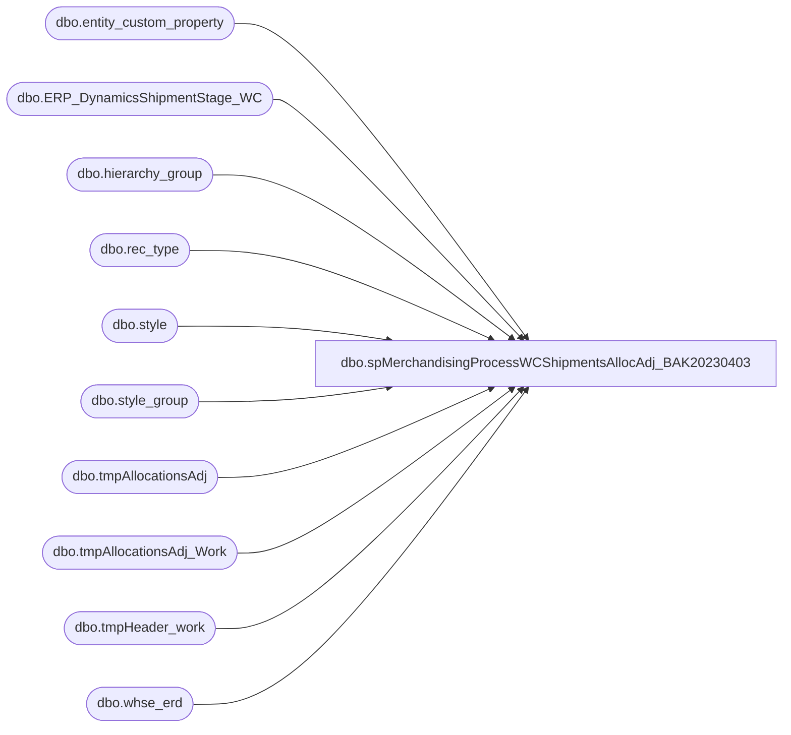

# dbo.spMerchandisingProcessWCShipmentsAllocAdj_BAK20230403

**Database:** me_01  
**Server:** bedrockdb02  

## Architecture Diagram



## Table Dependencies

| Referenced Table |
|---|
| dbo.entity_custom_property |
| dbo.ERP_DynamicsShipmentStage_WC |
| dbo.hierarchy_group |
| dbo.rec_type |
| dbo.style |
| dbo.style_group |
| dbo.tmpAllocationsAdj |
| dbo.tmpAllocationsAdj_Work |
| dbo.tmpHeader_work |
| dbo.whse_erd |

## Stored Procedure Code

```sql
CREATE proc [dbo].[spMerchandisingProcessWCShipmentsAllocAdj_BAK20230403]

as 
-- =====================================================================================================
-- Name: spMerchandisingProcessWCShipmentsAllocAdj
--
-- Description:	Imports shipment records from west coast warehouse, generates shipment and allocation adjustment files for Merchandising Pipeline
--				
--
-- Input:	Imports shipment files from \\kermode\FileRepository\MERCHANDISING\WC_Distro\SHIPMENTS
--
-- Output: outputs shipment files to \\pipeapp01\Company01\Text File to IM Import Tables - Import Store Shipment\
--		   outputs allocation adjustment files to \\pipeapp01\Company01\Text File to AR Import Tables - Allocation Adjustment\
-- Dependencies: NA
--				 
-- Revision History
--		Name:			Date:			Comments:
--		Dan Tweedie		03/15/2012		created proc
--		Dan Tweedie		07/14/2015		Pointed to Kermode instead of Oursmerchdb01
--		Tim Callahan	11/14/2017		Removed call of Segment 65000 segment to prevent conflicts with the Pipeline Sales Posting Segments
--										If an allocation adjustment is generated from this data it will post at 7:30 a.m. when Distro Export job begins runnin
--		Tim Callahan	06/28/2018		Added Code to remove D365 transfers from #file_input table after D365 capture otherwise this data would fail in Merch\Pipeline
--										Also updated #file_input table to accept 12 characters in the distribution number field 
--		Dan Tweedie		2018-07-03		Added Stage Data For Dynamics
--		Dan Tweedie		2019-01-22		Updated insert statement for stage to Dynamics
--		Tim Callahan	04/24/2019		Updated Proc to pull left 4 Location Code Characters as this caused issues with allocation adjustment file creation step
--		Tim Callahan	2022-07-31		Updated Proc to Handle an InsertDate and Null License Plate field, a license plate will be provided in near future. 
-- =====================================================================================================

set nocount on

----PART ONE - IMPORT SHIPMENT FILES

IF (Object_ID('tempdb..#files') IS NOT NULL) DROP TABLE #files
create table #files (output varchar(1000))
insert #files exec master..xp_cmdshell 'dir \\kermode\FileRepository\MERCHANDISING\WC_Distro\SHIPMENTS\*.dat /B'
delete from #files where output is null or output = 'File Not Found'

if (select count(*) from #files) > 0

BEGIN
		IF (Object_ID('tempdb..#file_input') IS NOT NULL) DROP TABLE #file_input
			create table #file_input
			(document_no varchar(10),
			 BOL varchar(30),
			 location_code varchar(1000),
			 rec_type varchar(4),
			 ship_date varchar(8),
			 style_code varchar(6),
			 ordered_qty int,
			 shipped_qty int,
			 carton_no varchar(20),
			 distribution_no varchar(12),
			 distribution_line int)
		
		declare @files int,
				@filename varchar(52),
				@filepath varchar(100),
				@bulkinsert varchar(4000),
				@del varchar(1000),
				@move varchar(1000),
				@query varchar(1000),
				@file_name varchar(100),
				@file_location varchar(1000),
				@server varchar(20),
				@database varchar(20),
				@bcp varchar(1000)


		select @filepath = '\\kermode\FileRepository\MERCHANDISING\WC_Distro\SHIPMENTS\'
		select @files = count(*) from #files

		while @files > 0
			begin

				select @filename = max(output) from #files
				select @bulkinsert = 'bulk insert #file_input from ''' + @filepath + @filename + ''' with (FIELDTERMINATOR = ''	'', ROWTERMINATOR = ''\n'')'
				exec (@bulkinsert)
				
				select @move = 'move ' + @filepath + @filename + ' \\kermode\FileRepository\MERCHANDISING\WC_Distro\SHIPMENTS\Done'

				exec master..xp_cmdshell @move
								
				delete from #files where output = @filename
				select @files = count(*) from #files
								
				if @files < 1
					break
				else
					continue
			end

			
-----------STAGE SHIPMENTS FOR DYNAMICS
			insert ERP_DynamicsShipmentStage_WC
			select *, 
			null , -- Added 7/31/2022, eventually a License Plate field will be available in the WC data file 
			GETDATE() -- Added 7/31/2022
			
			from #file_input
			where carton_no is not null
			and len(carton_no) > 1
			and carton_no not in (select carton_no from ERP_DynamicsShipmentStage_WC where carton_no is NOT NULL)
---------------------------------------
			
-- Added 6/28/2018

delete 
from #file_input
where distribution_no like 'S%' or distribution_no like 'T%'

----------------------------------------------------------------------------------------------------------------------------------------------------
--PART TWO - GENERATE SHIPMENT RECORDS FOR PIPELINE
--step 1 - build shipment header and detail tables
IF (Object_ID('me_01..tmpHeader_work') IS NOT NULL) DROP TABLE tmpHeader_work
select distinct
	   fi.document_no,
	   convert(varchar, cast(fi.ship_date as datetime), 101) date_shipped, 
	   datepart(dw, fi.ship_date) day_shipped,
	   case when fi.rec_type in ('1','6','8','9','56','61','1006') then isnull(we.truck_960,7)--truck
			when fi.rec_type in ('54','58','80','81','82','83','84','1004') then isnull(we.ground_960,7)--ground
			when fi.rec_type in ('51','52','73','85','86','1001','1002') then '1'--1 day
			when fi.rec_type in ('53','74','87','1003','57','1007','62') then '2'--2 day -- includes courier and intnl priority
			when fi.rec_type in ('60','88','1010') then '3'--3 day
			when fi.rec_type in ('55','89','1005') then datediff(dd, datepart(dw, fi.ship_date),7) -- saturday
			when fi.rec_type in ('63') then isnull(we.intnl_econ_960,5)--Intl Economy -- santiago will provide list by store, what's not provided will be 5 days
			when fi.rec_type in ('64','65') then '30'--30
			when fi.rec_type = '3' then isnull(we.supplySecond_960,7)
			when fi.rec_type = '7' then isnull(we.supplyThird_960,7)
			else 7
		end as transit_days,
	    --as expected_receipt_date,
	   left(fi.location_code,4) as location_code, -- Modified 4/24/2019 -TC
	   rt.[message] as external_system_name
into tmpHeader_work
from #file_input fi
join rec_type rt (nolock) on fi.rec_type = rt.rectype
left join whse_erd we (nolock) on fi.location_code = we.location_code
where fi.carton_no is not null
order by fi.document_no


--apply erd value with weekend buffer
IF (Object_ID('me_01..tmpHeader') IS NOT NULL) DROP TABLE tmpHeader
select document_no, date_shipped, 
case when (datepart(dw, date_shipped) = 2 and transit_days > 4)
			or (datepart(dw, date_shipped) = 3 and transit_days > 3)
			or (datepart(dw, date_shipped) = 4 and transit_days > 2)
			or (datepart(dw, date_shipped) = 5 and transit_days > 1)
			or (datepart(dw, date_shipped) = 6)
		then convert(varchar, dateadd(day, (transit_days + 2), cast(date_shipped as datetime)), 101)
	when transit_days is NULL then convert(varchar, dateadd(day, (7), cast(date_shipped as datetime)), 101)
	else convert(varchar, dateadd(day, (transit_days), cast(date_shipped as datetime)), 101)
end as expected_receipt_date,
location_code, external_system_name
into tmpHeader
from tmpHeader_work
order by document_no

IF (Object_ID('me_01..tmpDetail') IS NOT NULL) DROP TABLE tmpDetail
select 
	   fi.document_no,
	   fi.distribution_no,
	   fi.carton_no,
	   cast('000000' as varchar) + fi.style_code as UPC_no,
	   case when substring(hg.hierarchy_group_code,7,2)='60' 
			then fi.shipped_qty / ecp.custom_property_value
			else fi.shipped_qty
		end as sent_units
into tmpDetail
from #file_input fi
join style s (nolock) on fi.style_code = s.style_code
join style_group sg (nolock) on s.style_id = sg.style_id
join hierarchy_group hg (nolock) on sg.hierarchy_group_id = hg.hierarchy_group_id
left join entity_custom_property ecp on s.style_id = ecp.parent_id and ecp.custom_property_id = 2 and ecp.parent_type = 1
where carton_no is not null	   
order by document_no, distribution_no, carton_no


-------------------------------
--step 2 - output shipment file

declare @query_shipment varchar(1000),
		@date varchar(200),
		@file_name_shipment varchar(100),
		@file_location_shipment varchar(100),
		@server_shipment varchar(20),
		@database_shipment varchar(20),
		@sqlcmd varchar(1000),
		@query_text varchar(1000)


set @date = convert(varchar, datepart(yyyy, getdate())) + convert(varchar, datepart(mm, getdate())) + convert(varchar, datepart(dd, getdate())) + convert(varchar, datepart(hh, getdate())) + convert(varchar, datepart(mi, getdate())) + convert(varchar, datepart(ss, getdate()))
set @query_shipment = 'set nocount on exec me_01.dbo.spMerchandisingOutputWCshipments'
set @file_location_shipment = '\\pipeapp01\Company01\Text File to IM Import Tables - Import Store Shipment\'
set @file_name_shipment = 'NSBIMSTORESHIPMENT.WC.' + @date + '.GO'
set @server_shipment = 'bedrockdb02'
set @database_shipment = 'me_01'
set @sqlcmd = 'sqlcmd -E -S' + @server_shipment + ' -d' + @database_shipment + ' -Q' + '"' + @query_shipment + '"' + ' -o' + '"' + @file_location_shipment + @file_name_shipment + '"' + ' -w1000 -W'
exec master..xp_cmdshell @sqlcmd

EXEC pipeapp01.master..xp_cmdshell 'PipelineScheduleClient Start 16500 0' --shipments -- Added 11/11/2015
EXEC pipeapp01.master..xp_cmdshell 'PipelineScheduleClient Start 19000 0' --write to prod tables -- Added 11/11/2015
------------------------------------------------------------------------------------------------------------------------
--PART THREE - GENERATE ALLOCATIONS ADJUSTMENT RECORDS FOR PIPELINE
--step 1 - build allocations adjustment header and detail tables
IF (Object_ID('me_01..tmpAllocationsAdj_Work') IS NOT NULL) DROP TABLE tmpAllocationsAdj_Work
select fi.distribution_no, fi.distribution_line, ('000000' + fi.style_code) UPC, left(fi.location_code,4) as location_code,  -- Modified 4/24/2019 -TC
 sum(fi.shipped_qty) Adj_qty
into tmpAllocationsAdj_Work
from #file_input fi
group by fi.distribution_no, fi.distribution_line, ('000000' + fi.style_code), fi.location_code

IF (Object_ID('me_01..tmpAllocationsAdj') IS NOT NULL) DROP TABLE tmpAllocationsAdj
select taa.distribution_no, taa.distribution_line, taa.upc, taa.location_code,
case when substring(hg.hierarchy_group_code,7,2)='60' 
		then (taa.adj_qty/ecp.custom_property_value) 
		else taa.adj_qty
		end as adj_qty
into tmpAllocationsAdj
from tmpAllocationsAdj_Work taa
join style s on s.style_code = right(taa.upc, 6) 
join style_group sg on s.style_id = sg.style_id
join hierarchy_group hg on sg.hierarchy_group_id = hg.hierarchy_group_id
left outer join	entity_custom_property ecp on s.style_id = ecp.parent_id and ecp.custom_property_id = 2 and	ecp.parent_type = 1

if (select count(*) from tmpAllocationsAdj) > 0

begin

	declare @query_alloc varchar(1000),
			@date_alloc varchar(200),
			@file_name_alloc varchar(100),
			@file_location_alloc varchar(100),
			@server_alloc varchar(20),
			@database_alloc varchar(20),
			@sqlcmd_alloc varchar(1000)

	set @date_alloc = convert(varchar, datepart(yyyy, getdate())) + convert(varchar, datepart(mm, getdate())) + convert(varchar, datepart(dd, getdate())) + convert(varchar, datepart(hh, getdate())) + convert(varchar, datepart(mi, getdate())) + convert(varchar, datepart(ss, getdate()))
	set @query_alloc = 'set nocount on exec spMerchandisingOutputWCAllocAdj'
	set @file_location_alloc = '\\pipeapp01\Company01\Text File to AR Import Tables - Allocation Adjustment\'
	set @file_name_alloc = 'NSBIMALLADJUSTMENT.WC.' + @date_alloc + '.GO'
	set @server_alloc = 'bedrockdb02'
	set @database_alloc = 'me_01'
	set @sqlcmd_alloc = 'sqlcmd -E -S' + @server_alloc + ' -d' + @database_alloc + ' -Q' + '"' + @query_alloc + '"' + ' -o' + '"' + @file_location_alloc + @file_name_alloc + '"' + ' -w1000 -W'
	exec master..xp_cmdshell @sqlcmd_alloc

	EXEC pipeapp01.master..xp_cmdshell 'PipelineScheduleClient Start 16503 0' --alloc adj -- Added 11/11/2015
	-- EXEC pipeapp01.master..xp_cmdshell 'PipelineScheduleClient Start 65000 0' --write to prod tables - Added 11/11/2015 -- Remarked out on 11/14/2017

end 

END
```

